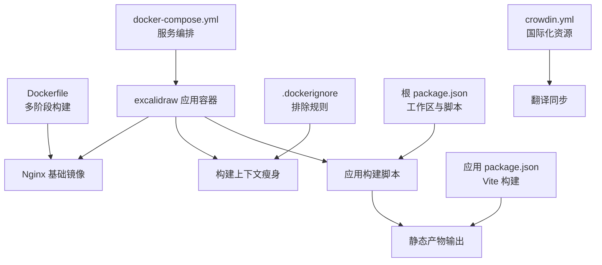
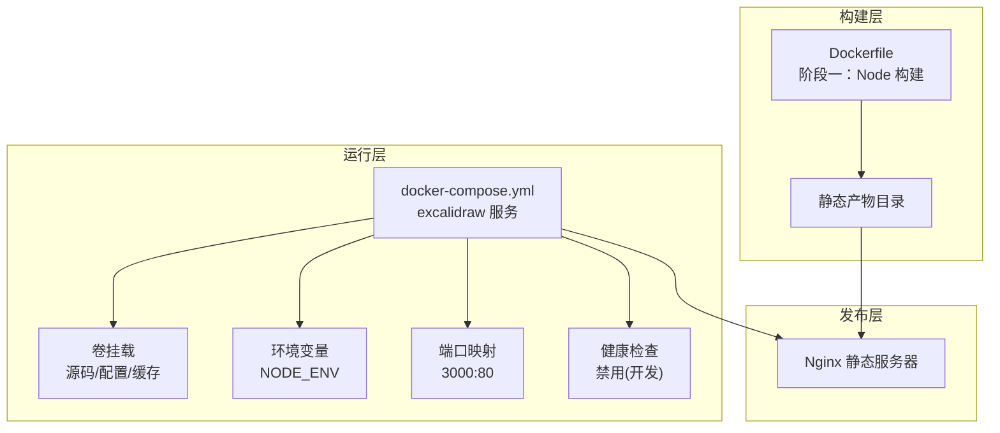
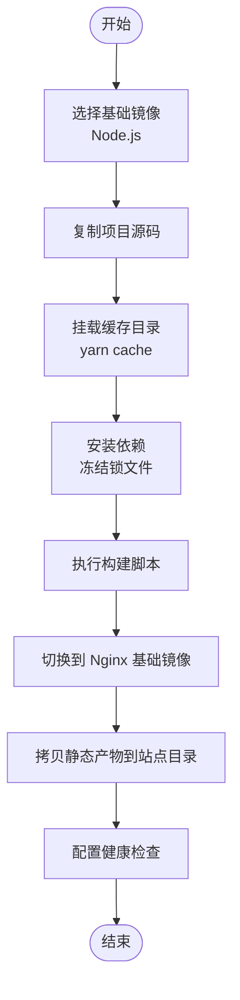
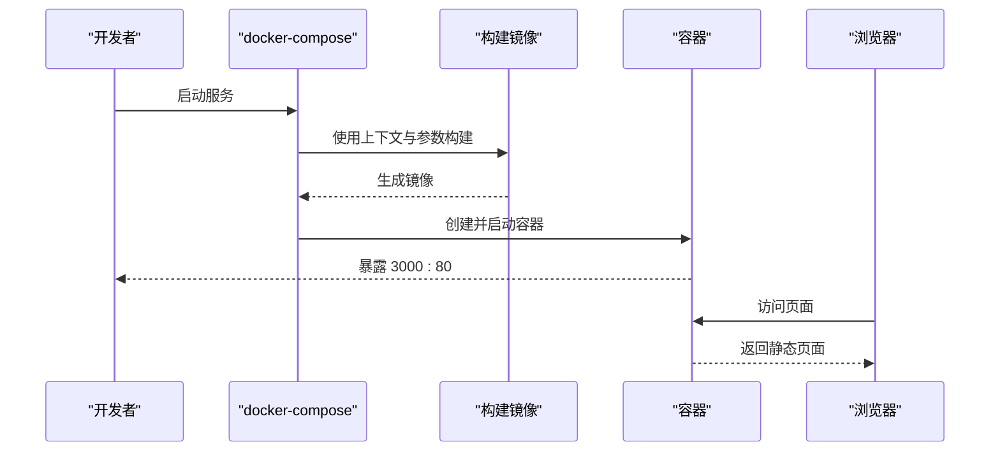
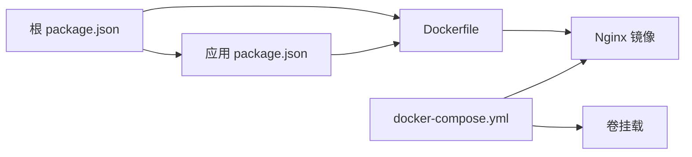

# 容器化部署

<cite>
**本文引用的文件**
- [Dockerfile](file://Dockerfile)
- [docker-compose.yml](file://docker-compose.yml)
- [.dockerignore](file://.dockerignore)
- [package.json](file://package.json)
- [excalidraw-app/package.json](file://excalidraw-app/package.json)
- [.github/FUNDING.yml](file://.github/FUNDING.yml)
- [.github/copilot-instructions.md](file://.github/copilot-instructions.md)
- [crowdin.yml](file://crowdin.yml)
</cite>

## 目录

1. [简介](#简介)
2. [项目结构](#项目结构)
3. [核心组件](#核心组件)
4. [架构总览](#架构总览)
5. [详细组件分析](#详细组件分析)
6. [依赖关系分析](#依赖关系分析)
7. [性能考量](#性能考量)
8. [故障排查指南](#故障排查指南)
9. [结论](#结论)
10. [附录](#附录)

## 简介

本指南面向 DevOps 团队与工程实践者，系统讲解本仓库的容器化部署方案，涵盖以下重点：

- Dockerfile 多阶段构建流程、缓存优化与平台兼容性配置
- docker-compose.yml 服务编排、网络与卷挂载策略
- 镜像最佳实践（体积优化、安全扫描、版本管理）
- 运行时配置（环境变量、端口映射、健康检查）
- 编排与扩展策略（负载均衡与故障转移思路）
- 结合仓库现有脚本与配置，给出可落地的部署与运维建议

## 项目结构

围绕容器化部署的关键文件与职责如下：

- 构建与打包：顶层 Dockerfile、根与应用层 package.json 脚本
- 运行时编排：docker-compose.yml、.dockerignore
- 开发协作与质量规范：.github/copilot-instructions.md、.github/FUNDING.yml
- 国际化资源：crowdin.yml

图表来源

- [Dockerfile:1-21](file://Dockerfile#L1-L21)
- [docker-compose.yml:1-24](file://docker-compose.yml#L1-L24)
- [.dockerignore:1-20](file://.dockerignore#L1-L20)
- [package.json:50-91](file://package.json#L50-L91)
- [excalidraw-app/package.json:43-52](file://excalidraw-app/package.json#L43-L52)
- [crowdin.yml:1-4](file://crowdin.yml#L1-L4)

章节来源

- [Dockerfile:1-21](file://Dockerfile#L1-L21)
- [docker-compose.yml:1-24](file://docker-compose.yml#L1-L24)
- [.dockerignore:1-20](file://.dockerignore#L1-L20)
- [package.json:50-91](file://package.json#L50-L91)
- [excalidraw-app/package.json:43-52](file://excalidraw-app/package.json#L43-L52)
- [crowdin.yml:1-4](file://crowdin.yml#L1-L4)

## 核心组件

- 多阶段构建镜像
  - 阶段一：基于 Node.js 构建前端静态资源
  - 阶段二：使用 Nginx 静态服务器提供服务
- Compose 服务
  - 单服务编排，开发模式下启用交互式终端、健康检查禁用、卷挂载本地源码以支持热更新
- 构建脚本与引擎约束
  - 根与应用层 package.json 提供统一的构建与启动脚本，并声明 Node 引擎版本要求
- 排除规则
  - .dockerignore 仅包含必要文件与目录，避免无关内容进入镜像层

章节来源

- [Dockerfile:1-21](file://Dockerfile#L1-L21)
- [docker-compose.yml:1-24](file://docker-compose.yml#L1-L24)
- [package.json:46-48](file://package.json#L46-L48)
- [excalidraw-app/package.json:25-27](file://excalidraw-app/package.json#L25-L27)
- [.dockerignore:1-20](file://.dockerignore#L1-L20)

## 架构总览

容器化部署采用“构建-发布-运行”三层：

- 构建层：Dockerfile 多阶段构建，产出静态站点
- 发布层：Nginx 静态服务器承载前端产物
- 运行层：Compose 编排单容器服务，开发模式下挂载源码实现快速迭代

图表来源

- [Dockerfile:1-21](file://Dockerfile#L1-L21)
- [docker-compose.yml:1-24](file://docker-compose.yml#L1-L24)

## 详细组件分析

### Dockerfile 多阶段构建与缓存优化

- 平台兼容性
  - 使用构建参数传递目标平台，确保跨平台镜像构建一致性
- 构建阶段
  - 阶段一：安装依赖、执行构建脚本，产物输出到应用构建目录
  - 阶段二：从阶段一拷贝静态产物至 Nginx 默认站点目录
- 缓存优化
  - 使用构建挂载缓存目录，减少重复安装依赖的时间
- 健康检查
  - 在最终镜像中添加健康检查命令，便于容器编排工具进行存活探测

图表来源

- [Dockerfile:1-21](file://Dockerfile#L1-L21)

章节来源

- [Dockerfile:1-21](file://Dockerfile#L1-L21)

### docker-compose.yml 服务编排

- 服务定义
  - build 指定构建上下文与参数，容器名固定
- 网络与端口
  - 将宿主 3000 映射到容器 80 端口，便于本地访问
- 健康检查
  - 开发模式下禁用健康检查，提升调试灵活性
- 环境变量
  - 设置 NODE_ENV 为 development，配合应用脚本行为
- 卷挂载
  - 挂载源码目录、package.json、yarn.lock 以及一个空卷用于 node_modules，避免污染宿主机并隔离依赖

图表来源

- [docker-compose.yml:1-24](file://docker-compose.yml#L1-L24)

章节来源

- [docker-compose.yml:1-24](file://docker-compose.yml#L1-L24)

### 构建脚本与引擎约束

- 根 package.json
  - 定义工作区与统一脚本入口，包含应用构建、测试、清理等任务
  - 声明 Node 引擎版本要求，确保 CI/本地环境一致
- 应用 package.json
  - 提供 Vite 构建脚本，开发模式下通过环境变量控制 Sentry 行为
  - 生产构建脚本输出静态产物，供 Nginx 提供服务

章节来源

- [package.json:50-91](file://package.json#L50-L91)
- [excalidraw-app/package.json:43-52](file://excalidraw-app/package.json#L43-L52)

### 排除规则与构建上下文

- .dockerignore
  - 仅包含必要的文件与目录，同时排除构建产物与 node_modules，降低镜像层体积与构建时间

章节来源

- [.dockerignore:1-20](file://.dockerignore#L1-L20)

### 国际化资源与翻译同步

- crowdin.yml
  - 定义源语言与翻译文件路径，便于在 CI 中集成翻译同步流程

章节来源

- [crowdin.yml:1-4](file://crowdin.yml#L1-L4)

## 依赖关系分析

- 组件耦合
  - Compose 依赖 Dockerfile 的构建结果；应用脚本决定产物位置；Nginx 依赖静态产物
- 外部依赖
  - Node.js 版本要求与包管理器版本在根与应用层 package.json 中声明
- 可能的改进点
  - 当前 compose 为单容器服务，若需横向扩展，可在 Compose 中引入副本数或结合外部编排工具实现

图表来源

- [package.json:50-91](file://package.json#L50-L91)
- [excalidraw-app/package.json:43-52](file://excalidraw-app/package.json#L43-L52)
- [Dockerfile:1-21](file://Dockerfile#L1-L21)
- [docker-compose.yml:1-24](file://docker-compose.yml#L1-L24)

章节来源

- [package.json:50-91](file://package.json#L50-L91)
- [excalidraw-app/package.json:43-52](file://excalidraw-app/package.json#L43-L52)
- [Dockerfile:1-21](file://Dockerfile#L1-L21)
- [docker-compose.yml:1-24](file://docker-compose.yml#L1-L24)

## 性能考量

- 镜像体积优化
  - 使用多阶段构建，仅将静态产物放入最终镜像
  - .dockerignore 排除不必要的文件与目录
- 构建缓存
  - 利用构建挂载缓存目录，减少重复安装依赖的时间
- 平台兼容性
  - 通过构建参数传递平台信息，避免交叉平台构建问题
- 运行时性能
  - Nginx 静态服务器轻量高效，适合前端静态站点

## 故障排查指南

- 健康检查
  - 当前镜像已内置健康检查命令；Compose 在开发模式下禁用健康检查，如需启用可调整 compose 配置
- 端口冲突
  - 若宿主 3000 端口被占用，修改 compose 的端口映射
- 权限与卷挂载
  - 确认挂载的源码与配置文件权限正确，避免容器内写入失败
- 构建失败
  - 检查 Node 引擎版本是否满足要求；确认锁文件与包管理器版本一致

章节来源

- [Dockerfile:20-21](file://Dockerfile#L20-L21)
- [docker-compose.yml:12-13](file://docker-compose.yml#L12-L13)
- [docker-compose.yml:8-9](file://docker-compose.yml#L8-L9)
- [package.json:46-48](file://package.json#L46-L48)
- [excalidraw-app/package.json:25-27](file://excalidraw-app/package.json#L25-L27)

## 结论

本仓库已具备完善的容器化基础：多阶段构建、Nginx 托管、Compose 编排与缓存优化。建议在生产环境中补充镜像签名、漏洞扫描与版本标签策略，并根据业务需要扩展为多实例与反向代理架构，以实现高可用与弹性伸缩。

## 附录

### 镜像最佳实践清单

- 安全扫描
  - 在 CI 中集成镜像漏洞扫描步骤，阻断高危风险镜像上线
- 版本管理
  - 使用语义化版本标签与短提交 SHA 作为镜像标签，便于回滚与追踪
- 镜像大小
  - 保持多阶段构建与 .dockerignore 最小化，定期清理构建缓存

### 运行时配置要点

- 环境变量
  - 通过 Compose 的 environment 字段设置 NODE_ENV，或在 CI 中注入
- 端口映射
  - 开发环境映射 3000:80；生产环境建议通过反向代理暴露 80/443
- 健康检查
  - 生产环境启用健康检查，确保编排工具能及时发现异常

### 编排与扩展策略

- 负载均衡
  - 使用反向代理（如 Nginx/OpenResty）对多实例进行分发
- 故障转移
  - 配置健康检查与自动重启策略，结合外部编排工具实现故障检测与恢复
- 横向扩展
  - Compose 中增加副本数，或迁移到 Kubernetes 实现更精细的扩缩容
