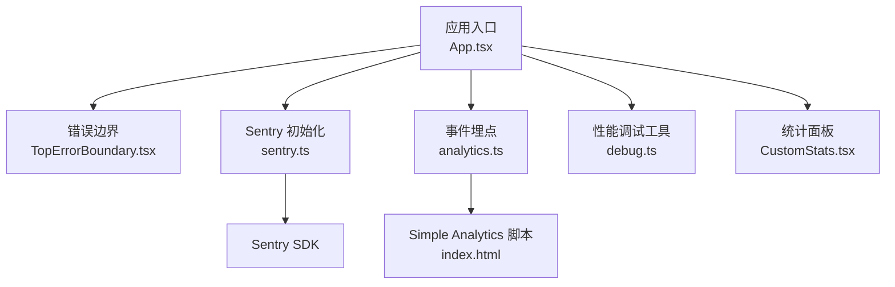
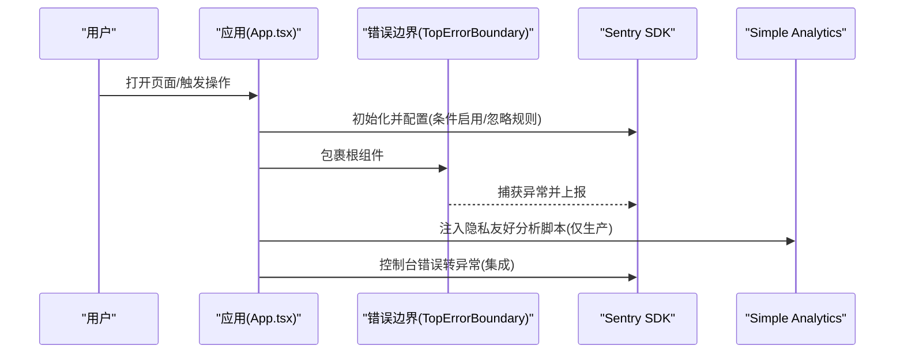
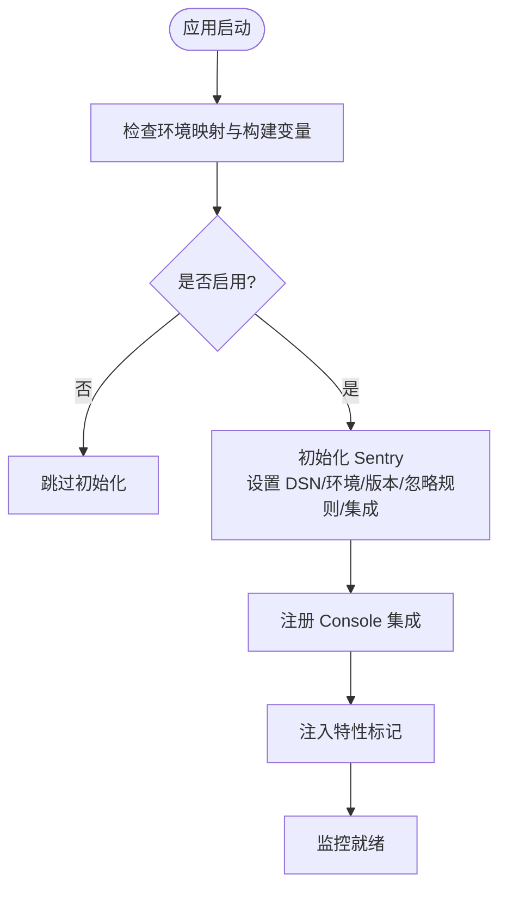
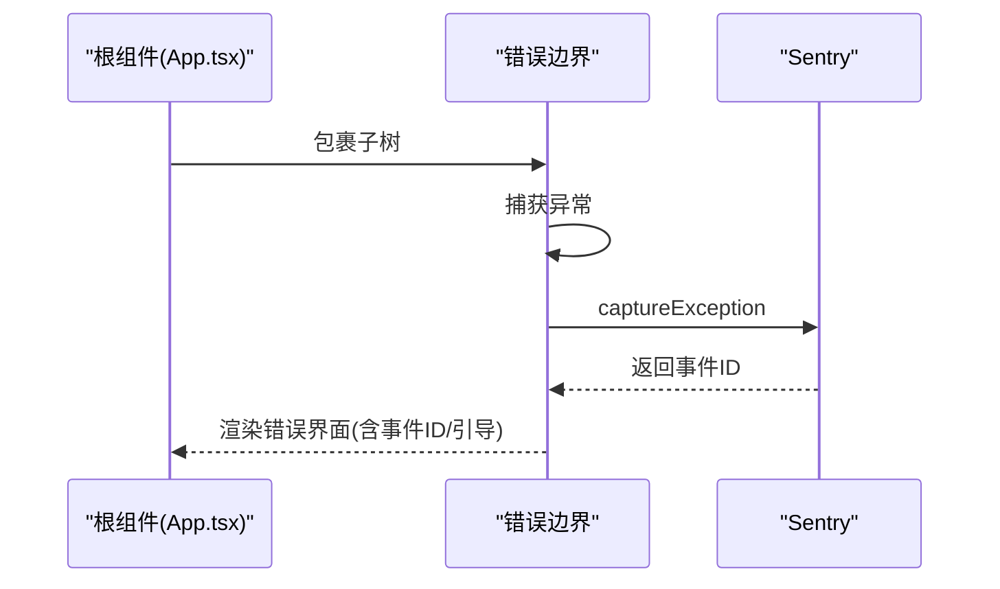
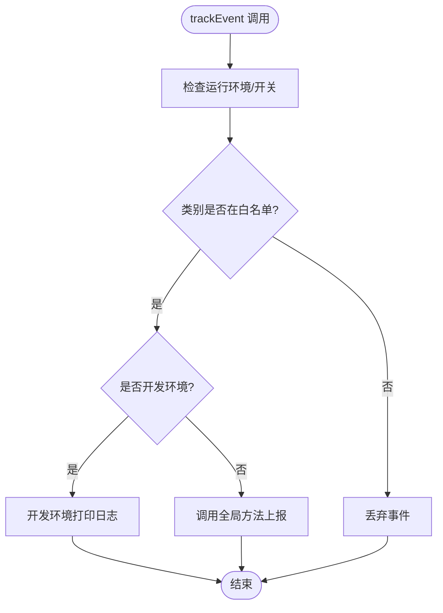
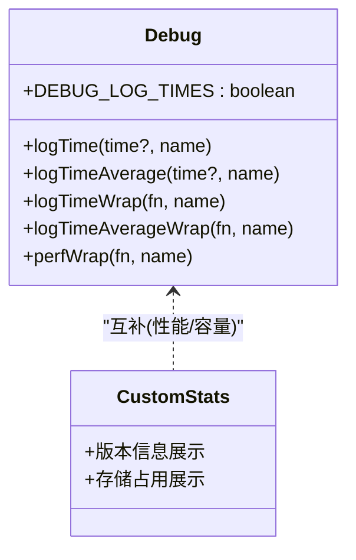
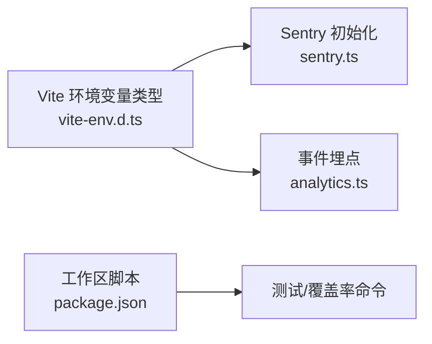

# 监控与日志

<cite>
**本文引用的文件**
- [sentry.ts](file://excalidraw-app/sentry.ts)
- [TopErrorBoundary.tsx](file://excalidraw-app/components/TopErrorBoundary.tsx)
- [analytics.ts](file://packages/excalidraw/analytics.ts)
- [index.html](file://excalidraw-app/index.html)
- [vite-env.d.ts](file://packages/excalidraw/vite-env.d.ts)
- [debug.ts](file://packages/common/debug.ts)
- [App.tsx](file://excalidraw-app/App.tsx)
- [CustomStats.tsx](file://excalidraw-app/CustomStats.tsx)
- [Stats.scss](file://packages/excalidraw/components/Stats/Stats.scss)
- [Collab.tsx](file://excalidraw-app/collab/Collab.tsx)
- [useTextGeneration.ts](file://packages/excalidraw/components/TTDDialog/hooks/useTextGeneration.ts)
- [useChatAgent.ts](file://packages/excalidraw/components/TTDDialog/Chat/useChatAgent.ts)
- [chat.test.ts](file://packages/excalidraw/components/TTDDialog/utils/chat.test.ts)
- [package.json](file://package.json)
</cite>

## 目录

1. [简介](#简介)
2. [项目结构](#项目结构)
3. [核心组件](#核心组件)
4. [架构总览](#架构总览)
5. [详细组件分析](#详细组件分析)
6. [依赖关系分析](#依赖关系分析)
7. [性能考量](#性能考量)
8. [故障排查指南](#故障排查指南)
9. [结论](#结论)
10. [附录](#附录)

## 简介

本指南面向运维与开发团队，系统性梳理本仓库在“监控与日志”方面的现状与实践建议，重点覆盖：

- Sentry 错误监控：初始化、过滤规则、异常捕获与上报、前端控制台错误转异常等
- 性能监控：帧率、调用耗时聚合与平均、调试输出与可视化
- 用户体验追踪：事件埋点（当前范围有限）
- 日志策略：结构化日志、日志级别、敏感信息过滤
- 告警与通知：当前未见集成第三方告警通道（邮件/Slack/微信），可按本文建议扩展
- 数据分析与报表：基于现有埋点与统计组件进行可视化与指标定义
- 监控仪表板设计：关键指标定义与展示建议

## 项目结构

围绕监控与日志的关键文件分布如下：

- 前端错误监控与边界：Sentry 初始化与错误边界
- 用户体验追踪：事件埋点函数
- 性能监控：通用调试工具类
- 统计面板：版本、存储占用等展示
- 构建与运行时环境：Vite 环境变量类型声明
- 集成示例：HTML 中隐私友好的分析脚本（非 Sentry）

图表来源

- [App.tsx:1-200](file://excalidraw-app/App.tsx#L1-L200)
- [TopErrorBoundary.tsx:1-147](file://excalidraw-app/components/TopErrorBoundary.tsx#L1-L147)
- [sentry.ts:1-95](file://excalidraw-app/sentry.ts#L1-L95)
- [analytics.ts:1-47](file://packages/excalidraw/analytics.ts#L1-L47)
- [debug.ts:1-175](file://packages/common/debug.ts#L1-L175)
- [CustomStats.tsx:1-92](file://excalidraw-app/CustomStats.tsx#L1-L92)
- [index.html:217-250](file://excalidraw-app/index.html#L217-L250)

章节来源

- [App.tsx:1-200](file://excalidraw-app/App.tsx#L1-L200)
- [sentry.ts:1-95](file://excalidraw-app/sentry.ts#L1-L95)
- [TopErrorBoundary.tsx:1-147](file://excalidraw-app/components/TopErrorBoundary.tsx#L1-L147)
- [analytics.ts:1-47](file://packages/excalidraw/analytics.ts#L1-L47)
- [debug.ts:1-175](file://packages/common/debug.ts#L1-L175)
- [CustomStats.tsx:1-92](file://excalidraw-app/CustomStats.tsx#L1-L92)
- [index.html:217-250](file://excalidraw-app/index.html#L217-L250)

## 核心组件

- Sentry 错误监控
  - 初始化与环境映射、DSN 条件启用、忽略特定错误、集成 Console 捕获、特征标记注入
  - 错误边界捕获顶层异常并上报 Sentry，同时向用户展示事件 ID 与引导
- 用户体验追踪
  - 事件埋点函数，限定允许类别、开发/生产环境开关、通过全局方法上报
- 性能监控
  - 调试工具类提供时间聚合、平均耗时、帧率统计、包装器等能力
- 统计面板
  - 展示版本信息与本地存储占用，便于快速定位问题场景

章节来源

- [sentry.ts:1-95](file://excalidraw-app/sentry.ts#L1-L95)
- [TopErrorBoundary.tsx:1-147](file://excalidraw-app/components/TopErrorBoundary.tsx#L1-L147)
- [analytics.ts:1-47](file://packages/excalidraw/analytics.ts#L1-L47)
- [debug.ts:1-175](file://packages/common/debug.ts#L1-L175)
- [CustomStats.tsx:1-92](file://excalidraw-app/CustomStats.tsx#L1-L92)

## 架构总览

下图展示了前端监控链路：应用初始化 Sentry、包裹根组件、错误边界兜底、事件埋点上报、性能调试输出。

图表来源

- [App.tsx:1-200](file://excalidraw-app/App.tsx#L1-L200)
- [TopErrorBoundary.tsx:1-147](file://excalidraw-app/components/TopErrorBoundary.tsx#L1-L147)
- [sentry.ts:1-95](file://excalidraw-app/sentry.ts#L1-L95)
- [index.html:217-250](file://excalidraw-app/index.html#L217-L250)

## 详细组件分析

### Sentry 错误监控配置

- 环境映射与启用条件
  - 通过主机名映射到环境值，结合构建变量决定是否启用
  - 支持在本地/Docker 禁用以避免噪声或尊重隐私
- 忽略规则
  - 针对浏览器特定错误、服务工作线程动态导入失败、存储配额超限、私有模式禁用 IndexedDB 等常见噪音
- 集成
  - Console 错误集成：将 console.error 转换为异常事件
  - 特征标记集成：注入特性开关状态
- 上报前处理
  - 清理 URL 片段、构造异常对象、过滤 node_modules 内部栈帧、标注机制信息
- 错误边界配合
  - 在顶层捕获异常，设置事件 ID 并引导用户反馈

图表来源

- [sentry.ts:13-95](file://excalidraw-app/sentry.ts#L13-L95)

章节来源

- [sentry.ts:1-95](file://excalidraw-app/sentry.ts#L1-L95)
- [TopErrorBoundary.tsx:26-46](file://excalidraw-app/components/TopErrorBoundary.tsx#L26-L46)

### 错误边界与用户体验

- 捕获顶层异常，收集组件栈信息与本地存储快照
- 上报 Sentry 并返回错误界面，显示事件 ID，提供复制与创建 Issue 引导
- 适配 iframe 场景下的嵌入检测与提示

图表来源

- [TopErrorBoundary.tsx:1-147](file://excalidraw-app/components/TopErrorBoundary.tsx#L1-L147)

章节来源

- [TopErrorBoundary.tsx:1-147](file://excalidraw-app/components/TopErrorBoundary.tsx#L1-L147)

### 用户体验追踪（事件埋点）

- 事件埋点函数支持类别、动作、标签、数值
- 受运行环境与开关控制（如开发环境默认关闭、可通过构建变量开启）
- 仅允许白名单类别，避免过度采集
- 生产环境通过全局方法上报，开发环境打印日志便于调试

图表来源

- [analytics.ts:8-47](file://packages/excalidraw/analytics.ts#L8-L47)

章节来源

- [analytics.ts:1-47](file://packages/excalidraw/analytics.ts#L1-L47)

### 性能监控与调试

- 时间聚合与平均
  - 提供聚合与平均两类计时接口，自动启动定时记录与帧动画统计
  - 输出每秒调用次数、帧均耗时、帧预算占比等
- 包装器
  - 对函数执行前后进行计时包装，便于快速标注性能热点
- 统计面板
  - 展示版本号与本地存储占用，辅助定位性能退化与缓存问题

图表来源

- [debug.ts:7-175](file://packages/common/debug.ts#L7-L175)
- [CustomStats.tsx:1-92](file://excalidraw-app/CustomStats.tsx#L1-L92)

章节来源

- [debug.ts:1-175](file://packages/common/debug.ts#L1-L175)
- [CustomStats.tsx:1-92](file://excalidraw-app/CustomStats.tsx#L1-L92)

### 协作与可见性（性能相关）

- 协作者鼠标位置与可视区域广播逻辑中包含“易失性”广播，减少非关键更新对主流程影响
- 可视区域变化时的跟随逻辑与跨跟随场景的防护，避免冗余更新

章节来源

- [Collab.tsx:614-649](file://excalidraw-app/collab/Collab.tsx#L614-L649)

### 文本生成与错误处理（埋点与可观测性）

- 文本生成流程中记录埋点事件
- 使用 Chat Agent 将错误序列化并写入聊天历史，便于后续分析与回放

章节来源

- [useTextGeneration.ts:98-141](file://packages/excalidraw/components/TTDDialog/hooks/useTextGeneration.ts#L98-L141)
- [useChatAgent.ts:42-66](file://packages/excalidraw/components/TTDDialog/Chat/useChatAgent.ts#L42-L66)
- [chat.test.ts:628-656](file://packages/excalidraw/components/TTDDialog/utils/chat.test.ts#L628-L656)

## 依赖关系分析

- 运行时环境变量
  - Vite 环境变量类型声明包含 Sentry 开关、跟踪开关、Matomo 参数等
- 工作空间与脚本
  - monorepo 工作区定义与测试脚本，便于在 CI 中统一执行

图表来源

- [vite-env.d.ts:1-60](file://packages/excalidraw/vite-env.d.ts#L1-L60)
- [sentry.ts:11-11](file://excalidraw-app/sentry.ts#L11-L11)
- [analytics.ts:18-18](file://packages/excalidraw/analytics.ts#L18-L18)
- [package.json:51-91](file://package.json#L51-L91)

章节来源

- [vite-env.d.ts:1-60](file://packages/excalidraw/vite-env.d.ts#L1-L60)
- [package.json:51-91](file://package.json#L51-L91)

## 性能考量

- 建议
  - 使用调试工具类对关键路径进行包裹计时，识别长尾与抖动
  - 结合统计面板关注本地存储增长趋势，避免因缓存导致性能退化
  - 在协作场景中合理使用“易失性”广播，降低非关键更新对渲染的影响
- 当前实现
  - 提供帧率统计与平均耗时计算，便于定位卡顿与耗时热点

章节来源

- [debug.ts:1-175](file://packages/common/debug.ts#L1-L175)
- [CustomStats.tsx:1-92](file://excalidraw-app/CustomStats.tsx#L1-L92)
- [Collab.tsx:219-257](file://excalidraw-app/collab/Collab.tsx#L219-L257)

## 故障排查指南

- Sentry 未上报或被禁用
  - 检查构建变量与主机名映射，确认线上环境已启用
  - 查看忽略规则是否误伤目标错误
- 错误边界未触发
  - 确认根组件已包裹错误边界
  - 检查异常是否被捕获在子组件内部且未冒泡
- 事件埋点无效
  - 确认运行环境与开关变量
  - 核对类别是否在白名单内
- 性能异常
  - 使用调试工具类对热点函数进行包装计时
  - 关注统计面板中的版本与存储占用变化

章节来源

- [sentry.ts:1-95](file://excalidraw-app/sentry.ts#L1-L95)
- [TopErrorBoundary.tsx:1-147](file://excalidraw-app/components/TopErrorBoundary.tsx#L1-L147)
- [analytics.ts:1-47](file://packages/excalidraw/analytics.ts#L1-L47)
- [debug.ts:1-175](file://packages/common/debug.ts#L1-L175)
- [CustomStats.tsx:1-92](file://excalidraw-app/CustomStats.tsx#L1-L92)

## 结论

本项目在前端监控方面已具备基础但实用的能力：Sentry 错误监控与错误边界、有限的用户行为埋点、以及完善的性能调试工具与统计面板。建议在现有基础上逐步完善：

- 扩展埋点范围与数据模型，覆盖更多关键用户旅程
- 设计监控仪表板，统一展示关键指标（错误率、P95、存储增长、帧率等）
- 探索告警与通知机制（邮件/Slack/微信）以提升响应效率
- 完善日志策略与敏感信息过滤，确保合规与安全

## 附录

### 关键指标定义与仪表板设计建议

- 错误监控
  - 指标：异常事件数、错误趋势、Top-N 错误、错误修复周期
  - 展示：按环境/版本/路由维度拆分
- 性能监控
  - 指标：帧率、P95/P99 渲染耗时、关键路径耗时、存储占用
  - 展示：时间序列、热力图、回归对比
- 用户体验
  - 指标：关键功能使用率、转化漏斗、失败率
  - 展示：漏斗图、趋势、用户分群
- 告警与通知
  - 建议：阈值告警（错误率、P95）、趋势告警（异常突增）、SLI/SLO 对齐
  - 通知：邮件（低优先级）、Slack/微信（高优先级）

### 日志记录策略与敏感信息过滤

- 结构化日志
  - 统一字段：时间戳、级别、模块、消息、上下文（用户、会话、版本）
- 日志级别
  - 建议：ERROR/WARN/INFO/DEBUG 分层，生产默认 INFO
- 敏感信息过滤
  - URL 片段清理、用户输入脱敏、错误堆栈过滤第三方库
  - 参考：Sentry 初始化中的 URL 处理与忽略规则

章节来源

- [sentry.ts:39-82](file://excalidraw-app/sentry.ts#L39-L82)
- [TopErrorBoundary.tsx:36-45](file://excalidraw-app/components/TopErrorBoundary.tsx#L36-L45)
