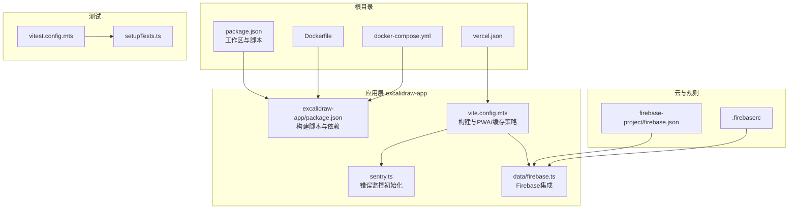
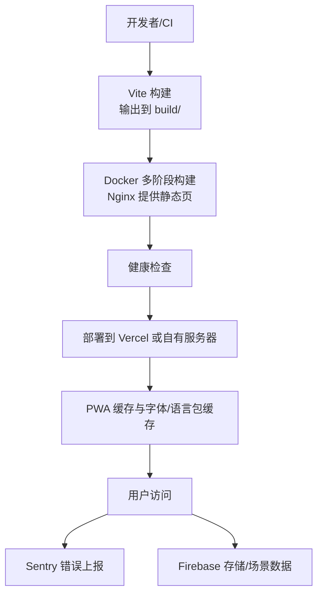
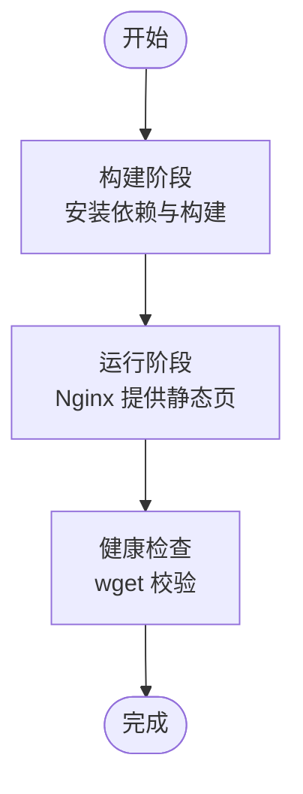
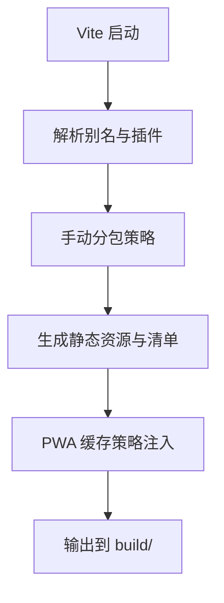
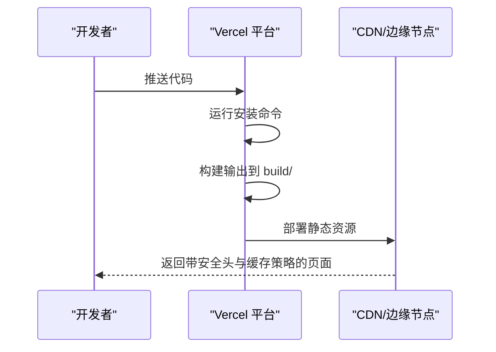
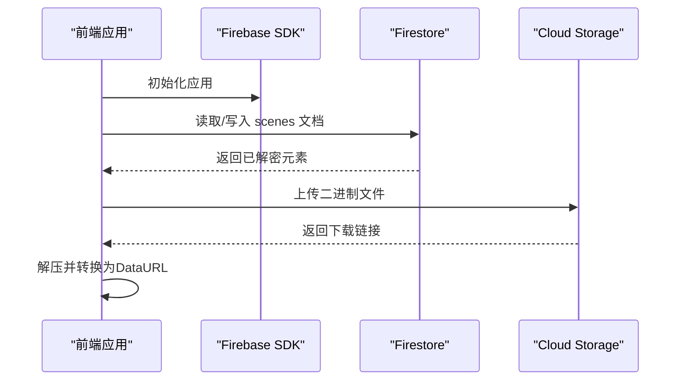
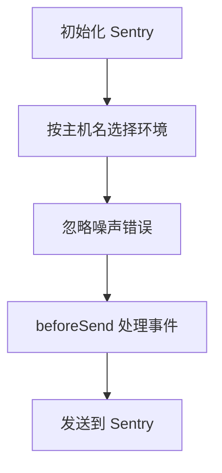
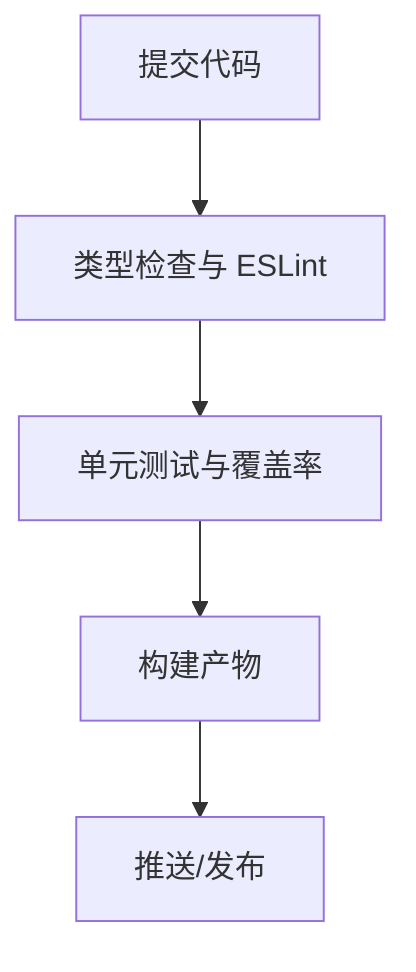
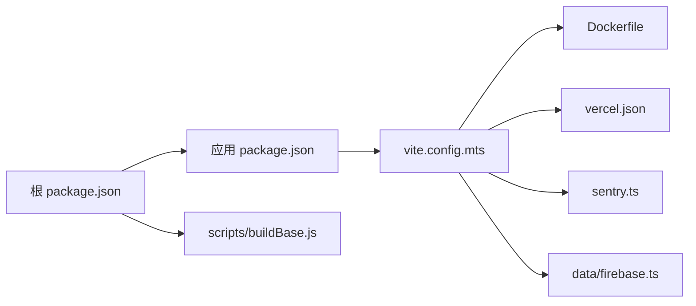

# 部署运维

<cite>
**本文引用的文件**
- [Dockerfile](file://Dockerfile)
- [docker-compose.yml](file://docker-compose.yml)
- [package.json](file://package.json)
- [excalidraw-app/package.json](file://excalidraw-app/package.json)
- [excalidraw-app/vite.config.mts](file://excalidraw-app/vite.config.mts)
- [excalidraw-app/sentry.ts](file://excalidraw-app/sentry.ts)
- [excalidraw-app/data/firebase.ts](file://excalidraw-app/data/firebase.ts)
- [firebase-project/firebase.json](file://firebase-project/firebase.json)
- [firebase-project/.firebaserc](file://firebase-project/.firebaserc)
- [vercel.json](file://vercel.json)
- [vitest.config.mts](file://vitest.config.mts)
- [setupTests.ts](file://setupTests.ts)
- [scripts/buildBase.js](file://scripts/buildBase.js)
</cite>

## 目录

1. [简介](#简介)
2. [项目结构](#项目结构)
3. [核心组件](#核心组件)
4. [架构总览](#架构总览)
5. [详细组件分析](#详细组件分析)
6. [依赖关系分析](#依赖关系分析)
7. [性能考量](#性能考量)
8. [故障排查指南](#故障排查指南)
9. [结论](#结论)
10. [附录](#附录)

## 简介

本指南面向运维团队，提供从开发到生产的完整部署与维护方案。内容覆盖容器化（Docker）、本地编排（docker-compose）、前端构建与静态资源分发（Vite/PWA）、云平台部署（Vercel）、Firebase 数据与存储配置、CI/CD 质量门禁（测试覆盖率与类型检查）、监控与日志（Sentry）、安全配置（HTTPS、CORS、安全头）以及备份与应急响应建议。文档以仓库现有配置为依据，结合实际代码实现进行说明。

## 项目结构

该仓库采用多包工作区（Yarn Workspaces），核心应用位于 excalidraw-app，包含前端源码、构建配置、PWA 与缓存策略；根目录提供 Dockerfile、docker-compose.yml、Vercel 配置与 Firebase 配置；测试框架使用 Vitest 并通过 setupTests.ts 提供浏览器环境模拟。

图表来源

- [package.json:1-96](file://package.json#L1-L96)
- [excalidraw-app/package.json:1-58](file://excalidraw-app/package.json#L1-L58)
- [excalidraw-app/vite.config.mts:1-319](file://excalidraw-app/vite.config.mts#L1-L319)
- [excalidraw-app/sentry.ts:1-95](file://excalidraw-app/sentry.ts#L1-L95)
- [excalidraw-app/data/firebase.ts:1-320](file://excalidraw-app/data/firebase.ts#L1-L320)
- [firebase-project/firebase.json:1-10](file://firebase-project/firebase.json#L1-L10)
- [firebase-project/.firebaserc:1-6](file://firebase-project/.firebaserc#L1-L6)
- [vercel.json:1-71](file://vercel.json#L1-L71)
- [vitest.config.mts:1-88](file://vitest.config.mts#L1-L88)
- [setupTests.ts:1-134](file://setupTests.ts#L1-L134)

章节来源

- [package.json:1-96](file://package.json#L1-L96)
- [excalidraw-app/package.json:1-58](file://excalidraw-app/package.json#L1-L58)
- [excalidraw-app/vite.config.mts:1-319](file://excalidraw-app/vite.config.mts#L1-L319)
- [excalidraw-app/sentry.ts:1-95](file://excalidraw-app/sentry.ts#L1-L95)
- [excalidraw-app/data/firebase.ts:1-320](file://excalidraw-app/data/firebase.ts#L1-L320)
- [firebase-project/firebase.json:1-10](file://firebase-project/firebase.json#L1-L10)
- [firebase-project/.firebaserc:1-6](file://firebase-project/.firebaserc#L1-L6)
- [vercel.json:1-71](file://vercel.json#L1-L71)
- [vitest.config.mts:1-88](file://vitest.config.mts#L1-L88)
- [setupTests.ts:1-134](file://setupTests.ts#L1-L134)

## 核心组件

- 构建与打包：Vite 配置定义输出目录、资源命名、手动分包与 PWA 缓存策略；根与应用层 package.json 提供统一与独立的构建脚本。
- 容器化：Dockerfile 使用多阶段构建，基于 Nginx 提供静态资源服务，并内置健康检查。
- 本地编排：docker-compose 将应用映射至 3000:80，挂载源码与依赖，便于开发调试。
- 云平台：Vercel 配置包含安全头、CORS、重定向与输出目录，适配前端静态站点托管。
- Firebase：通过 firebase.json 指定 Firestore 规则与索引、Storage 规则；应用侧通过 data/firebase.ts 初始化 SDK 并进行加密存储与读取。
- 监控与日志：Sentry 在线上环境按主机名映射初始化，忽略特定噪声错误，支持特性标志与控制台错误捕获。
- 测试与质量：Vitest 配置与 setupTests.ts 提供浏览器环境、覆盖率阈值与全局 mock，保障质量门禁。

章节来源

- [excalidraw-app/vite.config.mts:87-126](file://excalidraw-app/vite.config.mts#L87-L126)
- [excalidraw-app/vite.config.mts:150-221](file://excalidraw-app/vite.config.mts#L150-L221)
- [Dockerfile:1-21](file://Dockerfile#L1-L21)
- [docker-compose.yml:1-24](file://docker-compose.yml#L1-L24)
- [vercel.json:1-71](file://vercel.json#L1-L71)
- [firebase-project/firebase.json:1-10](file://firebase-project/firebase.json#L1-L10)
- [excalidraw-app/data/firebase.ts:44-79](file://excalidraw-app/data/firebase.ts#L44-L79)
- [excalidraw-app/sentry.ts:20-38](file://excalidraw-app/sentry.ts#L20-L38)
- [vitest.config.mts:74-85](file://vitest.config.mts#L74-L85)
- [setupTests.ts:1-134](file://setupTests.ts#L1-L134)

## 架构总览

下图展示从构建到运行的关键路径：本地或 CI 执行构建 → 产出静态资源 → 容器镜像构建与健康检查 → 云平台或自管服务器分发 → 前端通过 PWA 缓存与 Sentry 监控运行。

图表来源

- [excalidraw-app/vite.config.mts:87-126](file://excalidraw-app/vite.config.mts#L87-L126)
- [Dockerfile:16-21](file://Dockerfile#L16-L21)
- [vercel.json:68-70](file://vercel.json#L68-L70)
- [excalidraw-app/sentry.ts:1-95](file://excalidraw-app/sentry.ts#L1-L95)
- [excalidraw-app/data/firebase.ts:145-172](file://excalidraw-app/data/firebase.ts#L145-L172)

## 详细组件分析

### 容器化与本地编排

- Dockerfile
  - 多阶段构建：第一阶段安装依赖并执行生产构建；第二阶段基于 Nginx 提供静态资源服务。
  - 健康检查：对本地 80 端口发起 HTTP 请求验证可用性。
- docker-compose
  - 映射宿主源码与依赖至容器，便于热更新与开发调试。
  - 默认暴露 3000:80，便于本地预览。

图表来源

- [Dockerfile:1-21](file://Dockerfile#L1-L21)
- [docker-compose.yml:8-10](file://docker-compose.yml#L8-L10)

章节来源

- [Dockerfile:1-21](file://Dockerfile#L1-L21)
- [docker-compose.yml:1-24](file://docker-compose.yml#L1-L24)

### 前端构建与 PWA 缓存策略

- 输出目录与资源命名：构建输出至 build，woff2 字体单独归档，其他资源带哈希。
- 手动分包：将语言包、编辑器等模块拆分为独立 chunk，提升缓存命中率。
- PWA 缓存：字体、语言包、动态 chunk 分别缓存，最大文件尺寸限制，支持离线与更新。
- 开发体验：自动打开浏览器、端口可配置、类型检查与 ESLint 可开关。

图表来源

- [excalidraw-app/vite.config.mts:87-126](file://excalidraw-app/vite.config.mts#L87-L126)
- [excalidraw-app/vite.config.mts:150-221](file://excalidraw-app/vite.config.mts#L150-L221)

章节来源

- [excalidraw-app/vite.config.mts:1-319](file://excalidraw-app/vite.config.mts#L1-L319)

### 云平台部署（Vercel）

- 输出目录：指向 excalidraw-app/build。
- 安全头与 CORS：统一设置 X-Content-Type-Options、Referrer-Policy 等；针对 woff2 与特定字体文件设置缓存与跨域。
- 重定向：将特定路径转发至外部地址，或根据 Host 头重定向到 VS Code 市场。
- 安装命令：使用 yarn 安装依赖。

图表来源

- [vercel.json:68-70](file://vercel.json#L68-L70)
- [vercel.json:3-24](file://vercel.json#L3-L24)
- [vercel.json:26-50](file://vercel.json#L26-L50)
- [vercel.json:52-67](file://vercel.json#L52-L67)

章节来源

- [vercel.json:1-71](file://vercel.json#L1-L71)

### Firebase 配置与数据流

- 配置文件：firebase.json 指定 Firestore 规则与索引、Storage 规则；.firebaserc 指定默认项目。
- 应用集成：data/firebase.ts 初始化 Firebase，封装加密存储/读取、事务写入、文件上传与解压下载。
- 加密与一致性：使用 AES-GCM 对场景数据加密，基于事务保证并发一致性；文件上传设置缓存控制。

图表来源

- [excalidraw-app/data/firebase.ts:60-79](file://excalidraw-app/data/firebase.ts#L60-L79)
- [excalidraw-app/data/firebase.ts:187-247](file://excalidraw-app/data/firebase.ts#L187-L247)
- [excalidraw-app/data/firebase.ts:274-319](file://excalidraw-app/data/firebase.ts#L274-L319)
- [firebase-project/firebase.json:1-10](file://firebase-project/firebase.json#L1-L10)
- [firebase-project/.firebaserc:1-6](file://firebase-project/.firebaserc#L1-L6)

章节来源

- [excalidraw-app/data/firebase.ts:1-320](file://excalidraw-app/data/firebase.ts#L1-L320)
- [firebase-project/firebase.json:1-10](file://firebase-project/firebase.json#L1-L10)
- [firebase-project/.firebaserc:1-6](file://firebase-project/.firebaserc#L1-L6)

### 监控与日志（Sentry）

- 环境映射：按主机名映射到 production/staging，避免本地与容器内噪音上报。
- 忽略列表：过滤 Safari IndexedDB、localStorage 配额、动态导入失败等常见噪声。
- 特性标志：集成 Feature Flags，支持运行时开关。
- 控制台错误：captureConsoleIntegration 捕获 console.error 并作为异常事件上报。

图表来源

- [excalidraw-app/sentry.ts:5-38](file://excalidraw-app/sentry.ts#L5-L38)
- [excalidraw-app/sentry.ts:39-82](file://excalidraw-app/sentry.ts#L39-L82)

章节来源

- [excalidraw-app/sentry.ts:1-95](file://excalidraw-app/sentry.ts#L1-L95)

### CI/CD 流程与质量门禁

- 质量门禁：根 package.json 提供测试与类型检查脚本；vitest.config.mts 定义覆盖率阈值与报告格式。
- 浏览器环境：setupTests.ts 提供 jsdom、IndexedDB、字体加载等 mock，确保测试稳定性。
- 构建脚本：根与应用层分别提供构建与版本脚本，Docker 构建关闭 Sentry 上报以避免本地噪音。

图表来源

- [package.json:67-76](file://package.json#L67-L76)
- [vitest.config.mts:74-85](file://vitest.config.mts#L74-L85)
- [setupTests.ts:1-134](file://setupTests.ts#L1-L134)
- [excalidraw-app/package.json:45-48](file://excalidraw-app/package.json#L45-L48)

章节来源

- [package.json:67-76](file://package.json#L67-L76)
- [vitest.config.mts:1-88](file://vitest.config.mts#L1-L88)
- [setupTests.ts:1-134](file://setupTests.ts#L1-L134)
- [excalidraw-app/package.json:45-48](file://excalidraw-app/package.json#L45-L48)

### 安全配置（HTTPS、CORS、安全头）

- HTTPS：由 Vercel/CDN 层提供 TLS 终止，无需在应用内重复处理。
- CORS：针对 woff2 与特定字体设置 Access-Control-Allow-Origin；全局设置 Referrer-Policy、X-Content-Type-Options 等。
- 安全头：统一注入 nosniff、Referrer-Policy 等，减少常见攻击面。

章节来源

- [vercel.json:3-24](file://vercel.json#L3-L24)
- [vercel.json:26-50](file://vercel.json#L26-L50)

### 备份策略、灾难恢复与应急响应

- 数据备份
  - Firestore：定期导出规则与索引，结合 Firebase CLI 或第三方工具进行快照备份。
  - Cloud Storage：对重要文件建立版本化存储桶，保留历史版本以便回滚。
- 应急响应
  - 建立变更审批与回滚机制，优先回退到上一个稳定版本。
  - 结合 Sentry 的错误趋势与告警，快速定位问题根因。
- 灾难恢复
  - 准备最小可用环境（容器镜像 + 配置文件），在 24 小时内恢复服务。
  - 验证点：静态资源可访问、PWA 缓存命中、Firebase 写入/读取正常。

[本节为通用运维建议，不直接分析具体文件，故无“章节来源”]

## 依赖关系分析

- 工作区与脚本：根 package.json 管理工作区与统一脚本；应用层 package.json 提供独立构建与启动脚本。
- 构建链路：Vite 配置决定产物结构；Dockerfile 与 Vercel 配置决定部署形态。
- 监控与测试：Sentry 与 Vitest 形成运行期与开发期的质量闭环。

图表来源

- [package.json:1-96](file://package.json#L1-L96)
- [excalidraw-app/package.json:1-58](file://excalidraw-app/package.json#L1-L58)
- [scripts/buildBase.js:1-55](file://scripts/buildBase.js#L1-L55)
- [excalidraw-app/vite.config.mts:1-319](file://excalidraw-app/vite.config.mts#L1-L319)
- [Dockerfile:1-21](file://Dockerfile#L1-L21)
- [vercel.json:1-71](file://vercel.json#L1-L71)
- [excalidraw-app/sentry.ts:1-95](file://excalidraw-app/sentry.ts#L1-L95)
- [excalidraw-app/data/firebase.ts:1-320](file://excalidraw-app/data/firebase.ts#L1-L320)

章节来源

- [package.json:1-96](file://package.json#L1-L96)
- [excalidraw-app/package.json:1-58](file://excalidraw-app/package.json#L1-L58)
- [scripts/buildBase.js:1-55](file://scripts/buildBase.js#L1-L55)
- [excalidraw-app/vite.config.mts:1-319](file://excalidraw-app/vite.config.mts#L1-L319)
- [Dockerfile:1-21](file://Dockerfile#L1-L21)
- [vercel.json:1-71](file://vercel.json#L1-L71)
- [excalidraw-app/sentry.ts:1-95](file://excalidraw-app/sentry.ts#L1-L95)
- [excalidraw-app/data/firebase.ts:1-320](file://excalidraw-app/data/firebase.ts#L1-L320)

## 性能考量

- 资源缓存：PWA 对字体、语言包与动态 chunk 实施不同缓存策略，降低重复下载与首屏延迟。
- 构建优化：手动分包与资源命名哈希，提升缓存命中与长缓存效果。
- 静态服务：Nginx 提供高效静态资源服务，健康检查保障实例可用性。
- 监控反馈：Sentry 的错误与性能指标可用于识别慢查询与异常路径。

[本节提供通用指导，不直接分析具体文件，故无“章节来源”]

## 故障排查指南

- 构建失败
  - 检查 Vite 配置与别名是否正确，确认手动分包与资源命名规则。
  - 若使用 Docker，确认多阶段构建顺序与缓存键一致。
- 静态资源不可用
  - 核对 vercel.json 的 outputDirectory 与安装命令；确认 Nginx 静态目录映射。
- Firebase 写入/读取异常
  - 检查 .firebaserc 项目配置与规则文件；确认事务写入与解密流程。
- 错误上报异常
  - 检查 Sentry 环境映射与忽略列表；确认 beforeSend 逻辑未过滤有效错误。
- 测试不稳定
  - 确认 setupTests.ts 的 mock 是否覆盖了关键 API；关注覆盖率阈值变化。

章节来源

- [excalidraw-app/vite.config.mts:87-126](file://excalidraw-app/vite.config.mts#L87-L126)
- [Dockerfile:16-21](file://Dockerfile#L16-L21)
- [vercel.json:68-70](file://vercel.json#L68-L70)
- [firebase-project/.firebaserc:1-6](file://firebase-project/.firebaserc#L1-L6)
- [excalidraw-app/sentry.ts:20-38](file://excalidraw-app/sentry.ts#L20-L38)
- [setupTests.ts:1-134](file://setupTests.ts#L1-L134)

## 结论

本指南基于仓库现有配置与实现，给出了从构建、容器化、云平台部署到监控与安全的完整运维路径。建议在生产环境中结合 Sentry 的错误趋势、Vercel 的缓存与安全头策略、Firebase 的规则与备份机制，形成稳定可靠的交付流水线。

[本节为总结性内容，不直接分析具体文件，故无“章节来源”]

## 附录

- 关键配置要点速览
  - 构建：输出目录、手动分包、PWA 缓存策略
  - 容器：多阶段构建、Nginx 静态服务、健康检查
  - 云平台：输出目录、安全头、CORS、重定向
  - Firebase：规则与索引、项目配置、加密存储
  - 监控：环境映射、忽略噪声、特性标志
  - 质量：覆盖率阈值、浏览器环境 mock

[本节为概览性内容，不直接分析具体文件，故无“章节来源”]
