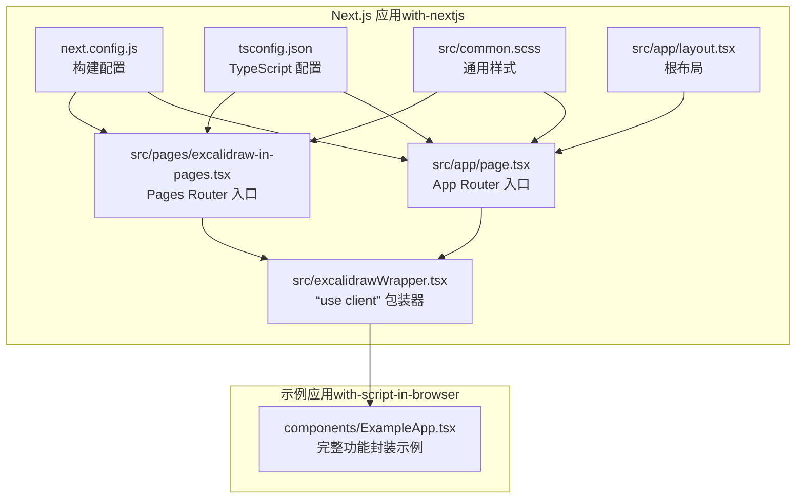
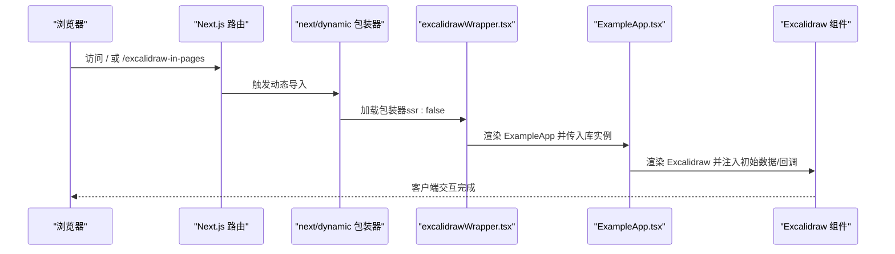
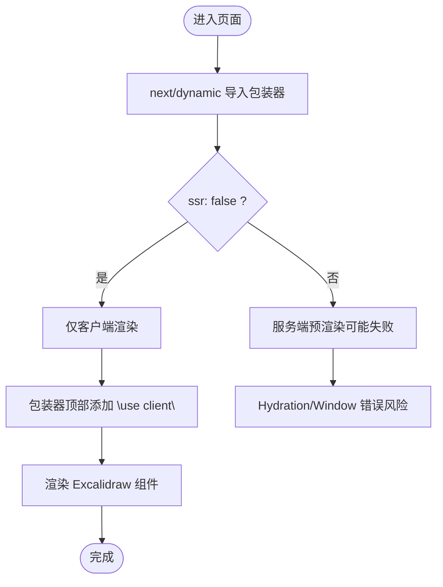
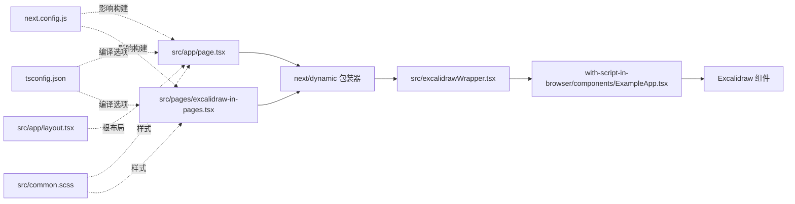

# Next.js 集成

<cite>
**本文引用的文件**
- [examples/with-nextjs/README.md](file://examples/with-nextjs/README.md)
- [examples/with-nextjs/package.json](file://examples/with-nextjs/package.json)
- [examples/with-nextjs/tsconfig.json](file://examples/with-nextjs/tsconfig.json)
- [examples/with-nextjs/next.config.js](file://examples/with-nextjs/next.config.js)
- [examples/with-nextjs/src/app/layout.tsx](file://examples/with-nextjs/src/app/layout.tsx)
- [examples/with-nextjs/src/app/page.tsx](file://examples/with-nextjs/src/app/page.tsx)
- [examples/with-nextjs/src/pages/excalidraw-in-pages.tsx](file://examples/with-nextjs/src/pages/excalidraw-in-pages.tsx)
- [examples/with-nextjs/src/excalidrawWrapper.tsx](file://examples/with-nextjs/src/excalidrawWrapper.tsx)
- [examples/with-nextjs/src/common.scss](file://examples/with-nextjs/src/common.scss)
- [dev-docs/docs/@excalidraw/excalidraw/integration.mdx](file://dev-docs/docs/@excalidraw/excalidraw/integration.mdx)
- [dev-docs/docs/@excalidraw/excalidraw/installation.mdx](file://dev-docs/docs/@excalidraw/excalidraw/installation.mdx)
- [examples/with-script-in-browser/components/ExampleApp.tsx](file://examples/with-script-in-browser/components/ExampleApp.tsx)
</cite>

## 目录
1. [简介](#简介)
2. [项目结构](#项目结构)
3. [核心组件](#核心组件)
4. [架构总览](#架构总览)
5. [详细组件分析](#详细组件分析)
6. [依赖关系分析](#依赖关系分析)
7. [性能考量](#性能考量)
8. [故障排查指南](#故障排查指南)
9. [结论](#结论)
10. [附录：完整集成流程](#附录完整集成流程)

## 简介
本文件面向在 Next.js 中集成 Excalidraw 的开发者，系统讲解以下内容：
- Next.js 动态导入的原理与实现（ssr: false、客户端渲染）
- App Router 与 Pages Router 的差异化集成方式
- use client 指令的作用与最佳实践
- 样式与资源路径（字体）的自托管与 EXCALIDRAW_ASSET_PATH 设置
- 构建配置、TypeScript 与 Next.js 的协同要点
- 性能优化、代码分割与缓存策略
- 常见问题定位与解决（hydration 错误、样式冲突、构建失败）

## 项目结构
该仓库提供了完整的 Next.js 示例工程，包含 App Router 与 Pages Router 两种入口页面，并通过动态导入将 Excalidraw 客户端化渲染。

图表来源
- [examples/with-nextjs/src/app/page.tsx:1-28](file://examples/with-nextjs/src/app/page.tsx#L1-L28)
- [examples/with-nextjs/src/pages/excalidraw-in-pages.tsx:1-24](file://examples/with-nextjs/src/pages/excalidraw-in-pages.tsx#L1-L24)
- [examples/with-nextjs/src/excalidrawWrapper.tsx:1-24](file://examples/with-nextjs/src/excalidrawWrapper.tsx#L1-L24)
- [examples/with-nextjs/next.config.js:1-13](file://examples/with-nextjs/next.config.js#L1-L13)
- [examples/with-nextjs/tsconfig.json:1-29](file://examples/with-nextjs/tsconfig.json#L1-L29)
- [examples/with-nextjs/src/common.scss:1-16](file://examples/with-nextjs/src/common.scss#L1-L16)
- [examples/with-nextjs/src/app/layout.tsx:1-12](file://examples/with-nextjs/src/app/layout.tsx#L1-L12)
- [examples/with-script-in-browser/components/ExampleApp.tsx:1-800](file://examples/with-script-in-browser/components/ExampleApp.tsx#L1-L800)

章节来源
- [examples/with-nextjs/README.md:1-37](file://examples/with-nextjs/README.md#L1-L37)
- [examples/with-nextjs/package.json:1-27](file://examples/with-nextjs/package.json#L1-L27)
- [examples/with-nextjs/next.config.js:1-13](file://examples/with-nextjs/next.config.js#L1-L13)
- [examples/with-nextjs/tsconfig.json:1-29](file://examples/with-nextjs/tsconfig.json#L1-L29)

## 核心组件
- 动态导入包装器：在 App Router 中，需要在包装器文件顶部添加 “use client”，并通过 next/dynamic(ssr: false) 将其仅在客户端渲染。
- App Router 页面：使用 next/dynamic 导入包装器，并注入资源路径脚本以支持自托管字体。
- Pages Router 页面：同样使用 next/dynamic 导入包装器，但无需 “use client”。
- 样式与布局：通过 common.scss 提供基础样式；根布局 layout.tsx 提供 html/body 结构。
- TypeScript 与 Next 配置：tsconfig.json 使用 preserve jsx 并启用 Next 插件；next.config.js 配置 distDir、忽略 TS 构建错误以及 transpilePackages。

章节来源
- [examples/with-nextjs/src/excalidrawWrapper.tsx:1-24](file://examples/with-nextjs/src/excalidrawWrapper.tsx#L1-L24)
- [examples/with-nextjs/src/app/page.tsx:1-28](file://examples/with-nextjs/src/app/page.tsx#L1-L28)
- [examples/with-nextjs/src/pages/excalidraw-in-pages.tsx:1-24](file://examples/with-nextjs/src/pages/excalidraw-in-pages.tsx#L1-L24)
- [examples/with-nextjs/src/common.scss:1-16](file://examples/with-nextjs/src/common.scss#L1-L16)
- [examples/with-nextjs/src/app/layout.tsx:1-12](file://examples/with-nextjs/src/app/layout.tsx#L1-L12)
- [examples/with-nextjs/tsconfig.json:1-29](file://examples/with-nextjs/tsconfig.json#L1-L29)
- [examples/with-nextjs/next.config.js:1-13](file://examples/with-nextjs/next.config.js#L1-L13)

## 架构总览
下图展示了 App Router 与 Pages Router 的渲染路径，以及动态导入如何确保 Excalidraw 在客户端执行。

图表来源
- [examples/with-nextjs/src/app/page.tsx:1-28](file://examples/with-nextjs/src/app/page.tsx#L1-L28)
- [examples/with-nextjs/src/pages/excalidraw-in-pages.tsx:1-24](file://examples/with-nextjs/src/pages/excalidraw-in-pages.tsx#L1-L24)
- [examples/with-nextjs/src/excalidrawWrapper.tsx:1-24](file://examples/with-nextjs/src/excalidrawWrapper.tsx#L1-L24)
- [examples/with-script-in-browser/components/ExampleApp.tsx:1-800](file://examples/with-script-in-browser/components/ExampleApp.tsx#L1-L800)

## 详细组件分析

### 动态导入与 SSR 禁用
- App Router：在页面中使用 next/dynamic 导入包装器，并设置 ssr: false，避免服务端预渲染导致的 window 不存在等错误。
- Pages Router：同样使用 next/dynamic 导入包装器，但无需 “use client”。
- 包装器：在包装器文件顶部添加 “use client”，声明该模块为客户端组件，使动态导入生效。

图表来源
- [examples/with-nextjs/src/app/page.tsx:8-13](file://examples/with-nextjs/src/app/page.tsx#L8-L13)
- [examples/with-nextjs/src/pages/excalidraw-in-pages.tsx:7-12](file://examples/with-nextjs/src/pages/excalidraw-in-pages.tsx#L7-L12)
- [examples/with-nextjs/src/excalidrawWrapper.tsx:1-1](file://examples/with-nextjs/src/excalidrawWrapper.tsx#L1-L1)

章节来源
- [examples/with-nextjs/src/app/page.tsx:1-28](file://examples/with-nextjs/src/app/page.tsx#L1-L28)
- [examples/with-nextjs/src/pages/excalidraw-in-pages.tsx:1-24](file://examples/with-nextjs/src/pages/excalidraw-in-pages.tsx#L1-L24)
- [examples/with-nextjs/src/excalidrawWrapper.tsx:1-24](file://examples/with-nextjs/src/excalidrawWrapper.tsx#L1-L24)

### App Router 与 Pages Router 的差异
- App Router：页面文件位于 src/app/page.tsx，使用 next/dynamic 导入包装器；根布局在 src/app/layout.tsx。
- Pages Router：页面文件位于 src/pages/excalidraw-in-pages.tsx，同样使用 next/dynamic 导入包装器。
- 关键差异：App Router 中的包装器需添加 “use client”，而 Pages Router 可直接导入包装器并动态加载。

章节来源
- [examples/with-nextjs/src/app/page.tsx:1-28](file://examples/with-nextjs/src/app/page.tsx#L1-L28)
- [examples/with-nextjs/src/pages/excalidraw-in-pages.tsx:1-24](file://examples/with-nextjs/src/pages/excalidraw-in-pages.tsx#L1-L24)
- [examples/with-nextjs/src/app/layout.tsx:1-12](file://examples/with-nextjs/src/app/layout.tsx#L1-L12)

### use client 指令与动态导入最佳实践
- 在包装器文件顶部添加 “use client”，确保动态导入仅在客户端执行。
- 使用 next/dynamic 并设置 ssr: false，避免服务端渲染期间访问浏览器 API。
- 对于仅导出组件的场景，可直接动态导入目标组件；若需要同时导入工具函数或常量，推荐使用包装器模式。

章节来源
- [examples/with-nextjs/src/excalidrawWrapper.tsx:1-24](file://examples/with-nextjs/src/excalidrawWrapper.tsx#L1-L24)
- [dev-docs/docs/@excalidraw/excalidraw/integration.mdx:33-131](file://dev-docs/docs/@excalidraw/excalidraw/integration.mdx#L33-L131)

### 样式与资源路径（字体）
- 引入样式：在页面中引入 common.scss，保证容器尺寸与基础样式一致。
- 字体自托管：复制字体目录至 public，并设置 window.EXCALIDRAW_ASSET_PATH；在 Next.js 中可通过 next/script 的 strategy="beforeInteractive" 注入脚本。
- 文档建议：若不自托管，可使用默认 CDN；若自托管，务必同步更新资源路径。

章节来源
- [examples/with-nextjs/src/common.scss:1-16](file://examples/with-nextjs/src/common.scss#L1-L16)
- [examples/with-nextjs/src/app/page.tsx:20-22](file://examples/with-nextjs/src/app/page.tsx#L20-L22)
- [dev-docs/docs/@excalidraw/excalidraw/installation.mdx:19-47](file://dev-docs/docs/@excalidraw/excalidraw/installation.mdx#L19-L47)

### TypeScript 与 Next.js 配置要点
- tsconfig.json：启用 isolatedModules、jsx: "preserve"，并使用 Next 插件；路径别名 @/* 指向 src。
- next.config.js：设置 distDir、ignoreBuildErrors（TS 与 jsx: preserve 冲突时的临时规避）、transpilePackages（允许跨包转译）。

章节来源
- [examples/with-nextjs/tsconfig.json:1-29](file://examples/with-nextjs/tsconfig.json#L1-L29)
- [examples/with-nextjs/next.config.js:1-13](file://examples/with-nextjs/next.config.js#L1-L13)

### 包装器与完整功能示例
- 包装器：导入 Excalidraw 库与样式，向外暴露一个包含 UI 扩展与回调的容器组件。
- 示例应用：ExampleApp.tsx 展示了如何注入初始数据、处理事件回调、切换主题与视图模式、集成侧边栏与菜单等高级用法。

章节来源
- [examples/with-nextjs/src/excalidrawWrapper.tsx:1-24](file://examples/with-nextjs/src/excalidrawWrapper.tsx#L1-L24)
- [examples/with-script-in-browser/components/ExampleApp.tsx:1-800](file://examples/with-script-in-browser/components/ExampleApp.tsx#L1-L800)

## 依赖关系分析
- 页面依赖动态导入包装器，包装器再依赖 ExampleApp 与 Excalidraw。
- next.config.js 影响打包与类型检查行为，tsconfig.json 影响编译与路径解析。
- 样式通过 common.scss 提供全局样式，布局通过 layout.tsx 提供根结构。

图表来源
- [examples/with-nextjs/src/app/page.tsx:1-28](file://examples/with-nextjs/src/app/page.tsx#L1-L28)
- [examples/with-nextjs/src/pages/excalidraw-in-pages.tsx:1-24](file://examples/with-nextjs/src/pages/excalidraw-in-pages.tsx#L1-L24)
- [examples/with-nextjs/src/excalidrawWrapper.tsx:1-24](file://examples/with-nextjs/src/excalidrawWrapper.tsx#L1-L24)
- [examples/with-script-in-browser/components/ExampleApp.tsx:1-800](file://examples/with-script-in-browser/components/ExampleApp.tsx#L1-L800)
- [examples/with-nextjs/next.config.js:1-13](file://examples/with-nextjs/next.config.js#L1-L13)
- [examples/with-nextjs/tsconfig.json:1-29](file://examples/with-nextjs/tsconfig.json#L1-L29)
- [examples/with-nextjs/src/common.scss:1-16](file://examples/with-nextjs/src/common.scss#L1-L16)
- [examples/with-nextjs/src/app/layout.tsx:1-12](file://examples/with-nextjs/src/app/layout.tsx#L1-L12)

章节来源
- [examples/with-nextjs/package.json:1-27](file://examples/with-nextjs/package.json#L1-L27)

## 性能考量
- 代码分割：通过 next/dynamic(ssr: false) 将 Excalidraw 组件按需加载，减少首屏体积。
- 资源路径：自托管字体时，合理设置 EXCALIDRAW_ASSET_PATH，避免重复下载与网络抖动。
- 构建优化：保持 jsx: "preserve" 与 Next 插件配合；必要时使用 ignoreBuildErrors 临时规避类型冲突。
- 运行时优化：在包装器中仅传递必要的 props，避免不必要的重渲染。

## 故障排查指南
- Hydration 错误
  - 现象：服务端与客户端渲染不一致导致报错。
  - 排查：确认页面已使用 next/dynamic 并设置 ssr: false；包装器已添加 “use client”；未在服务端访问浏览器 API。
  - 参考：动态导入与 “use client” 的使用路径。

- 样式冲突
  - 现象：Excalidraw UI 与应用样式相互影响。
  - 排查：检查 common.scss 是否正确引入；确认容器具有明确宽高；避免全局样式覆盖 UI 组件。
  - 参考：样式文件与容器尺寸要求。

- 构建失败（TS 与 jsx: preserve 冲突）
  - 现象：TypeScript 报错，与 Next 的 jsx 处理策略冲突。
  - 排查：next.config.js 中设置 ignoreBuildErrors；或调整 tsconfig 的 jsx 与插件配置。
  - 参考：构建配置与 TS 配置。

- 字体加载异常
  - 现象：字体未加载或加载缓慢。
  - 排查：确认已复制字体至 public；设置 EXCALIDRAW_ASSET_PATH；在 Next.js 中通过 next/script beforeInteractive 注入。
  - 参考：安装与字体自托管文档。

章节来源
- [examples/with-nextjs/src/app/page.tsx:1-28](file://examples/with-nextjs/src/app/page.tsx#L1-L28)
- [examples/with-nextjs/src/pages/excalidraw-in-pages.tsx:1-24](file://examples/with-nextjs/src/pages/excalidraw-in-pages.tsx#L1-L24)
- [examples/with-nextjs/src/excalidrawWrapper.tsx:1-24](file://examples/with-nextjs/src/excalidrawWrapper.tsx#L1-L24)
- [examples/with-nextjs/src/common.scss:1-16](file://examples/with-nextjs/src/common.scss#L1-L16)
- [examples/with-nextjs/next.config.js:1-13](file://examples/with-nextjs/next.config.js#L1-L13)
- [examples/with-nextjs/tsconfig.json:1-29](file://examples/with-nextjs/tsconfig.json#L1-L29)
- [dev-docs/docs/@excalidraw/excalidraw/installation.mdx:19-47](file://dev-docs/docs/@excalidraw/excalidraw/installation.mdx#L19-L47)

## 结论
在 Next.js 中集成 Excalidraw 的关键在于：
- 使用 next/dynamic 并禁用 SSR，确保客户端渲染；
- 在 App Router 中为包装器添加 “use client”；
- 正确处理样式与字体资源路径；
- 合理配置 TypeScript 与 Next.js，平衡构建稳定性与开发体验。

## 附录：完整集成流程
- 初始化项目：参考示例项目的 package.json 与 README，安装依赖并启动开发服务器。
- 创建页面：在 App Router 下创建 src/app/page.tsx，在 Pages Router 下创建 src/pages/excalidraw-in-pages.tsx。
- 创建包装器：在 src/excalidrawWrapper.tsx 中添加 “use client”，导入 Excalidraw 与样式。
- 引入动态导入：在页面中使用 next/dynamic 导入包装器，并设置 ssr: false。
- 注入资源路径：在 App Router 页面中通过 next/script 注入 EXCALIDRAW_ASSET_PATH。
- 自托管字体（可选）：复制字体目录至 public，并设置资源路径。
- 样式与布局：引入 common.scss，确保容器尺寸；在 App Router 中使用 layout.tsx。
- 构建与运行：根据 next.config.js 与 tsconfig.json 的配置进行构建与预览。

章节来源
- [examples/with-nextjs/README.md:1-37](file://examples/with-nextjs/README.md#L1-L37)
- [examples/with-nextjs/package.json:1-27](file://examples/with-nextjs/package.json#L1-L27)
- [examples/with-nextjs/src/app/page.tsx:1-28](file://examples/with-nextjs/src/app/page.tsx#L1-L28)
- [examples/with-nextjs/src/pages/excalidraw-in-pages.tsx:1-24](file://examples/with-nextjs/src/pages/excalidraw-in-pages.tsx#L1-L24)
- [examples/with-nextjs/src/excalidrawWrapper.tsx:1-24](file://examples/with-nextjs/src/excalidrawWrapper.tsx#L1-L24)
- [examples/with-nextjs/src/common.scss:1-16](file://examples/with-nextjs/src/common.scss#L1-L16)
- [examples/with-nextjs/src/app/layout.tsx:1-12](file://examples/with-nextjs/src/app/layout.tsx#L1-L12)
- [examples/with-nextjs/next.config.js:1-13](file://examples/with-nextjs/next.config.js#L1-L13)
- [examples/with-nextjs/tsconfig.json:1-29](file://examples/with-nextjs/tsconfig.json#L1-L29)
- [dev-docs/docs/@excalidraw/excalidraw/installation.mdx:19-47](file://dev-docs/docs/@excalidraw/excalidraw/installation.mdx#L19-L47)