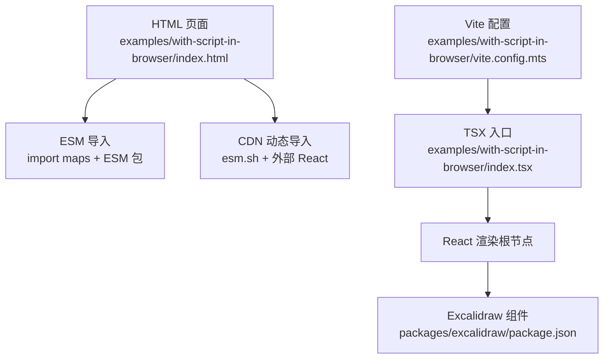
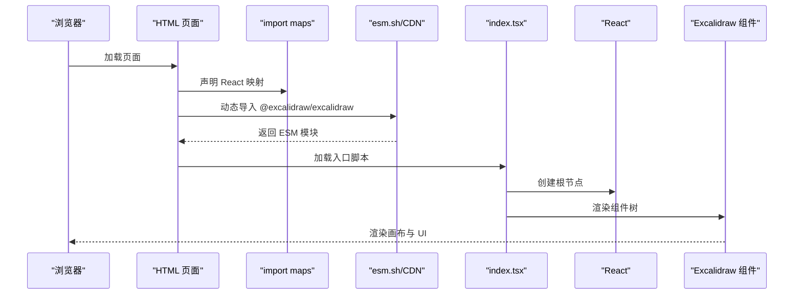
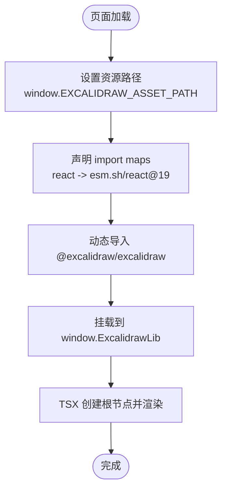
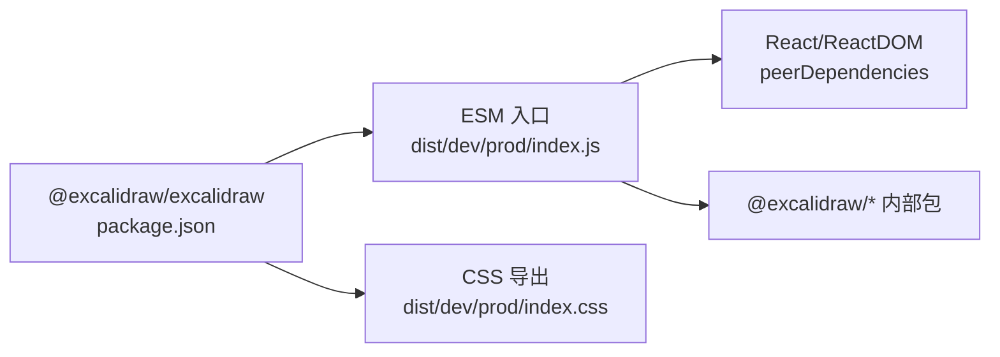

# 浏览器脚本集成

<cite>
**本文引用的文件**
- [examples/with-script-in-browser/index.html](file://examples/with-script-in-browser/index.html)
- [examples/with-script-in-browser/index.tsx](file://examples/with-script-in-browser/index.tsx)
- [examples/with-script-in-browser/components/ExampleApp.tsx](file://examples/with-script-in-browser/components/ExampleApp.tsx)
- [examples/with-script-in-browser/package.json](file://examples/with-script-in-browser/package.json)
- [examples/with-script-in-browser/vite.config.mts](file://examples/with-script-in-browser/vite.config.mts)
- [dev-docs/docs/@excalidraw/excalidraw/integration.mdx](file://dev-docs/docs/@excalidraw/excalidraw/integration.mdx)
- [dev-docs/docs/@excalidraw/excalidraw/installation.mdx](file://dev-docs/docs/@excalidraw/excalidraw/installation.mdx)
- [dev-docs/docs/@excalidraw/excalidraw/faq.mdx](file://dev-docs/docs/@excalidraw/excalidraw/faq.mdx)
- [dev-docs/docs/@excalidraw/excalidraw/customizing-styles.mdx](file://dev-docs/docs/@excalidraw/excalidraw/customizing-styles.mdx)
- [packages/excalidraw/package.json](file://packages/excalidraw/package.json)
- [scripts/buildPackage.js](file://scripts/buildPackage.js)
- [public/service-worker.js](file://public/service-worker.js)
</cite>

## 目录
1. [简介](#简介)
2. [项目结构](#项目结构)
3. [核心组件](#核心组件)
4. [架构总览](#架构总览)
5. [详细组件分析](#详细组件分析)
6. [依赖关系分析](#依赖关系分析)
7. [性能与离线考虑](#性能与离线考虑)
8. [故障排查指南](#故障排查指南)
9. [结论](#结论)
10. [附录：完整HTML示例与最佳实践](#附录完整html示例与最佳实践)

## 简介
本文件面向希望在传统 HTML 页面中直接集成 Excalidraw 组件的开发者，系统讲解以下主题：
- 在浏览器中通过 import maps、CDN 引入与 UMD 构建进行集成
- 浏览器环境下的依赖管理（React 版本兼容性、ESM/CJS 处理）
- 完整的 HTML 页面示例（从基础到高级功能）
- 浏览器特有问题与解决方案（CORS、资源加载、跨域）
- 性能优化、缓存策略与离线支持
- 调试技巧与常见错误排查（模块解析失败、版本冲突、运行时错误）

## 项目结构
围绕浏览器脚本集成，本仓库提供了三种典型路径：
- 使用 ESM + import maps 的纯浏览器直连方式
- 使用 CDN 动态导入与外部 React 的方式
- 使用打包工具（Vite）在本地开发与构建中的集成方式

图表来源
- [examples/with-script-in-browser/index.html:1-32](file://examples/with-script-in-browser/index.html#L1-L32)
- [examples/with-script-in-browser/index.tsx:1-30](file://examples/with-script-in-browser/index.tsx#L1-L30)
- [packages/excalidraw/package.json:1-141](file://packages/excalidraw/package.json#L1-L141)
- [examples/with-script-in-browser/vite.config.mts:1-20](file://examples/with-script-in-browser/vite.config.mts#L1-L20)

章节来源
- [examples/with-script-in-browser/index.html:1-32](file://examples/with-script-in-browser/index.html#L1-L32)
- [examples/with-script-in-browser/index.tsx:1-30](file://examples/with-script-in-browser/index.tsx#L1-L30)
- [examples/with-script-in-browser/package.json:1-23](file://examples/with-script-in-browser/package.json#L1-L23)
- [examples/with-script-in-browser/vite.config.mts:1-20](file://examples/with-script-in-browser/vite.config.mts#L1-L20)
- [packages/excalidraw/package.json:1-141](file://packages/excalidraw/package.json#L1-L141)

## 核心组件
- Excalidraw 组件导出与入口
  - 包含 ESM 入口、CSS 导出、类型声明等，支持在浏览器中以 ESM 方式直接引入或通过 CDN 引用。
- 示例应用与高级功能演示
  - 提供了包含侧边栏、菜单、协作触发器、库管理、导出复制等高级功能的示例封装。

章节来源
- [packages/excalidraw/package.json:1-141](file://packages/excalidraw/package.json#L1-L141)
- [examples/with-script-in-browser/components/ExampleApp.tsx:1-971](file://examples/with-script-in-browser/components/ExampleApp.tsx#L1-L971)

## 架构总览
下图展示了浏览器端集成的关键交互：页面通过 import maps 或 CDN 将 Excalidraw 与 React 绑定，随后由 TSX 入口创建根节点并渲染组件树。

图表来源
- [examples/with-script-in-browser/index.html:185-193](file://examples/with-script-in-browser/index.html#L185-L193)
- [examples/with-script-in-browser/index.html:23-29](file://examples/with-script-in-browser/index.html#L23-L29)
- [examples/with-script-in-browser/index.tsx:16-30](file://examples/with-script-in-browser/index.tsx#L16-L30)

## 详细组件分析

### 浏览器直连集成（import maps + ESM）
- 关键点
  - 使用 import maps 将 react、react/jsx-runtime、react-dom 指向 CDN，避免重复打包与版本冲突
  - 设置窗口变量以指向资源路径，确保字体与资源正确加载
  - 通过 ESM 模块导入 Excalidraw 并挂载到全局窗口对象以便后续使用
- 实现要点
  - 在 head 中声明 import map，并设置资源前缀
  - 在 body 中以模块脚本形式导入并挂载库
  - 在本地 TSX 入口中读取全局库并渲染

图表来源
- [examples/with-script-in-browser/index.html:12-16](file://examples/with-script-in-browser/index.html#L12-L16)
- [examples/with-script-in-browser/index.html:185-193](file://examples/with-script-in-browser/index.html#L185-L193)
- [examples/with-script-in-browser/index.html:23-29](file://examples/with-script-in-browser/index.html#L23-L29)
- [examples/with-script-in-browser/index.tsx:16-30](file://examples/with-script-in-browser/index.tsx#L16-L30)

章节来源
- [dev-docs/docs/@excalidraw/excalidraw/integration.mdx:159-241](file://dev-docs/docs/@excalidraw/excalidraw/integration.mdx#L159-L241)
- [examples/with-script-in-browser/index.html:12-16](file://examples/with-script-in-browser/index.html#L12-L16)
- [examples/with-script-in-browser/index.html:185-193](file://examples/with-script-in-browser/index.html#L185-L193)
- [examples/with-script-in-browser/index.html:23-29](file://examples/with-script-in-browser/index.html#L23-L29)
- [examples/with-script-in-browser/index.tsx:16-30](file://examples/with-script-in-browser/index.tsx#L16-L30)

### CDN 动态导入（esm.sh + 外部 React）
- 关键点
  - 通过 esm.sh 直接以 ESM 形式导入 @excalidraw/excalidraw，并声明 external 以避免内联 React
  - 同时显式导入 react 与 react-dom，保证 JSX 运行时可用
- 适用场景
  - 不需要打包工具、快速验证或最小化示例

章节来源
- [dev-docs/docs/@excalidraw/excalidraw/integration.mdx:209-235](file://dev-docs/docs/@excalidraw/excalidraw/integration.mdx#L209-L235)

### UMD 构建与 Preact 兼容
- 关键点
  - 包默认提供 ESM 构建；UMD 构建内联了 React JSX Runtime 与 ReactDOM
  - 若使用 Preact，需设置环境变量以切换至 Preact 构建
  - 打包工具（如 Vite）需确保 process 可用，可通过 define 注入环境变量

章节来源
- [dev-docs/docs/@excalidraw/excalidraw/integration.mdx:138-157](file://dev-docs/docs/@excalidraw/excalidraw/integration.mdx#L138-L157)
- [dev-docs/docs/@excalidraw/excalidraw/faq.mdx:32-42](file://dev-docs/docs/@excalidraw/excalidraw/faq.mdx#L32-L42)

### React 版本兼容性与模块系统
- 兼容范围
  - peerDependencies 支持 React 17/18/19
- 模块系统
  - 包为 ESM，默认导出 index.js，同时提供 types 与 CSS 导出
- 浏览器直连建议
  - 使用 import maps 指向对应版本的 React，避免多版本共存导致的冲突

章节来源
- [packages/excalidraw/package.json:76-79](file://packages/excalidraw/package.json#L76-L79)
- [packages/excalidraw/package.json:4-34](file://packages/excalidraw/package.json#L4-L34)

### 资源加载与自托管字体
- 默认行为
  - 字体资源默认从 CDN 加载
- 自托管方案
  - 将字体目录复制到项目静态资源目录，并设置资源路径前缀
  - 可根据部署路径动态设置 window.EXCALIDRAW_ASSET_PATH

章节来源
- [dev-docs/docs/@excalidraw/excalidraw/installation.mdx:19-47](file://dev-docs/docs/@excalidraw/excalidraw/installation.mdx#L19-L47)

### 高级功能集成（示例应用）
- 示例应用涵盖
  - 库管理、侧边栏、菜单、协作触发器、TTD 对话框、导出复制、滚动条控制、主题切换、视图模式等
  - 通过 imperative API 与回调事件实现复杂交互
- 使用方式
  - 在 TSX 中导入示例应用组件并传入 excalidrawLib

章节来源
- [examples/with-script-in-browser/components/ExampleApp.tsx:1-971](file://examples/with-script-in-browser/components/ExampleApp.tsx#L1-L971)
- [examples/with-script-in-browser/index.tsx:16-30](file://examples/with-script-in-browser/index.tsx#L16-L30)

## 依赖关系分析
- 包导出与入口
  - ESM 入口、CSS 导出、类型声明
- 构建产物
  - 开发与生产两套 ESM 分块产物，包含样式与字体资源
- 外部依赖
  - React/ReactDOM 作为 peerDependencies，需由宿主环境提供
  - 内部依赖通过 esbuild 外链，减少包体积

图表来源
- [packages/excalidraw/package.json:4-34](file://packages/excalidraw/package.json#L4-L34)
- [packages/excalidraw/package.json:76-117](file://packages/excalidraw/package.json#L76-L117)
- [scripts/buildPackage.js:108-125](file://scripts/buildPackage.js#L108-L125)

章节来源
- [packages/excalidraw/package.json:1-141](file://packages/excalidraw/package.json#L1-L141)
- [scripts/buildPackage.js:1-130](file://scripts/buildPackage.js#L1-L130)

## 性能与离线考虑
- 性能优化
  - 使用 ESM 分块与按需加载，减少初始包体积
  - 合理设置浏览器目标（es2020/es2022），提升运行时性能
- 缓存策略
  - CDN 资源可利用浏览器缓存；字体与 CSS 建议开启强缓存
  - 自托管资源时，为静态资源添加版本号或哈希后缀
- 离线支持
  - 服务工作者用于迁移旧版本 SW，新项目建议采用现代 PWA 策略
  - 对于核心资源（字体、CSS），可在离线场景下回退或预缓存

章节来源
- [scripts/buildPackage.js:71-76](file://scripts/buildPackage.js#L71-L76)
- [examples/with-script-in-browser/vite.config.mts:11-18](file://examples/with-script-in-browser/vite.config.mts#L11-L18)
- [public/service-worker.js:1-21](file://public/service-worker.js#L1-L21)

## 故障排查指南
- 模块解析失败
  - 确认 import maps 正确映射 react/react-dom/jsx-runtime
  - 确保 CDN 可达且未被 CSP 屏蔽
- 版本冲突
  - React/ReactDOM 必须与包导出的版本范围兼容
  - 避免同一页面同时加载多个版本的 React
- 运行时错误
  - 文档中提到的“Aggressive Anti-Fingerprinting”可能影响文本绘制，建议关闭该设置
  - Preact 场景需设置环境变量并确保打包工具注入 process
- 资源加载问题
  - 设置 window.EXCALIDRAW_ASSET_PATH 指向正确的资源路径
  - 自托管字体时，确保路径与实际部署路径一致

章节来源
- [dev-docs/docs/@excalidraw/excalidraw/faq.mdx:7-27](file://dev-docs/docs/@excalidraw/excalidraw/faq.mdx#L7-L27)
- [dev-docs/docs/@excalidraw/excalidraw/faq.mdx:32-42](file://dev-docs/docs/@excalidraw/excalidraw/faq.mdx#L32-L42)
- [dev-docs/docs/@excalidraw/excalidraw/installation.mdx:19-47](file://dev-docs/docs/@excalidraw/excalidraw/installation.mdx#L19-L47)

## 结论
在浏览器中集成 Excalidraw 的最佳实践是：
- 使用 import maps 将 React 指向稳定 CDN，确保版本一致性
- 通过 ESM 动态导入 Excalidraw 并挂载到全局，再在 TSX 中渲染
- 针对字体与资源，采用自托管或 CDN 并正确设置资源路径
- 在 Preact 环境下启用相应构建并通过打包工具注入环境变量
- 利用示例应用的高级功能模板快速扩展业务需求

## 附录：完整HTML示例与最佳实践
- 基础示例（import maps + ESM）
  - 参考路径：[examples/with-script-in-browser/index.html](file://examples/with-script-in-browser/index.html)
- CDN 动态导入示例
  - 参考路径：[dev-docs/docs/@excalidraw/excalidraw/integration.mdx:209-235](file://dev-docs/docs/@excalidraw/excalidraw/integration.mdx#L209-L235)
- 高级功能示例（侧边栏、菜单、库、导出等）
  - 参考路径：[examples/with-script-in-browser/components/ExampleApp.tsx](file://examples/with-script-in-browser/components/ExampleApp.tsx)
- 样式定制
  - 参考路径：[dev-docs/docs/@excalidraw/excalidraw/customizing-styles.mdx:1-50](file://dev-docs/docs/@excalidraw/excalidraw/customizing-styles.mdx#L1-L50)
- 资源路径与字体自托管
  - 参考路径：[dev-docs/docs/@excalidraw/excalidraw/installation.mdx:19-47](file://dev-docs/docs/@excalidraw/excalidraw/installation.mdx#L19-L47)