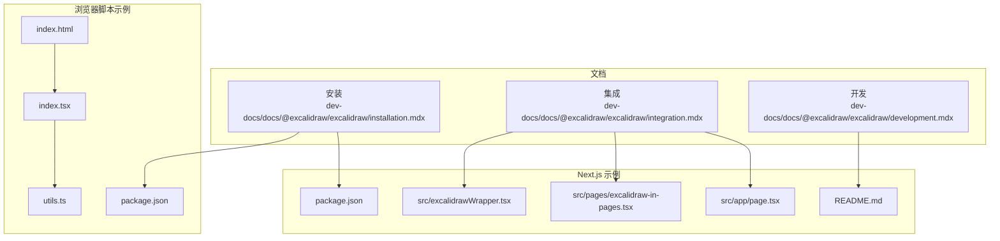
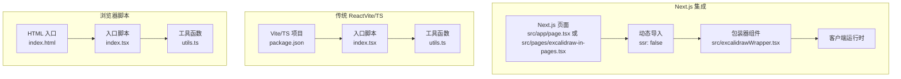
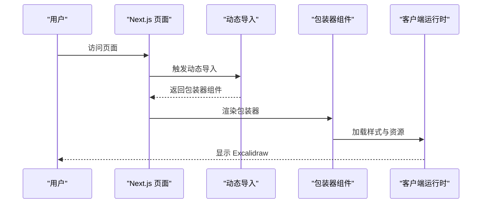
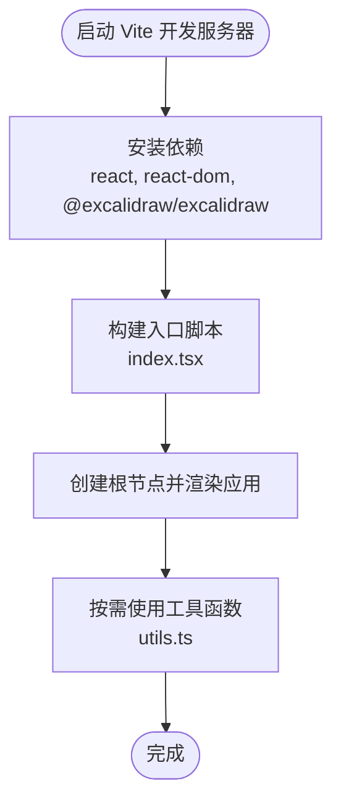
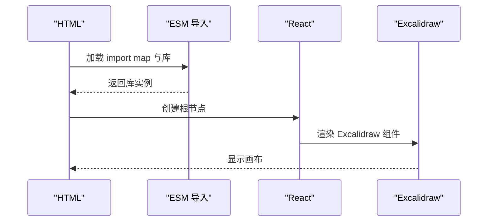
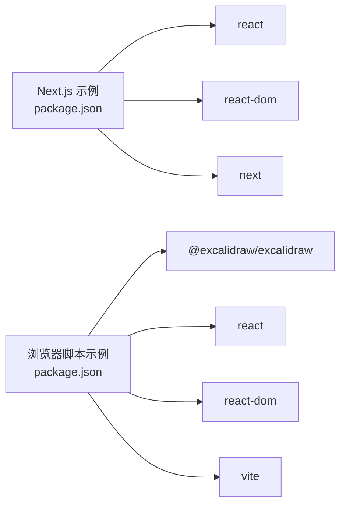

# 集成示例

<cite>
**本文引用的文件**
- [dev-docs 文档：集成](file://dev-docs/docs/@excalidraw/excalidraw/integration.mdx)
- [dev-docs 文档：安装](file://dev-docs/docs/@excalidraw/excalidraw/installation.mdx)
- [dev-docs 文档：开发](file://dev-docs/docs/@excalidraw/excalidraw/development.mdx)
- [Next.js 示例：根页面（App Router）](file://examples/with-nextjs/src/app/page.tsx)
- [Next.js 示例：页面路由页面](file://examples/with-nextjs/src/pages/excalidraw-in-pages.tsx)
- [Next.js 示例：包装器组件](file://examples/with-nextjs/src/excalidrawWrapper.tsx)
- [Next.js 示例：项目配置](file://examples/with-nextjs/package.json)
- [Next.js 示例：说明文档](file://examples/with-nextjs/README.md)
- [浏览器脚本示例：HTML 入口](file://examples/with-script-in-browser/index.html)
- [浏览器脚本示例：入口脚本](file://examples/with-script-in-browser/index.tsx)
- [浏览器脚本示例：工具函数](file://examples/with-script-in-browser/utils.ts)
- [浏览器脚本示例：项目配置](file://examples/with-script-in-browser/package.json)
</cite>

## 目录

1. [简介](#简介)
2. [项目结构](#项目结构)
3. [核心组件](#核心组件)
4. [架构总览](#架构总览)
5. [详细组件分析](#详细组件分析)
6. [依赖分析](#依赖分析)
7. [性能考虑](#性能考虑)
8. [故障排查指南](#故障排查指南)
9. [结论](#结论)
10. [附录](#附录)

## 简介

本文件面向希望在不同前端技术栈中集成 Excalidraw 的开发者，提供从零开始的完整集成示例与最佳实践，覆盖以下场景：

- Next.js 应用集成（App Router 与 Pages Router）
- 传统 React 应用集成（Vite/TS 场景）
- 浏览器脚本直接集成（无需打包器）

文档同时涵盖 SSR 支持策略、资源路径自托管、样式与字体加载、以及性能优化建议。对于不同技术背景的读者，既提供可直接复制的配置片段路径，也给出可操作的步骤指引。

## 项目结构

该仓库包含三类集成示例与官方文档：

- 官方文档：安装、集成、开发相关说明
- Next.js 示例：演示在 Next.js 中使用动态导入与客户端指令
- 浏览器脚本示例：演示通过 ESM 导入与 import map 在浏览器中直接使用

图表来源

- [dev-docs 文档：集成](file://dev-docs/docs/@excalidraw/excalidraw/integration.mdx)
- [dev-docs 文档：安装](file://dev-docs/docs/@excalidraw/excalidraw/installation.mdx)
- [Next.js 示例：根页面（App Router）](file://examples/with-nextjs/src/app/page.tsx)
- [Next.js 示例：页面路由页面](file://examples/with-nextjs/src/pages/excalidraw-in-pages.tsx)
- [Next.js 示例：包装器组件](file://examples/with-nextjs/src/excalidrawWrapper.tsx)
- [Next.js 示例：项目配置](file://examples/with-nextjs/package.json)
- [Next.js 示例：说明文档](file://examples/with-nextjs/README.md)
- [浏览器脚本示例：HTML 入口](file://examples/with-script-in-browser/index.html)
- [浏览器脚本示例：入口脚本](file://examples/with-script-in-browser/index.tsx)
- [浏览器脚本示例：工具函数](file://examples/with-script-in-browser/utils.ts)
- [浏览器脚本示例：项目配置](file://examples/with-script-in-browser/package.json)

章节来源

- [dev-docs 文档：集成](file://dev-docs/docs/@excalidraw/excalidraw/integration.mdx)
- [dev-docs 文档：安装](file://dev-docs/docs/@excalidraw/excalidraw/installation.mdx)
- [dev-docs 文档：开发](file://dev-docs/docs/@excalidraw/excalidraw/development.mdx)
- [Next.js 示例：根页面（App Router）](file://examples/with-nextjs/src/app/page.tsx)
- [Next.js 示例：页面路由页面](file://examples/with-nextjs/src/pages/excalidraw-in-pages.tsx)
- [Next.js 示例：包装器组件](file://examples/with-nextjs/src/excalidrawWrapper.tsx)
- [Next.js 示例：项目配置](file://examples/with-nextjs/package.json)
- [Next.js 示例：说明文档](file://examples/with-nextjs/README.md)
- [浏览器脚本示例：HTML 入口](file://examples/with-script-in-browser/index.html)
- [浏览器脚本示例：入口脚本](file://examples/with-script-in-browser/index.tsx)
- [浏览器脚本示例：工具函数](file://examples/with-script-in-browser/utils.ts)
- [浏览器脚本示例：项目配置](file://examples/with-script-in-browser/package.json)

## 核心组件

- 组件导出与样式

  - 官方文档明确支持以 ES 模块方式导入组件，并提供样式入口。
  - Next.js 示例通过动态导入避免 SSR 渲染组件。
  - 浏览器脚本示例通过 ESM 导入并在 HTML 中设置资源路径变量。

- 资源路径与字体

  - 自托管字体时需复制字体目录到静态资源目录，并设置资源路径变量；文档提供了在 Next.js 与浏览器中的设置方式。

- 工具函数与类型
  - 浏览器脚本示例提供文件选择、防抖、批处理更新等实用工具，便于扩展功能。

章节来源

- [dev-docs 文档：安装](file://dev-docs/docs/@excalidraw/excalidraw/installation.mdx)
- [dev-docs 文档：集成](file://dev-docs/docs/@excalidraw/excalidraw/integration.mdx)
- [Next.js 示例：包装器组件](file://examples/with-nextjs/src/excalidrawWrapper.tsx)
- [浏览器脚本示例：入口脚本](file://examples/with-script-in-browser/index.tsx)
- [浏览器脚本示例：工具函数](file://examples/with-script-in-browser/utils.ts)

## 架构总览

下图展示了三种集成方式的高层流程：Next.js（SSR -> 动态导入 -> 客户端渲染）、传统 React（构建工具 -> ESM 导入 -> 渲染）、浏览器脚本（HTML 引入 -> ESM 导入 -> 渲染）。

图表来源

- [Next.js 示例：根页面（App Router）](file://examples/with-nextjs/src/app/page.tsx)
- [Next.js 示例：页面路由页面](file://examples/with-nextjs/src/pages/excalidraw-in-pages.tsx)
- [Next.js 示例：包装器组件](file://examples/with-nextjs/src/excalidrawWrapper.tsx)
- [Next.js 示例：项目配置](file://examples/with-nextjs/package.json)
- [浏览器脚本示例：HTML 入口](file://examples/with-script-in-browser/index.html)
- [浏览器脚本示例：入口脚本](file://examples/with-script-in-browser/index.tsx)
- [浏览器脚本示例：工具函数](file://examples/with-script-in-browser/utils.ts)
- [浏览器脚本示例：项目配置](file://examples/with-script-in-browser/package.json)

## 详细组件分析

### Next.js 应用集成（App Router 与 Pages Router）

- SSR 支持策略

  - 由于组件不支持服务端渲染，需要通过动态导入禁用 SSR，并在客户端指令中声明组件为客户端组件。
  - App Router 与 Pages Router 均可通过动态导入包装器组件实现相同效果。

- 资源路径设置

  - 在 Next.js 中，可在页面中注入脚本以设置资源路径变量，确保字体与资源正确加载。

- 样式与容器尺寸

  - 组件会占满容器的宽高，需确保容器具有非零尺寸。

- 包装器组件职责
  - 包装器负责引入样式、调用库并渲染主组件，便于在页面中复用。

图表来源

- [Next.js 示例：根页面（App Router）](file://examples/with-nextjs/src/app/page.tsx)
- [Next.js 示例：页面路由页面](file://examples/with-nextjs/src/pages/excalidraw-in-pages.tsx)
- [Next.js 示例：包装器组件](file://examples/with-nextjs/src/excalidrawWrapper.tsx)

章节来源

- [dev-docs 文档：集成](file://dev-docs/docs/@excalidraw/excalidraw/integration.mdx)
- [Next.js 示例：根页面（App Router）](file://examples/with-nextjs/src/app/page.tsx)
- [Next.js 示例：页面路由页面](file://examples/with-nextjs/src/pages/excalidraw-in-pages.tsx)
- [Next.js 示例：包装器组件](file://examples/with-nextjs/src/excalidrawWrapper.tsx)
- [Next.js 示例：项目配置](file://examples/with-nextjs/package.json)

### 传统 React 应用集成（Vite/TS）

- 依赖与脚本

  - 使用 Vite 作为构建工具，安装 React、ReactDOM 与 Excalidraw。
  - 入口脚本引入样式与库，创建根节点并渲染应用。

- 工具函数
  - 提供文件选择、距离计算、防抖与批处理更新等工具，便于扩展功能。

图表来源

- [浏览器脚本示例：项目配置](file://examples/with-script-in-browser/package.json)
- [浏览器脚本示例：入口脚本](file://examples/with-script-in-browser/index.tsx)
- [浏览器脚本示例：工具函数](file://examples/with-script-in-browser/utils.ts)

章节来源

- [dev-docs 文档：安装](file://dev-docs/docs/@excalidraw/excalidraw/installation.mdx)
- [浏览器脚本示例：项目配置](file://examples/with-script-in-browser/package.json)
- [浏览器脚本示例：入口脚本](file://examples/with-script-in-browser/index.tsx)
- [浏览器脚本示例：工具函数](file://examples/with-script-in-browser/utils.ts)

### 浏览器脚本集成（无需打包器）

- HTML 设置

  - 在 HTML 中设置资源路径变量，以便加载字体与资源。
  - 通过 import map 解决 React 版本去重问题。

- ESM 导入
  - 使用 ESM 导入库与 React，创建应用并渲染组件。

图表来源

- [dev-docs 文档：集成](file://dev-docs/docs/@excalidraw/excalidraw/integration.mdx)
- [浏览器脚本示例：HTML 入口](file://examples/with-script-in-browser/index.html)
- [浏览器脚本示例：入口脚本](file://examples/with-script-in-browser/index.tsx)

章节来源

- [dev-docs 文档：集成](file://dev-docs/docs/@excalidraw/excalidraw/integration.mdx)
- [浏览器脚本示例：HTML 入口](file://examples/with-script-in-browser/index.html)
- [浏览器脚本示例：入口脚本](file://examples/with-script-in-browser/index.tsx)

## 依赖分析

- Next.js 示例
  - 依赖 React、ReactDOM 与 Next.js；通过脚本复制字体资源到公共目录，保证自托管字体可用。
- 浏览器脚本示例
  - 依赖 @excalidraw/excalidraw、React、ReactDOM 与 Vite；通过 import map 与资源路径变量解决外部依赖与资源加载问题。

图表来源

- [Next.js 示例：项目配置](file://examples/with-nextjs/package.json)
- [浏览器脚本示例：项目配置](file://examples/with-script-in-browser/package.json)

章节来源

- [Next.js 示例：项目配置](file://examples/with-nextjs/package.json)
- [浏览器脚本示例：项目配置](file://examples/with-script-in-browser/package.json)

## 性能考虑

- SSR 与客户端渲染
  - 由于组件不支持 SSR，应通过动态导入禁用 SSR，仅在客户端渲染，避免首屏错误或空白。
- 资源路径与字体
  - 自托管字体可减少 CDN 依赖，提升加载稳定性；确保资源路径变量与静态资源目录一致。
- 批处理与节流
  - 对频繁触发的状态更新使用批处理与节流，降低渲染压力，提升交互流畅度。
- 代码分割
  - 将包装器组件拆分为独立模块，配合动态导入实现按需加载，减小初始包体积。

章节来源

- [dev-docs 文档：集成](file://dev-docs/docs/@excalidraw/excalidraw/integration.mdx)
- [dev-docs 文档：安装](file://dev-docs/docs/@excalidraw/excalidraw/installation.mdx)
- [浏览器脚本示例：工具函数](file://examples/with-script-in-browser/utils.ts)

## 故障排查指南

- 组件在 SSR 中报错
  - 症状：服务端渲染时报错或空白。
  - 处理：使用动态导入禁用 SSR，并在客户端指令中声明组件为客户端组件。
- 字体或资源 404
  - 症状：字体或资源无法加载。
  - 处理：复制字体目录到公共目录，并设置资源路径变量；检查路径是否与实际部署路径一致。
- React 版本冲突
  - 症状：运行时报错，提示 React 版本不匹配。
  - 处理：使用 import map 指定统一版本；或在 Vite 中定义环境变量以启用特定构建。
- 容器尺寸为 0
  - 症状：画布不显示。
  - 处理：确保包裹容器具有明确的宽高，组件会占满容器尺寸。

章节来源

- [dev-docs 文档：集成](file://dev-docs/docs/@excalidraw/excalidraw/integration.mdx)
- [dev-docs 文档：安装](file://dev-docs/docs/@excalidraw/excalidraw/installation.mdx)
- [Next.js 示例：根页面（App Router）](file://examples/with-nextjs/src/app/page.tsx)
- [Next.js 示例：页面路由页面](file://examples/with-nextjs/src/pages/excalidraw-in-pages.tsx)
- [Next.js 示例：包装器组件](file://examples/with-nextjs/src/excalidrawWrapper.tsx)

## 结论

通过上述三种集成方式，开发者可以在 Next.js、传统 React 与浏览器环境中快速嵌入 Excalidraw。关键在于：

- 正确处理 SSR 限制与客户端渲染时机
- 合理配置资源路径与字体自托管
- 利用动态导入与工具函数优化性能与体验

## 附录

- 从零开始的完整项目示例（步骤指引）

  - Next.js 示例
    - 初始化项目后，安装依赖并配置动态导入与客户端指令。
    - 复制字体资源到公共目录，并在页面中设置资源路径变量。
    - 参考路径：[Next.js 示例：项目配置](file://examples/with-nextjs/package.json)、[Next.js 示例：根页面（App Router）](file://examples/with-nextjs/src/app/page.tsx)、[Next.js 示例：页面路由页面](file://examples/with-nextjs/src/pages/excalidraw-in-pages.tsx)、[Next.js 示例：包装器组件](file://examples/with-nextjs/src/excalidrawWrapper.tsx)
  - 传统 React（Vite/TS）示例
    - 安装依赖并编写入口脚本，引入样式与库，创建根节点渲染应用。
    - 参考路径：[浏览器脚本示例：项目配置](file://examples/with-script-in-browser/package.json)、[浏览器脚本示例：入口脚本](file://examples/with-script-in-browser/index.tsx)
  - 浏览器脚本示例
    - 在 HTML 中设置资源路径变量与 import map，通过 ESM 导入库并渲染组件。
    - 参考路径：[浏览器脚本示例：HTML 入口](file://examples/with-script-in-browser/index.html)、[浏览器脚本示例：入口脚本](file://examples/with-script-in-browser/index.tsx)

- 高级集成场景
  - SSR 支持：通过动态导入禁用 SSR，仅在客户端渲染。
  - 代码分割：将包装器组件拆分并配合动态导入实现按需加载。
  - 性能优化：使用工具函数进行批处理与节流，减少频繁更新带来的开销。

章节来源

- [dev-docs 文档：开发](file://dev-docs/docs/@excalidraw/excalidraw/development.mdx)
- [dev-docs 文档：安装](file://dev-docs/docs/@excalidraw/excalidraw/installation.mdx)
- [dev-docs 文档：集成](file://dev-docs/docs/@excalidraw/excalidraw/integration.mdx)
- [Next.js 示例：项目配置](file://examples/with-nextjs/package.json)
- [Next.js 示例：根页面（App Router）](file://examples/with-nextjs/src/app/page.tsx)
- [Next.js 示例：页面路由页面](file://examples/with-nextjs/src/pages/excalidraw-in-pages.tsx)
- [Next.js 示例：包装器组件](file://examples/with-nextjs/src/excalidrawWrapper.tsx)
- [浏览器脚本示例：项目配置](file://examples/with-script-in-browser/package.json)
- [浏览器脚本示例：HTML 入口](file://examples/with-script-in-browser/index.html)
- [浏览器脚本示例：入口脚本](file://examples/with-script-in-browser/index.tsx)
