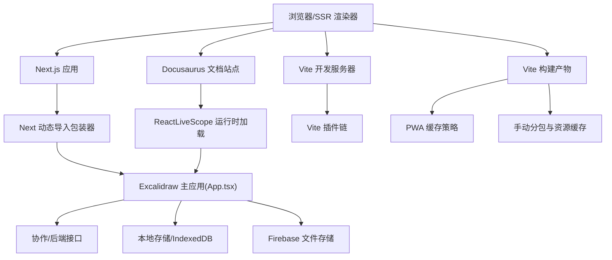
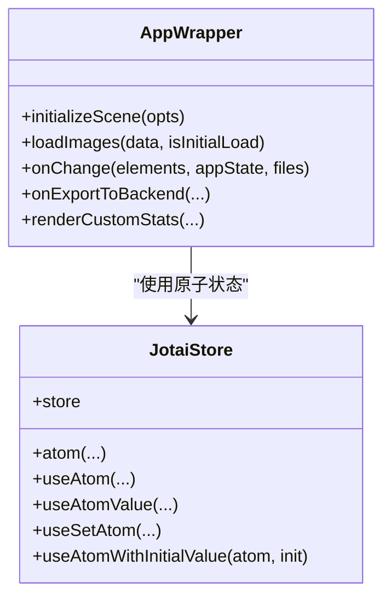
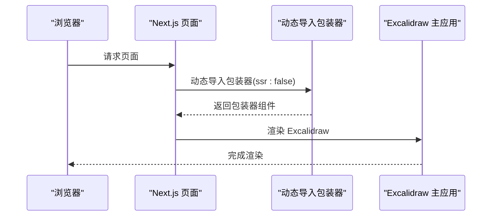
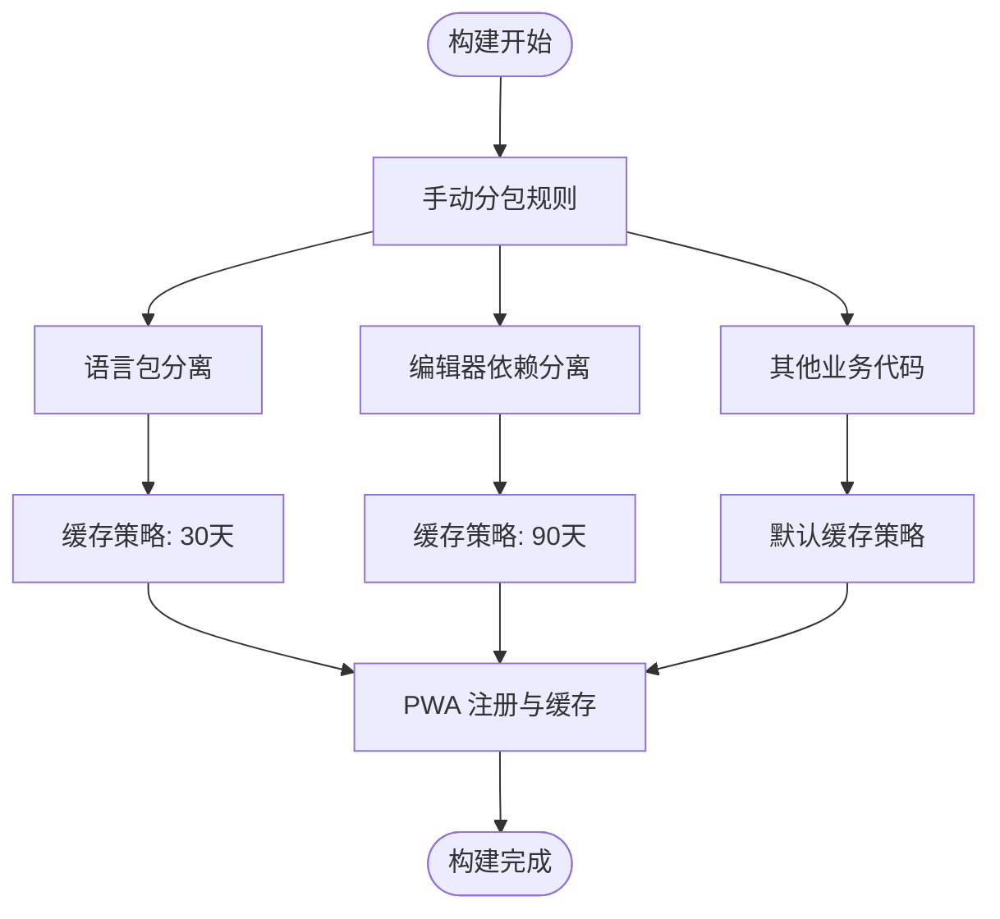
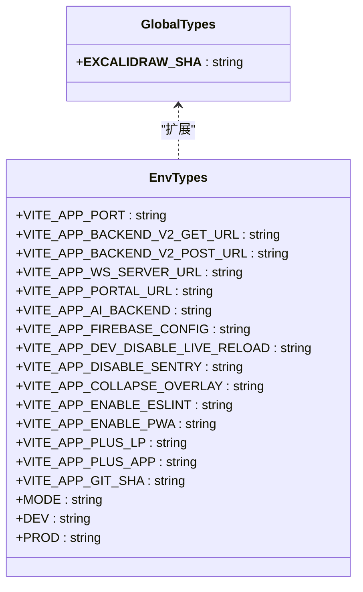
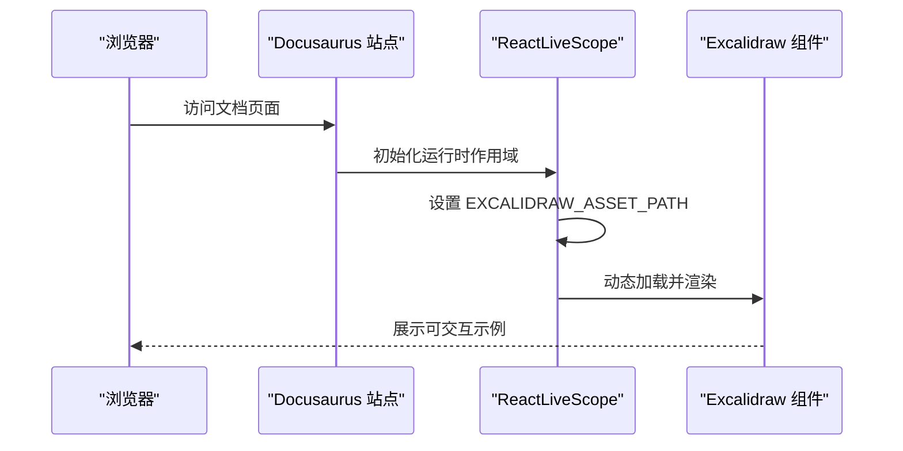
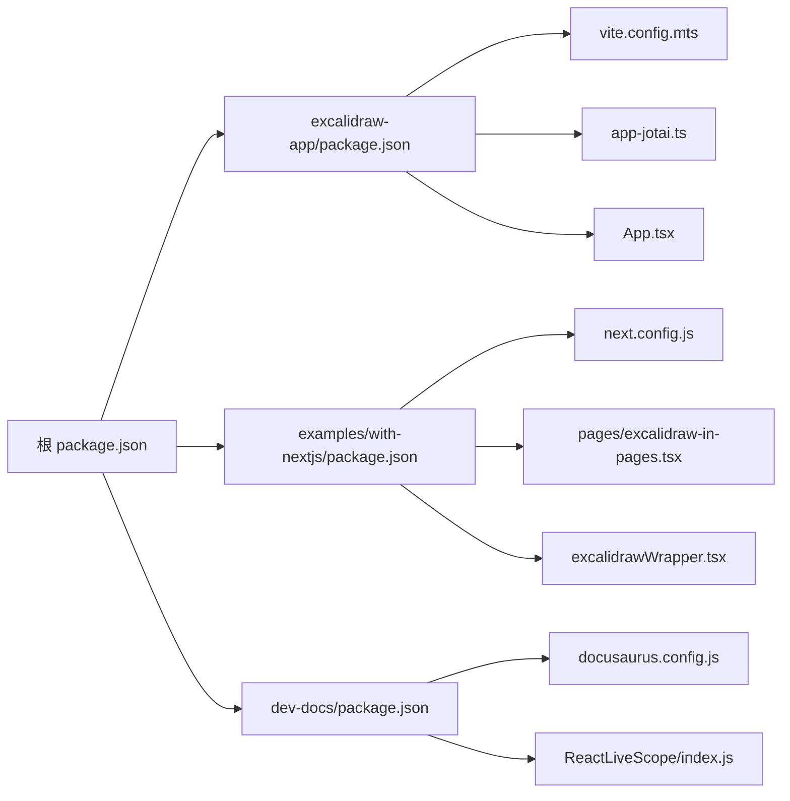

# 高级集成场景

<cite>
**本文引用的文件**
- [package.json](file://package.json)
- [tsconfig.json](file://tsconfig.json)
- [dev-docs/package.json](file://dev-docs/package.json)
- [dev-docs/docusaurus.config.js](file://dev-docs/docusaurus.config.js)
- [dev-docs/src/theme/ReactLiveScope/index.js](file://dev-docs/src/theme/ReactLiveScope/index.js)
- [excalidraw-app/package.json](file://excalidraw-app/package.json)
- [excalidraw-app/vite.config.mts](file://excalidraw-app/vite.config.mts)
- [excalidraw-app/vite-env.d.ts](file://excalidraw-app/vite-env.d.ts)
- [excalidraw-app/app-jotai.ts](file://excalidraw-app/app-jotai.ts)
- [excalidraw-app/App.tsx](file://excalidraw-app/App.tsx)
- [examples/with-nextjs/package.json](file://examples/with-nextjs/package.json)
- [examples/with-nextjs/next.config.js](file://examples/with-nextjs/next.config.js)
- [examples/with-nextjs/src/app/layout.tsx](file://examples/with-nextjs/src/app/layout.tsx)
- [examples/with-nextjs/src/pages/excalidraw-in-pages.tsx](file://examples/with-nextjs/src/pages/excalidraw-in-pages.tsx)
- [examples/with-nextjs/src/excalidrawWrapper.tsx](file://examples/with-nextjs/src/excalidrawWrapper.tsx)
- [excalidraw-app/global.d.ts](file://excalidraw-app/global.d.ts)
</cite>

## 目录

1. [简介](#简介)
2. [项目结构](#项目结构)
3. [核心组件](#核心组件)
4. [架构总览](#架构总览)
5. [详细组件分析](#详细组件分析)
6. [依赖关系分析](#依赖关系分析)
7. [性能考量](#性能考量)
8. [故障排除指南](#故障排除指南)
9. [结论](#结论)
10. [附录](#附录)

## 简介

本指南面向需要在复杂前端生态中集成 Excalidraw 的工程团队与个人开发者，系统讲解以下高级集成主题：

- 第三方状态管理：以 Jotai 为例的状态容器与原子化状态设计
- 路由集成：Next.js App Router 与 Pages Router 的动态导入与 SSR 注意事项
- 构建工具集成：Vite 的插件体系、代码分割、PWA 与缓存策略
- TypeScript 集成：路径映射、严格模式、类型声明与环境变量类型安全
- Preact 兼容性与 UMD 构建：通过环境变量与别名适配
- SSR 框架集成：Docusaurus 的文档站点如何在运行时加载 Excalidraw
- 性能优化：代码分割、懒加载、缓存与资源预取
- 企业级集成：权限控制、数据同步、安全配置与错误边界
- 故障排除：常见问题定位与调试工具使用

## 项目结构

该仓库采用多包工作区（monorepo），包含应用层、可复用包、示例与文档站点：

- 根目录：工作区与根脚本、全局 TS 配置
- excalidraw-app：主应用，包含 Vite 构建、Jotai 状态、App 主入口
- packages/\*：可复用子包（excalidraw、element、utils 等）
- examples/\*：示例工程（Next.js 集成、浏览器直连示例）
- dev-docs：基于 Docusaurus 的开发者文档站点

```mermaid
graph TB
subgraph "根工作区"
ROOT_PKG["根 package.json"]
ROOT_TS["根 tsconfig.json"]
end
subgraph "应用层"
APP_PKG["excalidraw-app/package.json"]
APP_VITE["excalidraw-app/vite.config.mts"]
APP_TS["excalidraw-app/vite-env.d.ts"]
APP_JOTAI["excalidraw-app/app-jotai.ts"]
APP_MAIN["excalidraw-app/App.tsx"]
APP_GLOBAL["excalidraw-app/global.d.ts"]
end
subgraph "示例"
NEXT_PKG["examples/with-nextjs/package.json"]
NEXT_CFG["examples/with-nextjs/next.config.js"]
NEXT_LAYOUT["examples/with-nextjs/src/app/layout.tsx"]
NEXT_PAGE["examples/with-nextjs/src/pages/excalidraw-in-pages.tsx"]
NEXT_WRAPPER["examples/with-nextjs/src/excalidrawWrapper.tsx"]
end
subgraph "文档站点"
DOCS_PKG["dev-docs/package.json"]
DOCS_CFG["dev-docs/docusaurus.config.js"]
DOCS_SCOPE["dev-docs/src/theme/ReactLiveScope/index.js"]
end
ROOT_PKG --> APP_PKG
ROOT_PKG --> NEXT_PKG
ROOT_PKG --> DOCS_PKG
ROOT_TS --> APP_TS
APP_MAIN --> APP_JOTAI
NEXT_PAGE --> NEXT_WRAPPER
DOCS_CFG --> DOCS_SCOPE
```

图表来源

- [package.json:1-96](file://package.json#L1-L96)
- [tsconfig.json:1-39](file://tsconfig.json#L1-L39)
- [excalidraw-app/package.json:1-58](file://excalidraw-app/package.json#L1-L58)
- [excalidraw-app/vite.config.mts:1-319](file://excalidraw-app/vite.config.mts#L1-L319)
- [excalidraw-app/vite-env.d.ts:1-50](file://excalidraw-app/vite-env.d.ts#L1-L50)
- [excalidraw-app/app-jotai.ts:1-38](file://excalidraw-app/app-jotai.ts#L1-L38)
- [excalidraw-app/App.tsx:1-800](file://excalidraw-app/App.tsx#L1-L800)
- [examples/with-nextjs/package.json:1-27](file://examples/with-nextjs/package.json#L1-L27)
- [examples/with-nextjs/next.config.js:1-13](file://examples/with-nextjs/next.config.js#L1-L13)
- [examples/with-nextjs/src/app/layout.tsx:1-12](file://examples/with-nextjs/src/app/layout.tsx#L1-L12)
- [examples/with-nextjs/src/pages/excalidraw-in-pages.tsx:1-24](file://examples/with-nextjs/src/pages/excalidraw-in-pages.tsx#L1-L24)
- [examples/with-nextjs/src/excalidrawWrapper.tsx:1-24](file://examples/with-nextjs/src/excalidrawWrapper.tsx#L1-L24)
- [dev-docs/package.json:1-52](file://dev-docs/package.json#L1-L52)
- [dev-docs/docusaurus.config.js:1-179](file://dev-docs/docusaurus.config.js#L1-L179)
- [dev-docs/src/theme/ReactLiveScope/index.js:1-40](file://dev-docs/src/theme/ReactLiveScope/index.js#L1-L40)

章节来源

- [package.json:1-96](file://package.json#L1-L96)
- [tsconfig.json:1-39](file://tsconfig.json#L1-L39)

## 核心组件

- 应用入口与状态容器
  - 主应用入口负责初始化场景、处理协作与本地存储同步、导出与调试等逻辑
  - 使用 Jotai 原子化状态，提供 Provider 包裹与自定义 hook
- 构建与开发体验
  - Vite 提供快速开发服务器、插件链与 PWA 支持；手动分包策略提升缓存命中率
  - TypeScript 严格模式与路径映射确保跨包引用稳定
- 示例与文档
  - Next.js 示例演示 App Router 与 Pages Router 的动态导入与 SSR 配置
  - Docusaurus 文档站点通过运行时加载与环境变量适配 Preact 兼容性

章节来源

- [excalidraw-app/App.tsx:1-800](file://excalidraw-app/App.tsx#L1-L800)
- [excalidraw-app/app-jotai.ts:1-38](file://excalidraw-app/app-jotai.ts#L1-L38)
- [excalidraw-app/vite.config.mts:1-319](file://excalidraw-app/vite.config.mts#L1-L319)
- [excalidraw-app/vite-env.d.ts:1-50](file://excalidraw-app/vite-env.d.ts#L1-L50)
- [examples/with-nextjs/src/pages/excalidraw-in-pages.tsx:1-24](file://examples/with-nextjs/src/pages/excalidraw-in-pages.tsx#L1-L24)
- [dev-docs/docusaurus.config.js:1-179](file://dev-docs/docusaurus.config.js#L1-L179)

## 架构总览

下图展示从浏览器到应用、构建工具与外部服务的整体交互：

图表来源

- [examples/with-nextjs/src/pages/excalidraw-in-pages.tsx:1-24](file://examples/with-nextjs/src/pages/excalidraw-in-pages.tsx#L1-L24)
- [examples/with-nextjs/src/excalidrawWrapper.tsx:1-24](file://examples/with-nextjs/src/excalidrawWrapper.tsx#L1-L24)
- [excalidraw-app/App.tsx:1-800](file://excalidraw-app/App.tsx#L1-L800)
- [dev-docs/src/theme/ReactLiveScope/index.js:1-40](file://dev-docs/src/theme/ReactLiveScope/index.js#L1-L40)
- [excalidraw-app/vite.config.mts:1-319](file://excalidraw-app/vite.config.mts#L1-L319)

## 详细组件分析

### 组件一：应用入口与状态容器（Jotai）

- 设计要点
  - 使用 Jotai 原子化状态，提供 Provider 包裹与自定义 hook，便于在大型应用中进行细粒度状态管理
  - 在应用入口中集中处理场景初始化、协作启动、本地存储同步与导出流程
- 关键流程
  - 初始化场景：根据 URL 参数或哈希决定是否加载外部场景或本地场景
  - 图像加载：区分协作与非协作场景，按需从 Firebase 或本地 IndexedDB 加载图片
  - 同步与卸载：监听可见性变化与卸载事件，确保数据持久化与提示阻止离开
- 类图

图表来源

- [excalidraw-app/App.tsx:1-800](file://excalidraw-app/App.tsx#L1-L800)
- [excalidraw-app/app-jotai.ts:1-38](file://excalidraw-app/app-jotai.ts#L1-L38)

章节来源

- [excalidraw-app/App.tsx:1-800](file://excalidraw-app/App.tsx#L1-L800)
- [excalidraw-app/app-jotai.ts:1-38](file://excalidraw-app/app-jotai.ts#L1-L38)

### 组件二：Next.js 集成（App Router 与 Pages Router）

- 设计要点
  - 使用动态导入禁用 SSR，避免在服务端渲染期间引入客户端依赖
  - App Router 通过 layout.tsx 提供根 HTML 结构；Pages Router 通过动态组件包裹实现 SSR 安全
- 关键流程
  - 动态导入：在客户端侧按需加载 Excalidraw 包装器
  - 样式注入：确保 CSS 正确加载，避免样式闪烁
- 时序图（Pages Router）

图表来源

- [examples/with-nextjs/src/pages/excalidraw-in-pages.tsx:1-24](file://examples/with-nextjs/src/pages/excalidraw-in-pages.tsx#L1-L24)
- [examples/with-nextjs/src/excalidrawWrapper.tsx:1-24](file://examples/with-nextjs/src/excalidrawWrapper.tsx#L1-L24)

章节来源

- [examples/with-nextjs/next.config.js:1-13](file://examples/with-nextjs/next.config.js#L1-L13)
- [examples/with-nextjs/src/app/layout.tsx:1-12](file://examples/with-nextjs/src/app/layout.tsx#L1-L12)
- [examples/with-nextjs/src/pages/excalidraw-in-pages.tsx:1-24](file://examples/with-nextjs/src/pages/excalidraw-in-pages.tsx#L1-L24)
- [examples/with-nextjs/src/excalidrawWrapper.tsx:1-24](file://examples/with-nextjs/src/excalidrawWrapper.tsx#L1-L24)

### 组件三：构建工具集成（Vite、PWA、代码分割）

- 设计要点
  - 手动分包策略：将语言包、编辑器依赖与业务代码拆分为独立 chunk，提升缓存命中率
  - PWA 缓存：针对字体、语言包与动态 chunk 设置不同缓存策略与过期时间
  - 插件链：React、SVGR、EJS、PWA、检查器等插件协同提供开发与构建体验
- 流程图（手动分包与缓存策略）

图表来源

- [excalidraw-app/vite.config.mts:87-126](file://excalidraw-app/vite.config.mts#L87-L126)
- [excalidraw-app/vite.config.mts:150-221](file://excalidraw-app/vite.config.mts#L150-L221)

章节来源

- [excalidraw-app/vite.config.mts:1-319](file://excalidraw-app/vite.config.mts#L1-L319)

### 组件四：TypeScript 集成与类型安全

- 设计要点
  - 根 TS 配置启用严格模式、路径映射与 JSX 转换，确保跨包引用与类型检查一致
  - 应用层通过环境变量类型声明，约束 Vite 环境变量的可用字段
  - 全局类型声明扩展窗口对象，统一资产路径等全局约定
- 类图（类型与环境）

图表来源

- [excalidraw-app/global.d.ts:1-7](file://excalidraw-app/global.d.ts#L1-L7)
- [excalidraw-app/vite-env.d.ts:1-50](file://excalidraw-app/vite-env.d.ts#L1-L50)
- [tsconfig.json:1-39](file://tsconfig.json#L1-L39)

章节来源

- [tsconfig.json:1-39](file://tsconfig.json#L1-L39)
- [excalidraw-app/vite-env.d.ts:1-50](file://excalidraw-app/vite-env.d.ts#L1-L50)
- [excalidraw-app/global.d.ts:1-7](file://excalidraw-app/global.d.ts#L1-L7)

### 组件五：SSR 框架集成（Docusaurus）

- 设计要点
  - 通过 Docusaurus 插件加载 .env 变量，关闭 Preact 兼容标志以避免冲突
  - ReactLiveScope 在运行时动态加载 Excalidraw 并注入初始数据与主题
- 时序图（文档站点加载）

图表来源

- [dev-docs/docusaurus.config.js:1-179](file://dev-docs/docusaurus.config.js#L1-L179)
- [dev-docs/src/theme/ReactLiveScope/index.js:1-40](file://dev-docs/src/theme/ReactLiveScope/index.js#L1-L40)

章节来源

- [dev-docs/docusaurus.config.js:1-179](file://dev-docs/docusaurus.config.js#L1-L179)
- [dev-docs/src/theme/ReactLiveScope/index.js:1-40](file://dev-docs/src/theme/ReactLiveScope/index.js#L1-L40)

## 依赖关系分析

- 工作区与包管理
  - 根 package.json 定义工作区与脚本，统一安装与测试命令
  - 应用层与示例层分别维护依赖与脚本，确保最小化耦合
- 构建与开发工具
  - Vite 作为核心构建工具，配合多种插件提升开发效率与产物质量
  - TypeScript 严格模式与路径映射确保跨包引用稳定
- 外部集成
  - Next.js 通过动态导入规避 SSR 限制
  - Docusaurus 通过运行时加载与环境变量适配 Preact 兼容性

图表来源

- [package.json:1-96](file://package.json#L1-L96)
- [excalidraw-app/package.json:1-58](file://excalidraw-app/package.json#L1-L58)
- [examples/with-nextjs/package.json:1-27](file://examples/with-nextjs/package.json#L1-L27)
- [dev-docs/package.json:1-52](file://dev-docs/package.json#L1-L52)

章节来源

- [package.json:1-96](file://package.json#L1-L96)
- [excalidraw-app/package.json:1-58](file://excalidraw-app/package.json#L1-L58)
- [examples/with-nextjs/package.json:1-27](file://examples/with-nextjs/package.json#L1-L27)
- [dev-docs/package.json:1-52](file://dev-docs/package.json#L1-L52)

## 性能考量

- 代码分割与懒加载
  - 手动分包策略将语言包与编辑器依赖独立打包，减少首屏体积并提升缓存命中
  - 动态导入在 Next.js 中禁用 SSR，避免服务端执行客户端代码
- 缓存机制
  - PWA 对字体、语言包与动态 chunk 设置不同缓存策略与过期时间，兼顾离线与更新需求
  - 字体资源不内联，避免主包体积膨胀
- 开发体验
  - Vite 插件链提供类型检查与 ESLint 集成，Overlay 可视化提示，提升开发效率
- 企业级优化建议
  - 引入资源预取与预连接，缩短关键请求延迟
  - 使用 HTTP/2 多路复用与压缩，结合缓存头策略
  - 对大依赖（如编辑器）采用按需加载与骨架屏过渡

章节来源

- [excalidraw-app/vite.config.mts:87-126](file://excalidraw-app/vite.config.mts#L87-L126)
- [excalidraw-app/vite.config.mts:150-221](file://excalidraw-app/vite.config.mts#L150-L221)
- [examples/with-nextjs/src/pages/excalidraw-in-pages.tsx:1-24](file://examples/with-nextjs/src/pages/excalidraw-in-pages.tsx#L1-L24)

## 故障排除指南

- Preact 兼容性
  - 在 Docusaurus 中通过设置环境变量关闭 Preact 兼容标志，避免与 React 冲突
- SSR 问题
  - Next.js 中使用动态导入并禁用 SSR，确保仅在客户端渲染
- 类型与路径映射
  - 根 TS 配置启用严格模式与路径映射，避免跨包引用失败
- 环境变量
  - 应用层通过环境变量类型声明约束可用字段，防止拼写错误导致运行时异常
- 错误边界与日志
  - 应用入口提供顶层错误边界与日志记录，便于定位问题

章节来源

- [dev-docs/docusaurus.config.js:1-179](file://dev-docs/docusaurus.config.js#L1-L179)
- [examples/with-nextjs/src/pages/excalidraw-in-pages.tsx:1-24](file://examples/with-nextjs/src/pages/excalidraw-in-pages.tsx#L1-L24)
- [tsconfig.json:1-39](file://tsconfig.json#L1-L39)
- [excalidraw-app/vite-env.d.ts:1-50](file://excalidraw-app/vite-env.d.ts#L1-L50)
- [excalidraw-app/App.tsx:1-800](file://excalidraw-app/App.tsx#L1-L800)

## 结论

本指南围绕 Excalidraw 在复杂前端生态中的集成实践，系统阐述了状态管理、路由与 SSR、构建工具、TypeScript 类型安全、Preact 兼容性与 UMD 构建、性能优化与企业级考虑，并提供了故障排除与调试建议。通过合理的分包策略、动态导入与 PWA 缓存，可在保证开发体验的同时获得优秀的用户体验与可维护性。

## 附录

- 最佳实践清单
  - 使用动态导入规避 SSR 限制
  - 明确手动分包策略，优先缓存高频更新少的资源
  - 严格类型检查与路径映射，确保跨包引用稳定
  - 通过环境变量与类型声明统一配置项
  - 在文档站点中通过运行时加载与环境变量适配兼容性
- 参考文件
  - [根 package.json:1-96](file://package.json#L1-L96)
  - [根 tsconfig.json:1-39](file://tsconfig.json#L1-L39)
  - [应用层 package.json:1-58](file://excalidraw-app/package.json#L1-L58)
  - [应用层 Vite 配置:1-319](file://excalidraw-app/vite.config.mts#L1-L319)
  - [应用层 Jotai 状态:1-38](file://excalidraw-app/app-jotai.ts#L1-L38)
  - [应用层入口:1-800](file://excalidraw-app/App.tsx#L1-L800)
  - [Next.js 示例 package.json:1-27](file://examples/with-nextjs/package.json#L1-L27)
  - [Next.js 示例 next.config.js:1-13](file://examples/with-nextjs/next.config.js#L1-L13)
  - [Next.js 示例 Pages 页面:1-24](file://examples/with-nextjs/src/pages/excalidraw-in-pages.tsx#L1-L24)
  - [Next.js 示例包装器:1-24](file://examples/with-nextjs/src/excalidrawWrapper.tsx#L1-L24)
  - [文档站点 package.json:1-52](file://dev-docs/package.json#L1-L52)
  - [文档站点 Docusaurus 配置:1-179](file://dev-docs/docusaurus.config.js#L1-L179)
  - [文档站点 ReactLiveScope:1-40](file://dev-docs/src/theme/ReactLiveScope/index.js#L1-L40)
