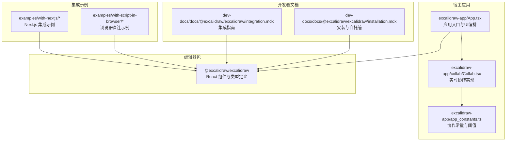
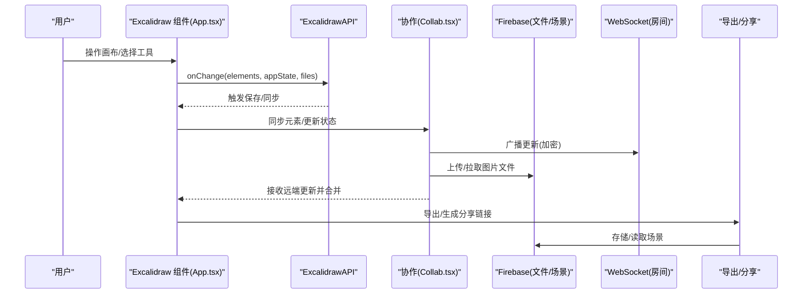
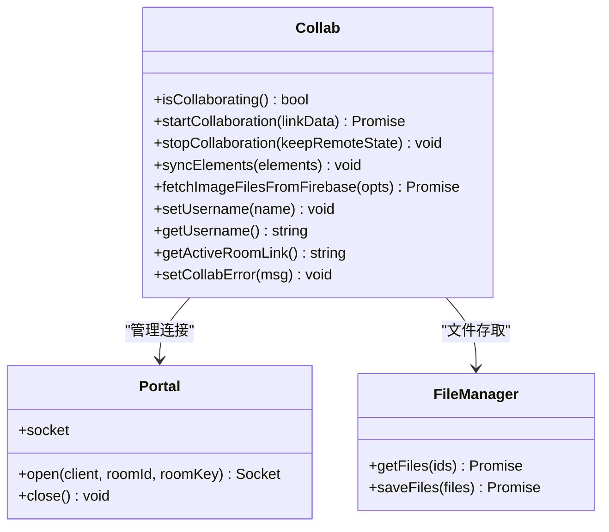
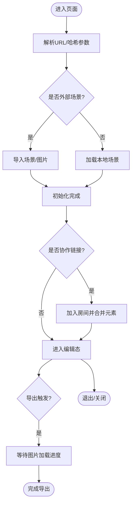
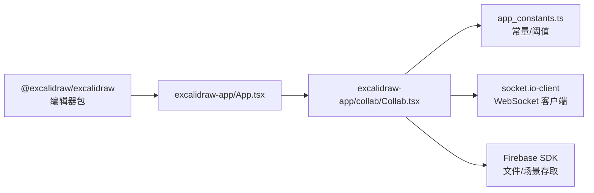

# 应用场景与案例

<cite>
**本文引用的文件**
- [README.md](file://README.md)
- [App.tsx](file://excalidraw-app/App.tsx)
- [Collab.tsx](file://excalidraw-app/collab/Collab.tsx)
- [app_constants.ts](file://excalidraw-app/app_constants.ts)
- [integration.mdx](file://dev-docs/docs/@excalidraw/excalidraw/integration.mdx)
- [installation.mdx](file://dev-docs/docs/@excalidraw/excalidraw/installation.mdx)
- [with-nextjs 示例 README](file://examples/with-nextjs/README.md)
- [浏览器示例 index.html](file://examples/with-script-in-browser/index.html)
- [with-nextjs 包装器](file://examples/with-nextjs/src/excalidrawWrapper.tsx)
- [浏览器示例入口](file://examples/with-script-in-browser/index.tsx)
- [Excalidraw 包 package.json](file://packages/excalidraw/package.json)
</cite>

## 目录
1. [简介](#简介)
2. [项目结构](#项目结构)
3. [核心组件](#核心组件)
4. [架构总览](#架构总览)
5. [详细组件分析](#详细组件分析)
6. [依赖分析](#依赖分析)
7. [性能考虑](#性能考虑)
8. [故障排查指南](#故障排查指南)
9. [结论](#结论)
10. [附录](#附录)

## 简介
本文件面向希望在自身业务中引入 Excalidraw 的团队与个人，系统梳理其在不同领域的典型应用场景、知名公司集成案例、用户使用模式与最佳实践，并提供可落地的集成方案、性能与安全考量及扩展性建议。文档基于仓库内源码与官方文档进行提炼，确保信息准确可追溯。

## 项目结构
Excalidraw 采用多包（monorepo）组织方式，核心编辑器以 npm 包形式提供，宿主应用位于 excalidraw-app 中，同时提供多种集成示例与开发者文档网站。下图给出与“应用场景与案例”相关的关键模块关系概览：

图表来源
- [App.tsx:1269-1288](file://excalidraw-app/App.tsx#L1269-L1288)
- [Collab.tsx:132-280](file://excalidraw-app/collab/Collab.tsx#L132-L280)
- [app_constants.ts:1-37](file://excalidraw-app/app_constants.ts#L1-L37)
- [integration.mdx:1-241](file://dev-docs/docs/@excalidraw/excalidraw/integration.mdx#L1-L241)
- [installation.mdx:1-56](file://dev-docs/docs/@excalidraw/excalidraw/installation.mdx#L1-L56)
- [with-nextjs 示例 README:1-37](file://examples/with-nextjs/README.md#L1-L37)
- [浏览器示例 index.html:1-32](file://examples/with-script-in-browser/index.html#L1-L32)
- [with-nextjs 包装器:1-24](file://examples/with-nextjs/src/excalidrawWrapper.tsx#L1-L24)
- [浏览器示例入口:1-30](file://examples/with-script-in-browser/index.tsx#L1-L30)

章节来源
- [README.md:1-125](file://README.md#L1-L125)
- [integration.mdx:1-241](file://dev-docs/docs/@excalidraw/excalidraw/integration.mdx#L1-L241)
- [installation.mdx:1-56](file://dev-docs/docs/@excalidraw/excalidraw/installation.mdx#L1-L56)

## 核心组件
- 实时协作引擎：负责建立协作房间、广播/接收更新、加密传输、光标与视图跟随、离线检测与错误提示等。
- 应用入口与UI编排：负责初始化场景、处理导入/导出、渲染菜单/侧边栏/分享对话框、命令面板、主题切换等。
- 集成适配层：提供 Next.js 动态加载、浏览器直连、CSS 资源路径、字体自托管等能力。
- 文档与示例：覆盖安装、SSR 注意事项、Preact 兼容、环境变量与资源路径设置等。

章节来源
- [App.tsx:374-1288](file://excalidraw-app/App.tsx#L374-L1288)
- [Collab.tsx:132-787](file://excalidraw-app/collab/Collab.tsx#L132-L787)
- [integration.mdx:33-157](file://dev-docs/docs/@excalidraw/excalidraw/integration.mdx#L33-L157)
- [installation.mdx:19-56](file://dev-docs/docs/@excalidraw/excalidraw/installation.mdx#L19-L56)

## 架构总览
下图展示从“用户操作到数据持久化”的端到端流程，涵盖本地存储、协作广播、云端文件管理与导出链路：

图表来源
- [App.tsx:678-728](file://excalidraw-app/App.tsx#L678-L728)
- [Collab.tsx:508-706](file://excalidraw-app/collab/Collab.tsx#L508-L706)
- [app_constants.ts:16-35](file://excalidraw-app/app_constants.ts#L16-L35)

## 详细组件分析

### 实时协作组件（Collab）
- 房间生命周期：生成房间ID/密钥、打开 WebSocket、初始化/回退加载场景、清理资源。
- 数据同步：元素差异合并、版本号管理、批量/节流广播、空闲状态与鼠标位置广播。
- 文件管理：图片文件按需拉取、状态跟踪、错误重试、最大体积限制。
- 错误与离线：连接失败回退、离线状态指示、卸载前阻塞与保存提示。

图表来源
- [Collab.tsx:114-243](file://excalidraw-app/collab/Collab.tsx#L114-L243)
- [Collab.tsx:132-204](file://excalidraw-app/collab/Collab.tsx#L132-L204)

章节来源
- [Collab.tsx:471-706](file://excalidraw-app/collab/Collab.tsx#L471-L706)
- [app_constants.ts:1-37](file://excalidraw-app/app_constants.ts#L1-L37)

### 应用入口与UI编排（App）
- 场景初始化：解析URL/哈希参数、导入本地/外部场景、协作房间接入、图片文件预加载。
- 事件与回调：变更监听、导出拦截（等待图片加载）、命令面板、分享/协作弹窗、主题切换。
- 错误与提示：离线警告、本地存储配额告警、错误对话框、分享链接弹窗。

图表来源
- [App.tsx:216-372](file://excalidraw-app/App.tsx#L216-L372)
- [App.tsx:800-839](file://excalidraw-app/App.tsx#L800-L839)

章节来源
- [App.tsx:374-1288](file://excalidraw-app/App.tsx#L374-L1288)

### 集成与部署要点
- Next.js：动态导入避免 SSR 渲染；App Router 需要“use client”指令；包装器统一注入样式与组件。
- 浏览器直连：通过 import map 引入 React；设置 EXCALIDRAW_ASSET_PATH；支持 ESM/CSS 自托管。
- 字体与资源：默认从 CDN 加载字体；可复制 dist/prod/fonts 到自有目录并设置资产路径。
- Preact 兼容：通过环境变量启用 Preact 构建，并在 Vite 中暴露该变量。

章节来源
- [integration.mdx:33-157](file://dev-docs/docs/@excalidraw/excalidraw/integration.mdx#L33-L157)
- [installation.mdx:19-56](file://dev-docs/docs/@excalidraw/excalidraw/installation.mdx#L19-L56)
- [with-nextjs 示例 README:1-37](file://examples/with-nextjs/README.md#L1-L37)
- [with-nextjs 包装器:1-24](file://examples/with-nextjs/src/excalidrawWrapper.tsx#L1-L24)
- [浏览器示例 index.html:1-32](file://examples/with-script-in-browser/index.html#L1-L32)
- [浏览器示例入口:1-30](file://examples/with-script-in-browser/index.tsx#L1-L30)

## 依赖分析
- 编辑器包：@excalidraw/excalidraw 提供 React 组件、类型与工具集，作为宿主应用的核心依赖。
- 协作常量：房间/文件/网络事件常量集中于 app_constants.ts，便于统一配置与调试。
- 外部服务：WebSocket 服务器用于实时广播，Firebase 用于场景与文件的临时存储与加密传输。
- 构建与运行：示例展示 ESM、UMD、Next.js 动态导入、Preact 兼容等多运行时形态。

图表来源
- [Excalidraw 包 package.json:1-141](file://packages/excalidraw/package.json#L1-L141)
- [App.tsx:1-120](file://excalidraw-app/App.tsx#L1-L120)
- [Collab.tsx:508-536](file://excalidraw-app/collab/Collab.tsx#L508-L536)
- [app_constants.ts:16-35](file://excalidraw-app/app_constants.ts#L16-L35)

章节来源
- [Excalidraw 包 package.json:76-117](file://packages/excalidraw/package.json#L76-L117)

## 性能考虑
- 渲染节流与批处理：应用入口开启渲染节流标记，减少高频交互下的重绘压力。
- 图片加载策略：按需拉取、状态跟踪、批量更新，导出前等待图片加载完成，避免半成品。
- 协作同步：元素差异合并、版本号管理、节流广播与全量同步间隔控制，降低带宽与冲突概率。
- 本地存储：分段保存、可见性/焦点事件联动，避免频繁写入 IndexedDB。

章节来源
- [App.tsx:155-156](file://excalidraw-app/App.tsx#L155-L156)
- [App.tsx:800-839](file://excalidraw-app/App.tsx#L800-L839)
- [Collab.tsx:789-800](file://excalidraw-app/collab/Collab.tsx#L789-L800)
- [app_constants.ts:1-37](file://excalidraw-app/app_constants.ts#L1-L37)

## 故障排查指南
- 协作连接失败：检查 WebSocket 服务器地址与网络连通性；关注 connect_error 回退逻辑；查看错误对话框与离线状态指示。
- 图片加载异常：确认文件大小未超过限制；检查文件状态更新与错误集合；必要时强制重新拉取。
- 导出空白或图片缺失：导出拦截器会等待图片加载进度，若长时间卡住，检查图片状态与网络状况。
- Next.js SSR 报错：确保 Excalidraw 组件仅在客户端渲染；App Router 使用“use client”；动态导入包裹器。
- 字体/资源 404：如启用自托管，请正确复制字体目录并设置 EXCALIDRAW_ASSET_PATH。

章节来源
- [Collab.tsx:512-536](file://excalidraw-app/collab/Collab.tsx#L512-L536)
- [Collab.tsx:160-199](file://excalidraw-app/collab/Collab.tsx#L160-L199)
- [App.tsx:800-839](file://excalidraw-app/App.tsx#L800-L839)
- [integration.mdx:33-131](file://dev-docs/docs/@excalidraw/excalidraw/integration.mdx#L33-L131)
- [installation.mdx:19-56](file://dev-docs/docs/@excalidraw/excalidraw/installation.mdx#L19-L56)

## 结论
Excalidraw 以轻量的 React 组件为核心，结合完善的协作、导出与集成能力，适用于教学培训、产品设计、团队协作、技术文档与创意草图等多种场景。通过合理的集成策略（SSR 兼容、资源自托管、Preact 兼容）、性能优化（图片按需加载、协作节流）与安全设计（端到端加密、离线保护），可在企业级环境中稳定落地。

## 附录

### 典型应用场景与实践建议
- 在线教学与培训
  - 建议：启用协作模式，共享链接给学员；使用命令面板快速切换主题与工具；导出为图片/链接便于课后复习。
  - 参考：协作房间、分享对话框、主题切换、导出拦截。
  - 章节来源
    - [App.tsx:986-1060](file://excalidraw-app/App.tsx#L986-L1060)
    - [Collab.tsx:471-706](file://excalidraw-app/collab/Collab.tsx#L471-L706)

- 产品设计与原型制作
  - 建议：利用形状库与箭头绑定；多人同时绘制同一原型；导出为 PNG/SVG 用于评审。
  - 参考：工具栏、绑定与标签箭头、导出选项。
  - 章节来源
    - [App.tsx:911-950](file://excalidraw-app/App.tsx#L911-L950)

- 团队协作与头脑风暴
  - 建议：创建房间并邀请成员；使用鼠标位置与视图跟随；离线时注意保存提示。
  - 参考：房间生成、广播/接收、离线检测。
  - 章节来源
    - [Collab.tsx:508-706](file://excalidraw-app/collab/Collab.tsx#L508-L706)
    - [app_constants.ts:25-30](file://excalidraw-app/app_constants.ts#L25-L30)

- 技术文档与流程图绘制
  - 建议：使用手绘风格提升可读性；导出为只读链接便于分享；图片自托管保障稳定性。
  - 参考：导出拦截、分享链接、字体自托管。
  - 章节来源
    - [App.tsx:734-772](file://excalidraw-app/App.tsx#L734-L772)
    - [installation.mdx:19-56](file://dev-docs/docs/@excalidraw/excalidraw/installation.mdx#L19-L56)

- 创意草图与灵感收集
  - 建议：无限画布与手绘风格；导出为图片归档；配合命令面板快速切换工具。
  - 参考：命令面板、工具栏、导出。
  - 章节来源
    - [App.tsx:1068-1256](file://excalidraw-app/App.tsx#L1068-L1256)

### 已知集成案例（来自仓库说明）
- Google Cloud、Meta、CodeSandbox、Obsidian、Replit、Slite、Notion、HackerRank 等。
- 章节来源
  - [README.md:108-111](file://README.md#L108-L111)

### 集成方案与实施建议
- Next.js 集成
  - 使用动态导入避免 SSR；App Router 添加“use client”；通过包装器注入样式与组件。
  - 章节来源
    - [integration.mdx:33-131](file://dev-docs/docs/@excalidraw/excalidraw/integration.mdx#L33-L131)
    - [with-nextjs 示例 README:1-37](file://examples/with-nextjs/README.md#L1-L37)
    - [with-nextjs 包装器:1-24](file://examples/with-nextjs/src/excalidrawWrapper.tsx#L1-L24)

- 浏览器直连
  - 设置 import map 与 EXCALIDRAW_ASSET_PATH；支持 ESM/CSS 自托管。
  - 章节来源
    - [integration.mdx:159-241](file://dev-docs/docs/@excalidraw/excalidraw/integration.mdx#L159-L241)
    - [浏览器示例 index.html:1-32](file://examples/with-script-in-browser/index.html#L1-L32)
    - [浏览器示例入口:1-30](file://examples/with-script-in-browser/index.tsx#L1-L30)

- Preact 兼容
  - 设置环境变量并确保构建工具暴露该变量；参考 Vite 配置片段。
  - 章节来源
    - [integration.mdx:138-157](file://dev-docs/docs/@excalidraw/excalidraw/integration.mdx#L138-L157)

- 安全与合规
  - 协作房间采用端到端加密；离线时阻止误卸载并提示保存；错误对话框统一呈现。
  - 章节来源
    - [Collab.tsx:448-467](file://excalidraw-app/collab/Collab.tsx#L448-L467)
    - [Collab.tsx:291-313](file://excalidraw-app/collab/Collab.tsx#L291-L313)
    - [App.tsx:1020-1041](file://excalidraw-app/App.tsx#L1020-L1041)

- 扩展性与维护
  - 通过 UIOptions 注入自定义导出/分享行为；命令面板扩展常用功能；主题与语言可配置。
  - 章节来源
    - [App.tsx:917-950](file://excalidraw-app/App.tsx#L917-L950)
    - [App.tsx:1068-1256](file://excalidraw-app/App.tsx#L1068-L1256)