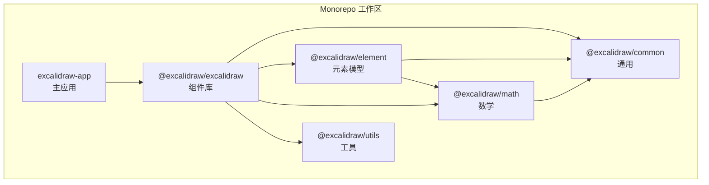
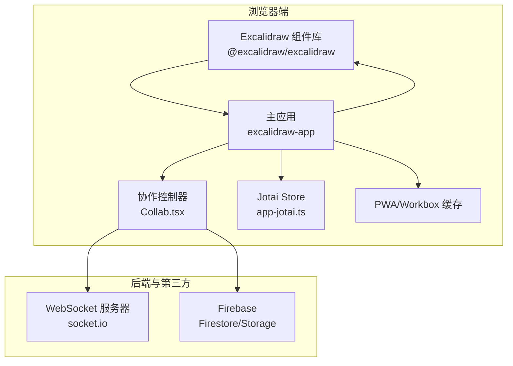
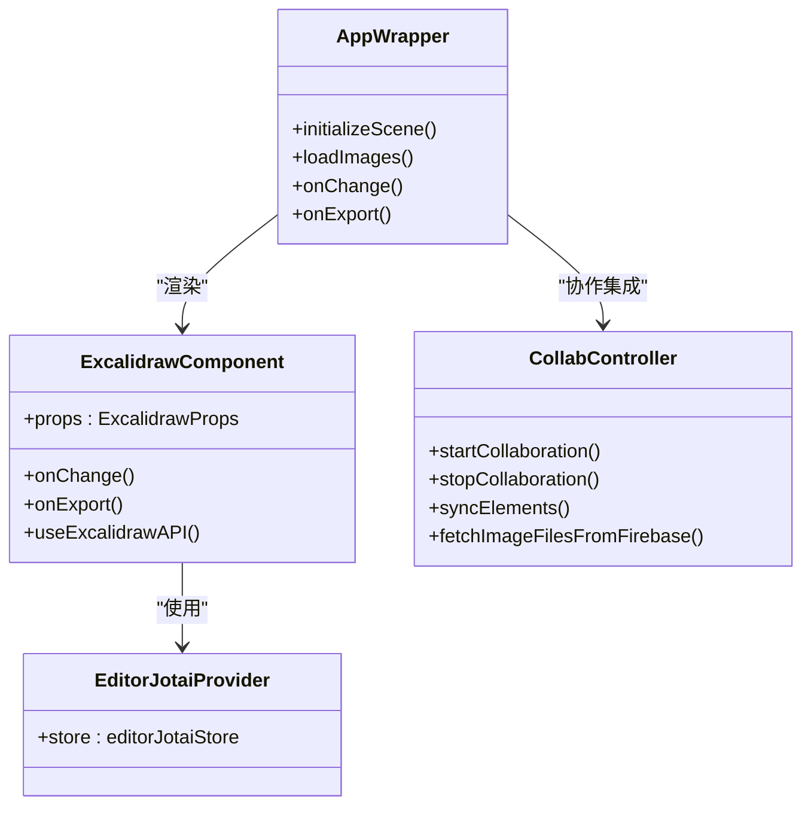
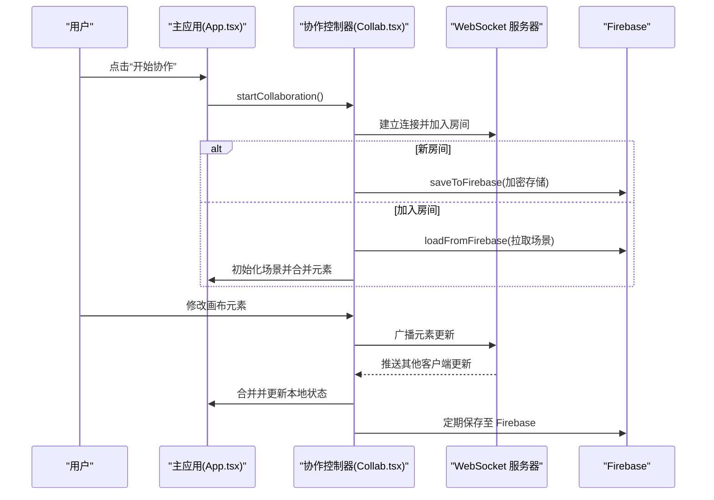
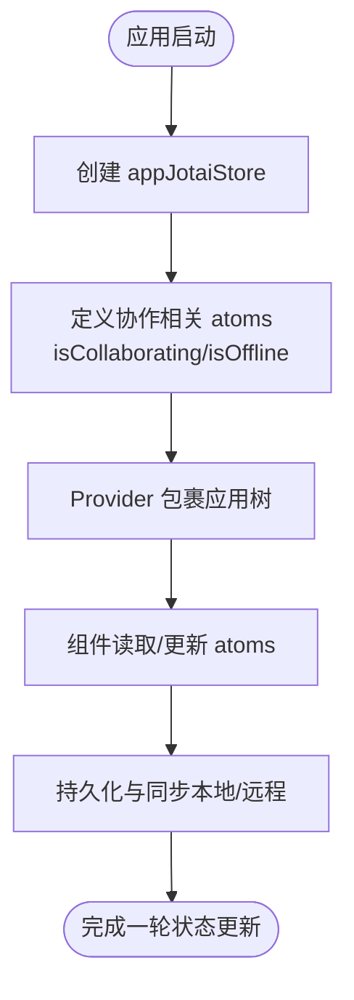
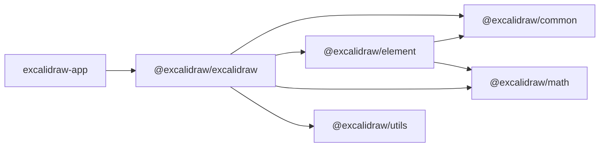

# 技术栈与架构

<cite>
**本文引用的文件**
- [package.json](file://package.json)
- [excalidraw-app/package.json](file://excalidraw-app/package.json)
- [packages/excalidraw/package.json](file://packages/excalidraw/package.json)
- [packages/tsconfig.base.json](file://packages/tsconfig.base.json)
- [excalidraw-app/vite.config.mts](file://excalidraw-app/vite.config.mts)
- [excalidraw-app/App.tsx](file://excalidraw-app/App.tsx)
- [excalidraw-app/app-jotai.ts](file://excalidraw-app/app-jotai.ts)
- [packages/excalidraw/index.tsx](file://packages/excalidraw/index.tsx)
- [excalidraw-app/collab/Collab.tsx](file://excalidraw-app/collab/Collab.tsx)
- [excalidraw-app/data/firebase.ts](file://excalidraw-app/data/firebase.ts)
</cite>

## 目录

1. [引言](#引言)
2. [项目结构](#项目结构)
3. [核心组件](#核心组件)
4. [架构总览](#架构总览)
5. [详细组件分析](#详细组件分析)
6. [依赖分析](#依赖分析)
7. [性能考虑](#性能考虑)
8. [故障排查指南](#故障排查指南)
9. [结论](#结论)
10. [附录](#附录)

## 引言

本文件面向希望深入理解 Excalidraw 技术栈与架构的开发者，系统阐述以下要点：

- 核心技术栈：React 19+、TypeScript、Jotai 状态管理、Vite 构建工具等的选择动机与优势
- Monorepo 架构：工作区组织、包职责划分与依赖关系
- 前端应用与组件库关系：excalidraw-app 与 @excalidraw/excalidraw 的边界与协作
- 实时协作系统：WebSocket 通信、Firebase 集成、加密与一致性保障
- 构建配置、开发工具链与部署策略
- 为技术决策提供背景说明，帮助读者理解架构设计思路

## 项目结构

Excalidraw 采用 Yarn Workspaces + Vite 的 Monorepo 组织方式，核心目录与职责如下：

- excalidraw-app：主应用，包含页面入口、状态管理、实时协作、数据层与 PWA 配置
- packages/\*：可复用的内部包，形成清晰的分层与职责边界
  - common：通用常量、类型与工具
  - element：元素模型与相关逻辑
  - math：数学与几何计算
  - utils：导出与序列化等工具函数
  - excalidraw：作为 React 组件库对外发布，聚合各子包并暴露 API
- scripts：构建脚本与工具链
- examples：示例工程（Next.js、浏览器直连）

**图表来源**

- [package.json:5-9](file://package.json#L5-L9)
- [excalidraw-app/package.json:1-58](file://excalidraw-app/package.json#L1-L58)
- [packages/excalidraw/package.json:1-141](file://packages/excalidraw/package.json#L1-L141)

**章节来源**

- [package.json:1-96](file://package.json#L1-L96)
- [packages/tsconfig.base.json:1-29](file://packages/tsconfig.base.json#L1-L29)

## 核心组件

本节聚焦于支撑整体架构的关键组件与模块。

- 应用入口与状态管理

  - excalidraw-app/App.tsx：应用主入口，负责初始化场景、处理本地存储同步、导入导出、错误边界与 PWA 行为；通过 Jotai 提供的应用级 Store 管理协作状态与全局原子
  - excalidraw-app/app-jotai.ts：封装 Jotai Store 与自定义 Hook，提供 useAtomWithInitialValue 等能力

- 组件库与对外 API

  - packages/excalidraw/index.tsx：组件库入口，导出 Excalidraw 组件、API Provider、hooks、工具函数与默认 UI 组件，内部使用 EditorJotaiProvider 管理编辑器状态

- 实时协作系统

  - excalidraw-app/collab/Collab.tsx：协作控制器，封装 Socket 会话、房间管理、用户光标与视口广播、空闲状态检测、文件上传与下载、冲突合并与版本控制
  - excalidraw-app/data/firebase.ts：基于 Firebase Firestore/Storage 的安全存储与传输，提供加解密、事务写入、版本缓存与批量文件上传

- 构建与开发工具
  - excalidraw-app/vite.config.mts：Vite 配置，包含路径别名、PWA、Sitemap、SVGR、WOFF2 转换、Workbox 缓存策略、路由懒加载拆分与环境变量加载

**章节来源**

- [excalidraw-app/App.tsx:1-1288](file://excalidraw-app/App.tsx#L1-L1288)
- [excalidraw-app/app-jotai.ts:1-38](file://excalidraw-app/app-jotai.ts#L1-L38)
- [packages/excalidraw/index.tsx:1-453](file://packages/excalidraw/index.tsx#L1-L453)
- [excalidraw-app/collab/Collab.tsx:1-1052](file://excalidraw-app/collab/Collab.tsx#L1-L1052)
- [excalidraw-app/data/firebase.ts:1-320](file://excalidraw-app/data/firebase.ts#L1-L320)
- [excalidraw-app/vite.config.mts:1-319](file://excalidraw-app/vite.config.mts#L1-L319)

## 架构总览

下图展示了前端应用与组件库、协作系统与后端服务之间的交互关系：

**图表来源**

- [excalidraw-app/App.tsx:1-1288](file://excalidraw-app/App.tsx#L1-L1288)
- [packages/excalidraw/index.tsx:1-453](file://packages/excalidraw/index.tsx#L1-L453)
- [excalidraw-app/collab/Collab.tsx:1-1052](file://excalidraw-app/collab/Collab.tsx#L1-L1052)
- [excalidraw-app/data/firebase.ts:1-320](file://excalidraw-app/data/firebase.ts#L1-L320)
- [excalidraw-app/vite.config.mts:1-319](file://excalidraw-app/vite.config.mts#L1-L319)

## 详细组件分析

### 组件库与应用的关系

- 组件库（@excalidraw/excalidraw）
  - 作为 React 组件库，提供 Excalidraw 组件、API Provider、hooks、UI 组件与工具函数
  - 内部通过 EditorJotaiProvider 管理编辑器状态，便于在宿主应用中复用
- 主应用（excalidraw-app）
  - 将组件库嵌入到页面中，负责场景初始化、本地存储同步、导入导出、错误处理与 PWA 行为
  - 使用 Jotai Store 管理协作状态（如 isCollaborating、isOffline）、共享原子与跨模块通信

**图表来源**

- [packages/excalidraw/index.tsx:1-453](file://packages/excalidraw/index.tsx#L1-L453)
- [excalidraw-app/App.tsx:1-1288](file://excalidraw-app/App.tsx#L1-L1288)
- [excalidraw-app/collab/Collab.tsx:1-1052](file://excalidraw-app/collab/Collab.tsx#L1-L1052)

**章节来源**

- [packages/excalidraw/package.json:1-141](file://packages/excalidraw/package.json#L1-L141)
- [packages/excalidraw/index.tsx:1-453](file://packages/excalidraw/index.tsx#L1-L453)
- [excalidraw-app/App.tsx:1-1288](file://excalidraw-app/App.tsx#L1-L1288)

### 实时协作系统（WebSocket + Firebase）

- 协作流程
  - 用户点击“开始协作”，生成房间 ID/Key，更新 URL 并建立 Socket 连接
  - 若为新房间，将当前画布元素标记为“待上传”并保存至 Firebase；若加入已有房间，则从 Firestore 拉取最新场景
  - 后续通过 Socket 广播元素变更，接收方进行去重与冲突合并，再通过 Firebase 存储最终一致状态
  - 文件（图片等）通过 Firebase Storage 加密压缩后传输，支持批量上传与失败回退

**图表来源**

- [excalidraw-app/collab/Collab.tsx:471-706](file://excalidraw-app/collab/Collab.tsx#L471-L706)
- [excalidraw-app/data/firebase.ts:187-247](file://excalidraw-app/data/firebase.ts#L187-L247)

**章节来源**

- [excalidraw-app/collab/Collab.tsx:1-1052](file://excalidraw-app/collab/Collab.tsx#L1-L1052)
- [excalidraw-app/data/firebase.ts:1-320](file://excalidraw-app/data/firebase.ts#L1-L320)

### 状态管理（Jotai）

- 应用级 Store
  - excalidraw-app/app-jotai.ts：创建并导出 appJotaiStore，提供 useAtomWithInitialValue 等 Hook，用于在应用层管理协作状态（如 isCollaborating、isOffline）
- 组件库内 Store
  - packages/excalidraw/index.tsx：通过 EditorJotaiProvider 管理编辑器内部状态，避免与宿主应用耦合

**图表来源**

- [excalidraw-app/app-jotai.ts:1-38](file://excalidraw-app/app-jotai.ts#L1-L38)
- [excalidraw-app/App.tsx:1-1288](file://excalidraw-app/App.tsx#L1-L1288)

**章节来源**

- [excalidraw-app/app-jotai.ts:1-38](file://excalidraw-app/app-jotai.ts#L1-L38)
- [excalidraw-app/App.tsx:1-1288](file://excalidraw-app/App.tsx#L1-L1288)

### 构建配置与开发工具链

- Vite 配置要点
  - 路径别名：将 @excalidraw/\* 映射到 packages 下对应源码，便于本地开发与联调
  - 插件生态：SVGR、PWA（Workbox）、Sitemap、checker（TS/ESLint）、EJS、WOFF2 转换
  - 手动分包：按功能拆分 chunk（如 mermaid-to-excalidraw、codemirror.chunk），优化缓存与首屏加载
  - 环境变量：通过 loadEnv 从父目录加载 .env，支持多环境差异化行为
- TypeScript 配置
  - 全局 tsconfig.base.json：统一编译选项、严格模式、路径映射，确保 monorepo 内包间类型一致

**章节来源**

- [excalidraw-app/vite.config.mts:1-319](file://excalidraw-app/vite.config.mts#L1-L319)
- [packages/tsconfig.base.json:1-29](file://packages/tsconfig.base.json#L1-L29)

## 依赖分析

- 包依赖关系
  - @excalidraw/excalidraw 依赖 @excalidraw/common、@excalidraw/element、@excalidraw/math、@excalidraw/utils 等
  - @excalidraw/element 依赖 @excalidraw/common 与 @excalidraw/math
  - 主应用 excalidraw-app 依赖 @excalidraw/excalidraw 与第三方库（socket.io-client、firebase、jotai 等）
- 工作区与脚本
  - package.json 定义 workspaces 与统一脚本，支持并行构建各包与主应用

**图表来源**

- [packages/excalidraw/package.json:80-117](file://packages/excalidraw/package.json#L80-L117)
- [packages/element/package.json:66-69](file://packages/element/package.json#L66-L69)
- [excalidraw-app/package.json:28-40](file://excalidraw-app/package.json#L28-L40)

**章节来源**

- [package.json:1-96](file://package.json#L1-L96)
- [packages/excalidraw/package.json:1-141](file://packages/excalidraw/package.json#L1-L141)
- [packages/element/package.json:1-71](file://packages/element/package.json#L1-L71)
- [excalidraw-app/package.json:1-58](file://excalidraw-app/package.json#L1-L58)

## 性能考虑

- 分包与缓存
  - Vite 手动分包策略将大体积依赖（如 CodeMirror）独立打包，结合 Workbox 的缓存策略（字体、语言包、chunk）提升离线与二次访问体验
- 渲染与事件节流
  - 应用层对高频事件（如滚动、可见性变化）进行节流/防抖，减少不必要的重渲染
- 图像与文件处理
  - 图片上传前压缩与加密，下载时按需获取并维护状态，避免重复请求
- PWA 与懒加载
  - 通过 PWA 与路由懒加载，优化首屏加载与运行时资源获取

**章节来源**

- [excalidraw-app/vite.config.mts:103-121](file://excalidraw-app/vite.config.mts#L103-L121)
- [excalidraw-app/vite.config.mts:170-220](file://excalidraw-app/vite.config.mts#L170-L220)
- [excalidraw-app/App.tsx:560-617](file://excalidraw-app/App.tsx#L560-L617)
- [excalidraw-app/collab/Collab.tsx:420-446](file://excalidraw-app/collab/Collab.tsx#L420-L446)

## 故障排查指南

- 协作异常
  - 现象：无法进入房间或元素不一致
  - 排查：检查 WebSocket 服务器地址、房间 ID/Key 是否正确；确认 Firebase 写入是否成功；查看去重与版本合并逻辑
- Firebase 写入失败
  - 现象：保存失败或大小超限
  - 排查：检查事务写入与解密流程；确认文件大小限制与加密参数；查看错误提示并记录日志
- PWA 缓存问题
  - 现象：更新后未生效
  - 排查：清理旧缓存、检查 Workbox 配置与缓存键；确认 precache 与 runtimeCaching 规则

**章节来源**

- [excalidraw-app/collab/Collab.tsx:315-355](file://excalidraw-app/collab/Collab.tsx#L315-L355)
- [excalidraw-app/data/firebase.ts:131-143](file://excalidraw-app/data/firebase.ts#L131-L143)
- [excalidraw-app/vite.config.mts:150-221](file://excalidraw-app/vite.config.mts#L150-L221)

## 结论

Excalidraw 的技术栈与架构围绕“可复用组件库 + 高效构建工具 + 可靠协作系统”展开：

- React 19+ 与 TypeScript 提供强类型与现代生态支持
- Jotai 在应用与组件库两端分别承担全局与编辑器状态管理
- Vite 与 Workbox 构建与缓存体系兼顾开发体验与运行性能
- WebSocket + Firebase 的协作方案在一致性、安全性与扩展性之间取得平衡
- Monorepo 通过清晰的包边界与共享配置，降低耦合并提升可维护性

## 附录

- 关键技术选型背景
  - React 19+：利用最新并发特性与改进的渲染模型，提升复杂画布场景下的交互流畅度
  - TypeScript：在大型 monorepo 中保证类型一致性与 IDE 支持
  - Jotai：细粒度状态与轻量级 Store，适合跨组件共享协作状态
  - Vite：快速冷启与热更新，配合插件生态满足多场景需求
  - Firebase：成熟的数据存储与 CDN 能力，适配协作场景的读写与分发
