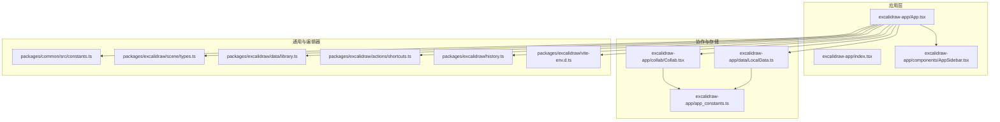
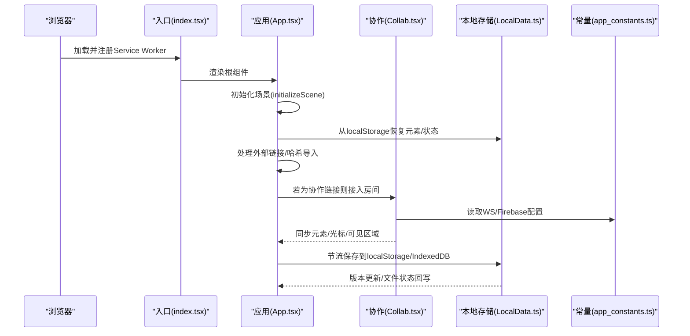
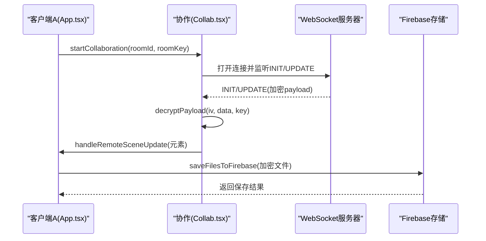
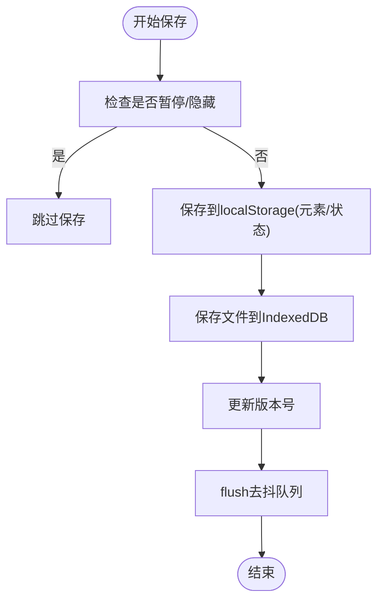
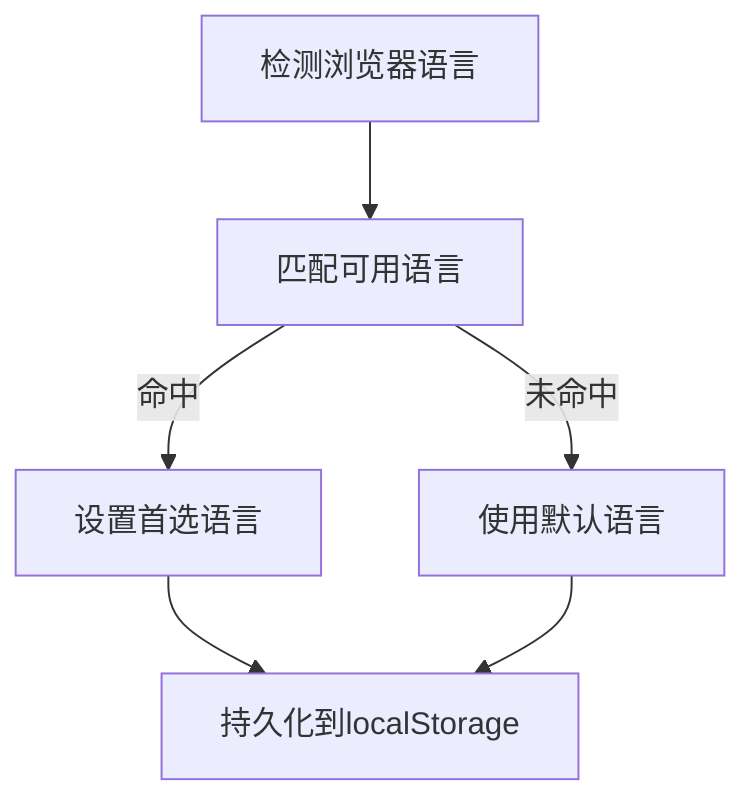
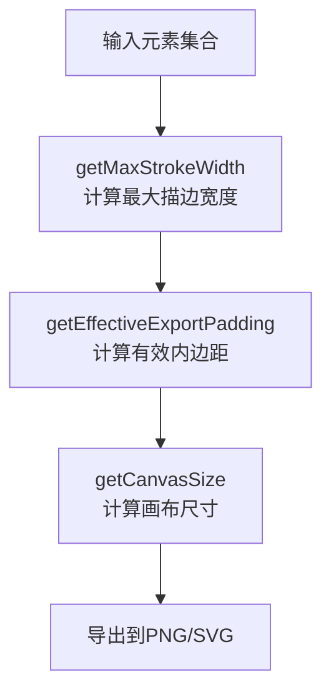
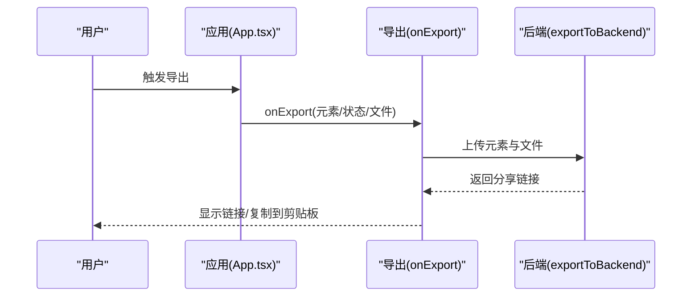
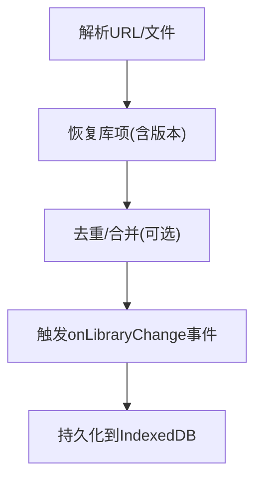
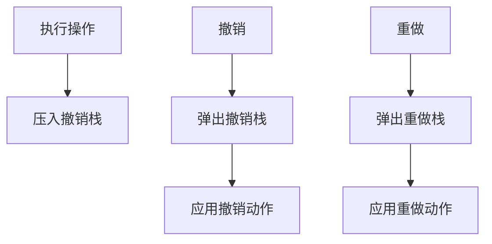
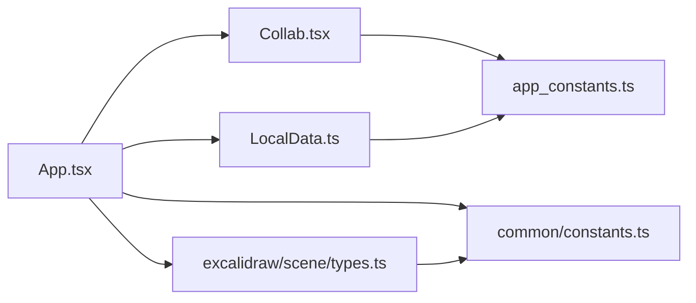

# 核心特性概览

<cite>
**本文引用的文件**
- [README.md](file://README.md)
- [package.json](file://package.json)
- [excalidraw-app/App.tsx](file://excalidraw-app/App.tsx)
- [excalidraw-app/index.tsx](file://excalidraw-app/index.tsx)
- [excalidraw-app/collab/Collab.tsx](file://excalidraw-app/collab/Collab.tsx)
- [excalidraw-app/data/LocalData.ts](file://excalidraw-app/data/LocalData.ts)
- [excalidraw-app/app-language/language-detector.ts](file://excalidraw-app/app-language/language-detector.ts)
- [excalidraw-app/components/AppSidebar.tsx](file://excalidraw-app/components/AppSidebar.tsx)
- [excalidraw-app/useHandleAppTheme.ts](file://excalidraw-app/useHandleAppTheme.ts)
- [excalidraw-app/app_constants.ts](file://excalidraw-app/app_constants.ts)
- [packages/common/src/constants.ts](file://packages/common/src/constants.ts)
- [packages/excalidraw/scene/types.ts](file://packages/excalidraw/scene/types.ts)
- [packages/excalidraw/actions/shortcuts.ts](file://packages/excalidraw/actions/shortcuts.ts)
- [packages/excalidraw/history.ts](file://packages/excalidraw/history.ts)
- [packages/excalidraw/data/library.ts](file://packages/excalidraw/data/library.ts)
- [packages/excalidraw/components/JSONExportDialog.tsx](file://packages/excalidraw/components/JSONExportDialog.tsx)
- [packages/excalidraw/tests/scene/export.test.ts](file://packages/excalidraw/tests/scene/export.test.ts)
- [packages/excalidraw/vite-env.d.ts](file://packages/excalidraw/vite-env.d.ts)
- [packages/excalidraw/scene/export.ts](file://packages/excalidraw/scene/export.ts)
- [packages/utils/src/export.ts](file://packages/utils/src/export.ts)
- [packages/excalidraw/renderer/staticSvgScene.ts](file://packages/excalidraw/renderer/staticSvgScene.ts)
</cite>

## 目录
1. [简介](#简介)
2. [项目结构](#项目结构)
3. [核心组件](#核心组件)
4. [架构总览](#架构总览)
5. [详细组件分析](#详细组件分析)
6. [依赖关系分析](#依赖关系分析)
7. [性能考量](#性能考量)
8. [故障排查指南](#故障排查指南)
9. [结论](#结论)
10. [附录](#附录)

## 简介
本文件为 Excalidraw 的核心特性概览，面向使用者与集成者，系统梳理其作为"手绘风格白板"的关键能力：无限画布、手绘渲染风格、丰富绘图工具、图像支持、形状库、主题切换、实时协作与端到端加密、本地优先存储、导出与导入、国际化、键盘快捷键、撤销重做等。通过分层讲解与可视化图示，帮助快速理解并高效使用。

## 项目结构
Excalidraw 采用多包工作区组织，核心应用位于 excalidraw-app，通用常量与类型定义在 packages/common，编辑器内核与导出逻辑在 packages/excalidraw。README 概述了特性清单，package.json 定义了 monorepo 结构与脚本。

图表来源
- [excalidraw-app/App.tsx:1-120](file://excalidraw-app/App.tsx#L1-L120)
- [excalidraw-app/index.tsx:1-18](file://excalidraw-app/index.tsx#L1-L18)
- [excalidraw-app/collab/Collab.tsx:1-120](file://excalidraw-app/collab/Collab.tsx#L1-L120)
- [excalidraw-app/data/LocalData.ts:1-60](file://excalidraw-app/data/LocalData.ts#L1-L60)
- [excalidraw-app/app_constants.ts:1-62](file://excalidraw-app/app_constants.ts#L1-L62)
- [packages/common/src/constants.ts:227-373](file://packages/common/src/constants.ts#L227-L373)
- [packages/excalidraw/scene/types.ts:42-175](file://packages/excalidraw/scene/types.ts#L42-L175)
- [packages/excalidraw/data/library.ts:1-120](file://packages/excalidraw/data/library.ts#L1-L120)
- [packages/excalidraw/actions/shortcuts.ts:96-130](file://packages/excalidraw/actions/shortcuts.ts#L96-L130)
- [packages/excalidraw/history.ts:148-196](file://packages/excalidraw/history.ts#L148-L196)
- [packages/excalidraw/vite-env.d.ts:1-60](file://packages/excalidraw/vite-env.d.ts#L1-L60)

章节来源
- [README.md:52-81](file://README.md#L52-L81)
- [package.json:1-96](file://package.json#L1-L96)

## 核心组件
- 应用入口与初始化
  - 入口注册 Service Worker 并渲染应用根节点，随后加载主应用组件。
  - 应用初始化负责场景恢复、外部链接导入、协作房间接入、图片文件加载与同步、本地存储与跨标签同步、错误边界处理等。
- 协作与端到端加密
  - 基于 WebSocket 的协作通道，使用对称密钥进行元素与文件的端到端加密，确保传输与存储安全。
- 本地优先存储
  - 使用 localStorage 存放元素与应用状态，IndexedDB 存放图片文件；提供保存节流、并发锁、版本控制与跨标签同步。
- 国际化与主题
  - 自动检测浏览器语言，支持多语言；主题支持系统跟随与手动切换，并持久化至本地存储。
- 工具与交互
  - 提供撤销/重做、缩放/平移、网格/对象吸附、快捷键、命令面板等基础体验。
- 导出与导入
  - 支持 PNG、SVG、剪贴板、后端分享链接等多种导出方式；支持从后端或外部 URL 导入场景。
- 形状库
  - 内置形状库管理，支持从 URL 或文件导入、合并更新、差异通知与持久化。

章节来源
- [excalidraw-app/index.tsx:1-18](file://excalidraw-app/index.tsx#L1-L18)
- [excalidraw-app/App.tsx:216-372](file://excalidraw-app/App.tsx#L216-L372)
- [excalidraw-app/collab/Collab.tsx:114-126](file://excalidraw-app/collab/Collab.tsx#L114-L126)
- [excalidraw-app/data/LocalData.ts:117-166](file://excalidraw-app/data/LocalData.ts#L117-L166)
- [excalidraw-app/app-language/language-detector.ts:10-25](file://excalidraw-app/app-language/language-detector.ts#L10-L25)
- [excalidraw-app/useHandleAppTheme.ts:12-70](file://excalidraw-app/useHandleAppTheme.ts#L12-L70)
- [packages/excalidraw/history.ts:148-196](file://packages/excalidraw/history.ts#L148-L196)
- [packages/common/src/constants.ts:227-373](file://packages/common/src/constants.ts#L227-L373)
- [packages/excalidraw/scene/types.ts:129-151](file://packages/excalidraw/scene/types.ts#L129-L151)
- [packages/excalidraw/data/library.ts:197-401](file://packages/excalidraw/data/library.ts#L197-L401)

## 架构总览
下图展示应用启动、场景初始化、协作与本地存储的关键流程。

图表来源
- [excalidraw-app/index.tsx:1-18](file://excalidraw-app/index.tsx#L1-L18)
- [excalidraw-app/App.tsx:216-372](file://excalidraw-app/App.tsx#L216-L372)
- [excalidraw-app/collab/Collab.tsx:471-706](file://excalidraw-app/collab/Collab.tsx#L471-L706)
- [excalidraw-app/data/LocalData.ts:117-166](file://excalidraw-app/data/LocalData.ts#L117-L166)
- [excalidraw-app/app_constants.ts:32-53](file://excalidraw-app/app_constants.ts#L32-L53)

## 详细组件分析

### 实时协作与端到端加密
- 协作流程
  - 生成房间ID与密钥，建立 WebSocket 连接，监听连接错误回退策略。
  - 首个进入房间的客户端会拉取/初始化场景，随后向其他客户端广播已解密的元素数据。
  - 元素变更通过加密后批量广播，接收端解密并进行冲突消除与版本同步。
- 端到端加密
  - 使用对称密钥对元素与文件进行加解密，仅房间成员持有密钥，保障隐私。
- 文件与图片
  - 图片文件上传前按最大大小限制编码，使用相同密钥加密后存入 Firebase；协作时按需拉取并更新状态。
- 错误与离线
  - 监听在线/离线状态，防止未保存数据丢失；失败时弹窗提示并设置错误指示器。

图表来源
- [excalidraw-app/collab/Collab.tsx:448-467](file://excalidraw-app/collab/Collab.tsx#L448-L467)
- [excalidraw-app/collab/Collab.tsx:508-536](file://excalidraw-app/collab/Collab.tsx#L508-L536)
- [excalidraw-app/collab/Collab.tsx:568-677](file://excalidraw-app/collab/Collab.tsx#L568-L677)
- [excalidraw-app/collab/Collab.tsx:160-199](file://excalidraw-app/collab/Collab.tsx#L160-L199)

章节来源
- [excalidraw-app/collab/Collab.tsx:114-126](file://excalidraw-app/collab/Collab.tsx#L114-L126)
- [excalidraw-app/collab/Collab.tsx:315-355](file://excalidraw-app/collab/Collab.tsx#L315-L355)
- [excalidraw-app/collab/Collab.tsx:420-446](file://excalidraw-app/collab/Collab.tsx#L420-L446)
- [excalidraw-app/app_constants.ts:32-53](file://excalidraw-app/app_constants.ts#L32-L53)

### 本地优先存储与跨标签同步
- 保存策略
  - 元素与应用状态写入 localStorage，图片文件写入 IndexedDB；保存操作带去抖与并发锁，避免频繁写入。
  - 在页面隐藏或协作中暂停保存，保证一致性。
- 版本与同步
  - 使用版本号标记数据/文件版本，跨标签通过 storage 事件感知并触发同步。
- 文件清理
  - 对未使用的图片文件按时间清理，释放空间。

图表来源
- [excalidraw-app/data/LocalData.ts:117-166](file://excalidraw-app/data/LocalData.ts#L117-L166)
- [excalidraw-app/data/LocalData.ts:169-227](file://excalidraw-app/data/LocalData.ts#L169-L227)

章节来源
- [excalidraw-app/data/LocalData.ts:73-109](file://excalidraw-app/data/LocalData.ts#L73-L109)
- [excalidraw-app/data/LocalData.ts:117-166](file://excalidraw-app/data/LocalData.ts#L117-L166)
- [excalidraw-app/data/LocalData.ts:229-278](file://excalidraw-app/data/LocalData.ts#L229-L278)

### 主题切换与国际化
- 主题
  - 支持系统跟随与手动切换，热键可快速切换深浅色模式；主题持久化到本地存储。
- 国际ization
  - 自动检测浏览器语言，匹配可用语言列表，回退到默认语言。

图表来源
- [excalidraw-app/app-language/language-detector.ts:10-25](file://excalidraw-app/app-language/language-detector.ts#L10-L25)
- [excalidraw-app/useHandleAppTheme.ts:12-70](file://excalidraw-app/useHandleAppTheme.ts#L12-L70)

章节来源
- [excalidraw-app/useHandleAppTheme.ts:12-70](file://excalidraw-app/useHandleAppTheme.ts#L12-L70)
- [excalidraw-app/app-language/language-detector.ts:10-25](file://excalidraw-app/app-language/language-detector.ts#L10-L25)

### 导出与导入
- 导出
  - 支持 PNG、SVG、剪贴板、后端分享链接；导出时可选择背景色、缩放、嵌入场景等参数。
- 导入
  - 支持从后端 JSON、外部 URL、哈希参数导入场景；导入前可确认覆盖当前画布。
- 测试与验证
  - 单元测试覆盖导出尺寸、嵌入场景、链接元素等行为。

**更新** 关于描边宽度处理的技术细节

Excalidraw 在导出功能中实现了智能的描边宽度处理机制，专门解决粗描边在 PNG/SVG 导出时的视觉问题。该机制通过以下三个核心函数实现：

1. **getMaxStrokeWidth**: 遍历所有元素，计算最大描边宽度值
2. **getEffectiveExportPadding**: 基于最大描边宽度动态调整导出内边距
3. **getCanvasSize**: 结合有效内边距计算最终画布尺寸

**技术实现要点**：
- 描边宽度会影响元素边界向外扩展 strokeWidth/2 的范围
- 仅当 exportPadding > 0 时才根据描边宽度进行扩展
- 尊重用户显式设置的 exportPadding=0 选择
- 通过 MAX_DECIMALS_FOR_SVG_EXPORT 常量控制 SVG 导出精度

图表来源
- [excalidraw-app/App.tsx:734-772](file://excalidraw-app/App.tsx#L734-L772)
- [packages/excalidraw/components/JSONExportDialog.tsx:29-72](file://packages/excalidraw/components/JSONExportDialog.tsx#L29-L72)
- [packages/excalidraw/tests/scene/export.test.ts:152-207](file://packages/excalidraw/tests/scene/export.test.ts#L152-L207)

章节来源
- [excalidraw-app/App.tsx:734-772](file://excalidraw-app/App.tsx#L734-L772)
- [packages/common/src/constants.ts:279-283](file://packages/common/src/constants.ts#L279-L283)
- [packages/excalidraw/scene/types.ts:129-151](file://packages/excalidraw/scene/types.ts#L129-L151)
- [packages/excalidraw/tests/scene/export.test.ts:152-207](file://packages/excalidraw/tests/scene/export.test.ts#L152-L207)
- [packages/excalidraw/scene/export.ts:572-596](file://packages/excalidraw/scene/export.ts#L572-L596)
- [packages/excalidraw/renderer/staticSvgScene.ts:52-66](file://packages/excalidraw/renderer/staticSvgScene.ts#L52-L66)

### 形状库
- 管理与持久化
  - 支持从 URL 或文件导入形状库，自动去重与合并；差异更新通过事件通知宿主应用。
- 分布式布局
  - 将库项按方形网格分布，便于浏览与拖拽。
- 安全校验
  - 仅允许受信任域名加载库资源，避免跨站风险。

图表来源
- [packages/excalidraw/data/library.ts:287-349](file://packages/excalidraw/data/library.ts#L287-L349)
- [packages/excalidraw/data/library.ts:405-495](file://packages/excalidraw/data/library.ts#L405-L495)
- [packages/excalidraw/data/library.ts:497-543](file://packages/excalidraw/data/library.ts#L497-L543)

章节来源
- [packages/excalidraw/data/library.ts:197-401](file://packages/excalidraw/data/library.ts#L197-L401)
- [packages/excalidraw/data/library.ts:405-495](file://packages/excalidraw/data/library.ts#L405-L495)

### 撤销重做与快捷键
- 撤销重做
  - 基于历史栈的可逆操作，支持可见性变化的批量处理与快照对比。
- 快捷键
  - 提供缩放、视图切换、工具切换、搜索菜单、保存等常用快捷键映射。

图表来源
- [packages/excalidraw/history.ts:148-196](file://packages/excalidraw/history.ts#L148-L196)
- [packages/excalidraw/actions/shortcuts.ts:96-130](file://packages/excalidraw/actions/shortcuts.ts#L96-L130)

章节来源
- [packages/excalidraw/history.ts:148-196](file://packages/excalidraw/history.ts#L148-L196)
- [packages/excalidraw/actions/shortcuts.ts:96-130](file://packages/excalidraw/actions/shortcuts.ts#L96-L130)

## 依赖关系分析
- 应用层依赖
  - 应用层通过常量模块读取环境变量与配置，通过协作模块接入实时协作，通过本地存储模块实现持久化。
- 编辑器与通用层
  - 编辑器内核依赖通用常量（MIME 类型、导出类型、网格与文本对齐等），并通过类型系统约束渲染配置与导出选项。
- 环境与构建
  - 通过 Vite 环境变量注入后端服务地址、AI 后端、Firebase 配置等，影响运行时行为。

图表来源
- [excalidraw-app/App.tsx:1-120](file://excalidraw-app/App.tsx#L1-L120)
- [excalidraw-app/collab/Collab.tsx:1-120](file://excalidraw-app/collab/Collab.tsx#L1-L120)
- [excalidraw-app/data/LocalData.ts:1-60](file://excalidraw-app/data/LocalData.ts#L1-L60)
- [packages/common/src/constants.ts:227-373](file://packages/common/src/constants.ts#L227-L373)
- [packages/excalidraw/scene/types.ts:42-175](file://packages/excalidraw/scene/types.ts#L42-L175)
- [excalidraw-app/app_constants.ts:1-62](file://excalidraw-app/app_constants.ts#L1-L62)

章节来源
- [packages/common/src/constants.ts:227-373](file://packages/common/src/constants.ts#L227-L373)
- [packages/excalidraw/scene/types.ts:42-175](file://packages/excalidraw/scene/types.ts#L42-L175)
- [packages/excalidraw/vite-env.d.ts:5-56](file://packages/excalidraw/vite-env.d.ts#L5-L56)

## 性能考量
- 保存节流与并发控制
  - 保存操作去抖与并发锁，避免高频写入导致的性能问题与竞态。
- 图片懒加载与缓存
  - 仅加载当前需要的图片，错误或陈旧状态会触发重新拉取；图片文件按时间清理。
- 协作广播优化
  - 使用版本号与冲突消除减少无效广播，降低网络与渲染压力。
- 渲染与主题
  - 渲染配置支持暗色模式与嵌入可复用图片，兼顾体积与兼容性。

章节来源
- [excalidraw-app/data/LocalData.ts:117-166](file://excalidraw-app/data/LocalData.ts#L117-L166)
- [excalidraw-app/collab/Collab.tsx:789-800](file://excalidraw-app/collab/Collab.tsx#L789-L800)
- [packages/common/src/constants.ts:340-350](file://packages/common/src/constants.ts#L340-L350)

## 故障排查指南
- 协作保存失败
  - 可能因数据超限或网络异常导致保存失败，组件会弹窗提示并设置错误指示器；建议检查网络与文件大小限制。
- 退出页面确认
  - 当存在未保存文件或未同步到云端时，会阻止页面卸载；可通过"保留并离开"或"继续等待"处理。
- 本地存储配额不足
  - 当 localStorage 抛出配额错误时，应用会标记并提示；可清理无用数据或改用云存储方案。
- 在线/离线状态
  - 离线时协作功能受限，图片加载可能失败；恢复在线后自动重试。

章节来源
- [excalidraw-app/collab/Collab.tsx:315-355](file://excalidraw-app/collab/Collab.tsx#L315-L355)
- [excalidraw-app/collab/Collab.tsx:291-313](file://excalidraw-app/collab/Collab.tsx#L291-L313)
- [excalidraw-app/data/LocalData.ts:111-113](file://excalidraw-app/data/LocalData.ts#L111-L113)
- [excalidraw-app/collab/Collab.tsx:256-258](file://excalidraw-app/collab/Collab.tsx#L256-L258)

## 结论
Excalidraw 以"手绘风格白板"为核心定位，结合无限画布、手绘渲染、丰富工具、图像与形状库、主题与国际化、实时协作与端到端加密、本地优先存储、完善的导出导入体系以及便捷的撤销重做与快捷键，形成一套完整且易用的创作与协作平台。通过模块化架构与清晰的数据流设计，既满足个人创作，也能支撑团队协作与规模化集成。

## 附录
- 功能清单摘要
  - 无限画布、手绘风格渲染、暗色模式
  - 图像支持、形状库、主题切换
  - 实时协作、端到端加密、本地优先存储
  - 导出 PNG/SVG/剪贴板/链接、导入后端/URL
  - 国际化、键盘快捷键、撤销重做

章节来源
- [README.md:52-81](file://README.md#L52-L81)