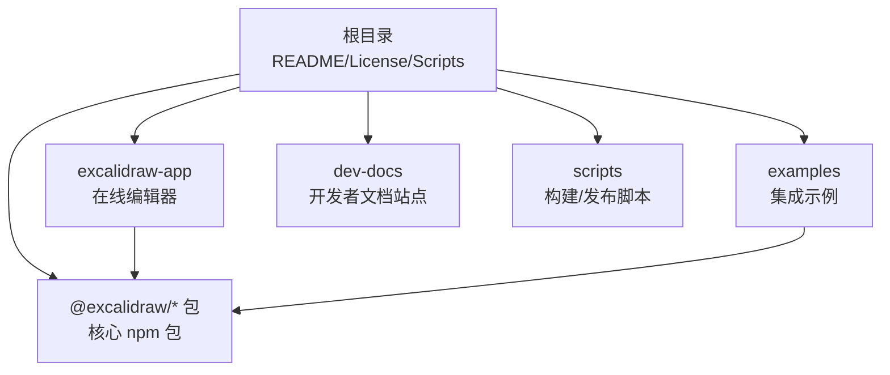
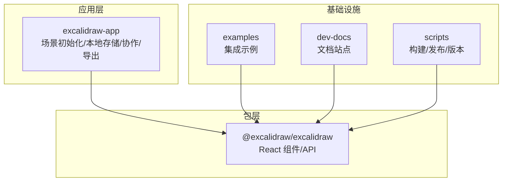
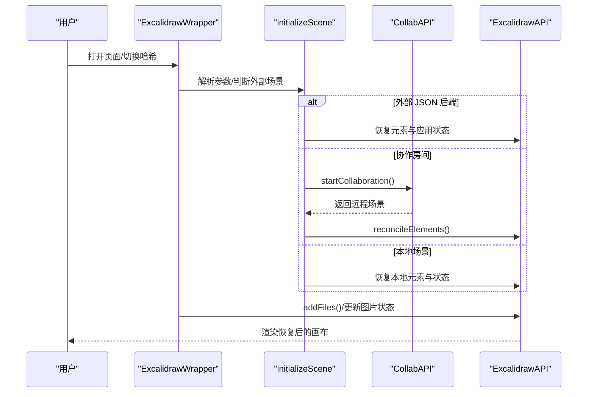
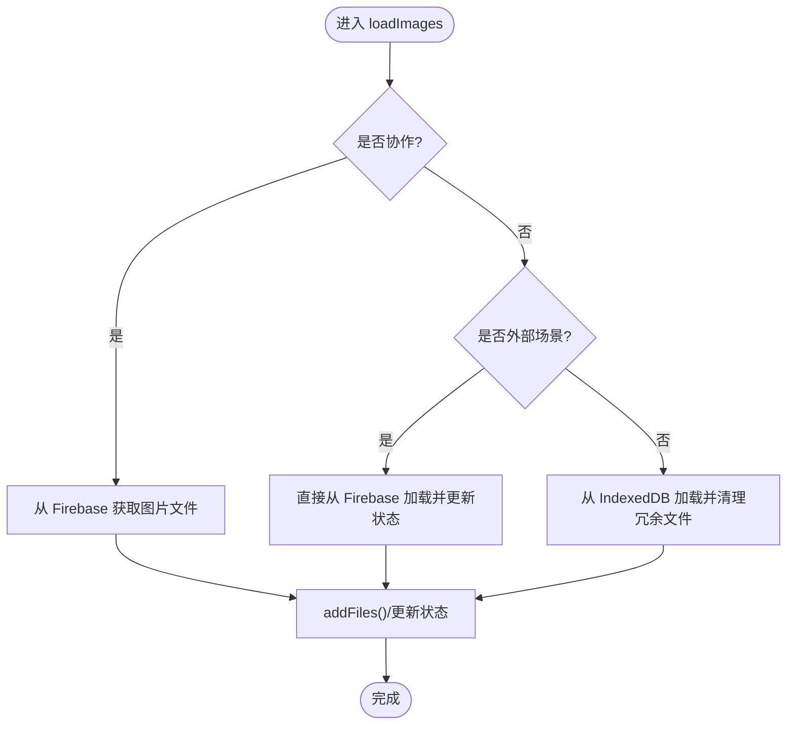
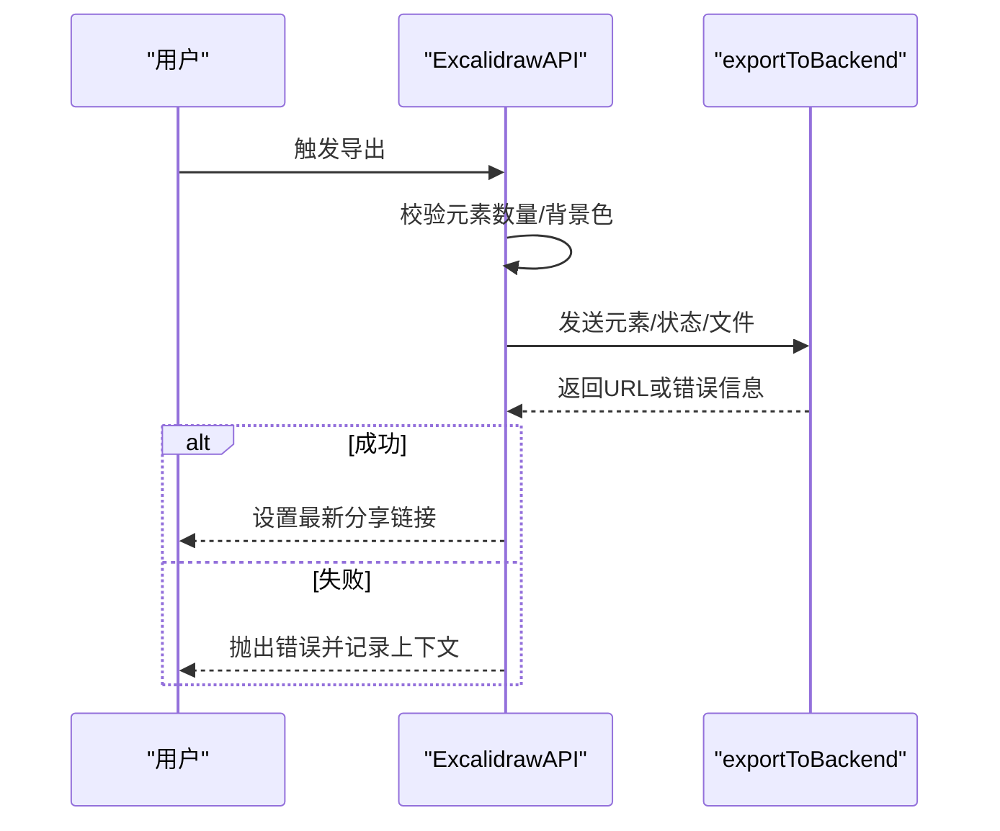
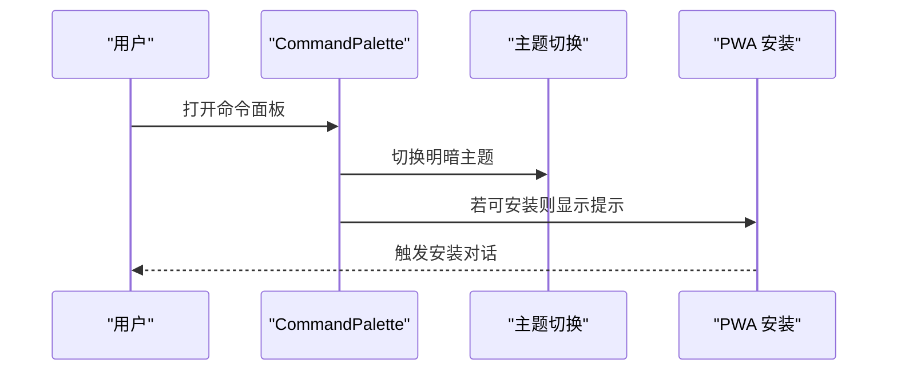
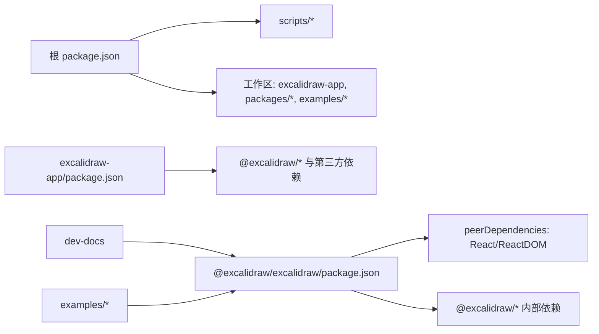

# 项目介绍与定位

<cite>
**本文引用的文件**
- [README.md](file://README.md)
- [LICENSE](file://LICENSE)
- [.github/FUNDING.yml](file://.github/FUNDING.yml)
- [package.json](file://package.json)
- [excalidraw-app/package.json](file://excalidraw-app/package.json)
- [packages/excalidraw/package.json](file://packages/excalidraw/package.json)
- [dev-docs/README.md](file://dev-docs/README.md)
- [dev-docs/docs/introduction/get-started.mdx](file://dev-docs/docs/introduction/get-started.mdx)
- [dev-docs/docs/introduction/development.mdx](file://dev-docs/docs/introduction/development.mdx)
- [scripts/release.js](file://scripts/release.js)
- [excalidraw-app/App.tsx](file://excalidraw-app/App.tsx)
</cite>

## 目录
1. [引言](#引言)
2. [项目结构](#项目结构)
3. [核心组件](#核心组件)
4. [架构总览](#架构总览)
5. [详细组件分析](#详细组件分析)
6. [依赖关系分析](#依赖关系分析)
7. [性能考量](#性能考量)
8. [故障排查指南](#故障排查指南)
9. [结论](#结论)
10. [附录](#附录)

## 引言
Excalidraw 是一款开源的虚拟手绘风格白板工具，强调“自由书写般的自然感”和“协作体验”。其核心价值主张在于：
- 开放与自由：MIT 许可证保障使用与二次开发自由；社区驱动迭代，持续引入新功能与改进。
- 即时可用：提供在线编辑器与 npm 组件包，便于快速集成到各类应用中。
- 协作与隐私：支持实时协作与端到端加密，兼顾团队协作与数据安全。
- 可扩展与本地优先：提供 PWA 能力、离线存储、可分享链接与多导出格式，满足个人与企业多样化场景。

目标用户群体与典型场景：
- 设计师：用于草图、线框图、概念图与创意发散，强调手绘风格带来的亲和与灵活性。
- 开发者：嵌入到文档系统、在线 IDE、知识库或低代码平台，提升交互与可视化表达能力。
- 教育工作者：课堂演示、教学设计、思维导图与课程资源制作。
- 企业团队：跨部门协作、产品设计评审、技术方案讨论与知识沉淀。

手绘风格的优势与用户体验价值：
- 放松与创造性：手绘线条更贴近人类自然表达方式，降低心理门槛，激发创意。
- 易于沟通：非正式但清晰的视觉语言，适合快速传达想法与原型。
- 高度可定制：主题、字体、形状库与导出选项，适配不同工作流与品牌规范。

开源理念与社区模式：
- MIT 许可证确保自由使用、修改与分发，鼓励生态繁荣。
- 社区贡献渠道明确（文档、Discord、GitHub Issues/Pull Requests），通过贡献指南与测试流程保障质量。
- 通过赞助与 Open Collective 支持项目可持续发展。

发展历程与版本演进：
- 采用多包管理与自动化发布脚本，统一版本号与依赖锁定，保证各子包一致性。
- 发布标签策略支持测试版、预发布与稳定版，配合变更日志维护透明度。
- 在线编辑器与 npm 包同步演进，逐步将在线特性以插件化方式下沉至 npm 包，增强复用性。

未来规划方向（基于当前仓库可见信息）：
- 将在线应用中的协作、分享、导出等能力以插件或可选模块形式迁移到 npm 包，提升通用性与可移植性。
- 持续优化性能与稳定性，扩展国际化与无障碍能力，完善开发者与用户文档。

章节来源
- [README.md:15-125](file://README.md#L15-L125)
- [LICENSE:1-22](file://LICENSE#L1-L22)
- [.github/FUNDING.yml:1-2](file://.github/FUNDING.yml#L1-L2)
- [dev-docs/docs/introduction/get-started.mdx:6-18](file://dev-docs/docs/introduction/get-started.mdx#L6-L18)
- [dev-docs/docs/introduction/development.mdx:39-103](file://dev-docs/docs/introduction/development.mdx#L39-L103)
- [scripts/release.js:9-246](file://scripts/release.js#L9-L246)

## 项目结构
该项目采用 monorepo 架构，包含以下关键部分：
- 根目录与顶层配置：根 package.json 管理工作区与脚本；README 提供概览与特性说明；LICENSE 与 FUNDING 定义开源与资助信息。
- 应用层（excalidraw-app）：在线编辑器主程序，负责状态管理、协作、本地存储、分享与导出等。
- 包层（packages/*）：核心 npm 包（如 @excalidraw/excalidraw），提供 React 组件与 API，供第三方应用集成。
- 示例（examples/*）：展示如何在 Next.js 或浏览器环境中集成 Excalidraw。
- 文档站点（dev-docs）：基于 Docusaurus 的开发者文档网站，涵盖安装、开发、API 与集成指南。
- 脚本（scripts/*）：构建、版本与发布相关脚本，支撑自动化流程。

图表来源
- [package.json:5-9](file://package.json#L5-L9)
- [excalidraw-app/package.json:28-57](file://excalidraw-app/package.json#L28-L57)
- [packages/excalidraw/package.json:41-141](file://packages/excalidraw/package.json#L41-L141)
- [dev-docs/README.md:3-25](file://dev-docs/README.md#L3-L25)

章节来源
- [package.json:1-96](file://package.json#L1-L96)
- [dev-docs/README.md:1-42](file://dev-docs/README.md#L1-L42)

## 核心组件
- 在线编辑器（excalidraw-app）
  - 负责初始化场景、加载本地/云端数据、处理协作与分享、导出与错误边界等。
  - 关键职责：场景初始化、图片文件加载、本地存储同步、协作状态管理、命令面板与 PWA 安装触发。
- 核心 npm 包（@excalidraw/excalidraw）
  - 提供 React 组件与 API，支持自定义 UI、初始数据注入、导出与恢复等。
  - 关键职责：渲染画布、工具栏、元素管理、导出与导入、国际化与主题切换。
- 文档站点（dev-docs）
  - 提供开发者入门、安装、开发与 API 文档，支撑贡献与集成。
- 示例（examples）
  - 展示在 Next.js 与浏览器环境中的集成方式，便于快速上手。

章节来源
- [excalidraw-app/App.tsx:216-372](file://excalidraw-app/App.tsx#L216-L372)
- [excalidraw-app/App.tsx:441-521](file://excalidraw-app/App.tsx#L441-L521)
- [excalidraw-app/App.tsx:799-800](file://excalidraw-app/App.tsx#L799-L800)
- [packages/excalidraw/package.json:41-141](file://packages/excalidraw/package.json#L41-L141)
- [dev-docs/docs/introduction/get-started.mdx:6-18](file://dev-docs/docs/introduction/get-started.mdx#L6-L18)

## 架构总览
整体架构由“在线编辑器 + 核心包 + 文档与示例 + 自动化脚本”构成，围绕“本地优先 + 协作 + 导出”的核心路径运行。

图表来源
- [excalidraw-app/App.tsx:374-1288](file://excalidraw-app/App.tsx#L374-L1288)
- [packages/excalidraw/package.json:41-141](file://packages/excalidraw/package.json#L41-L141)
- [dev-docs/README.md:3-25](file://dev-docs/README.md#L3-L25)
- [scripts/release.js:9-246](file://scripts/release.js#L9-L246)

## 详细组件分析

### 场景初始化与数据加载流程
该流程负责从本地存储、外部链接或协作房间中恢复场景，并按需加载图片文件与库数据。

图表来源
- [excalidraw-app/App.tsx:216-372](file://excalidraw-app/App.tsx#L216-L372)
- [excalidraw-app/App.tsx:441-521](file://excalidraw-app/App.tsx#L441-L521)

章节来源
- [excalidraw-app/App.tsx:216-372](file://excalidraw-app/App.tsx#L216-L372)
- [excalidraw-app/App.tsx:441-521](file://excalidraw-app/App.tsx#L441-L521)

### 图片文件加载与状态更新
图片加载根据是否协作、是否外部场景采取不同策略，并维护文件状态与错误处理。

图表来源
- [excalidraw-app/App.tsx:441-521](file://excalidraw-app/App.tsx#L441-L521)

章节来源
- [excalidraw-app/App.tsx:441-521](file://excalidraw-app/App.tsx#L441-L521)

### 导出流程（后端导出与分享链接）
导出前进行空画布校验与错误处理，生成可分享链接并记录最新链接以便后续操作。

图表来源
- [excalidraw-app/App.tsx:734-772](file://excalidraw-app/App.tsx#L734-L772)

章节来源
- [excalidraw-app/App.tsx:734-772](file://excalidraw-app/App.tsx#L734-L772)

### 命令面板与 PWA 安装
命令面板提供主题切换、安装 PWA 等快捷入口，提升用户体验与可访问性。

图表来源
- [excalidraw-app/App.tsx:1200-1288](file://excalidraw-app/App.tsx#L1200-L1288)

章节来源
- [excalidraw-app/App.tsx:1200-1288](file://excalidraw-app/App.tsx#L1200-L1288)

## 依赖关系分析
- 工作区与脚本
  - 根 package.json 定义工作区与构建/测试/发布脚本，统一管理 monorepo。
- 应用层依赖
  - excalidraw-app 依赖 @excalidraw/* 包与第三方库（React、Socket.IO、Firebase 等），负责运行时功能。
- 包层依赖
  - @excalidraw/excalidraw 作为核心包，声明 peerDependencies（React/ReactDOM）与内部依赖，提供可复用组件与 API。
- 文档与示例
  - dev-docs 使用 Docusaurus，examples 提供集成范式，二者共同降低上手成本。

图表来源
- [package.json:5-9](file://package.json#L5-L9)
- [excalidraw-app/package.json:28-57](file://excalidraw-app/package.json#L28-L57)
- [packages/excalidraw/package.json:76-117](file://packages/excalidraw/package.json#L76-L117)

章节来源
- [package.json:1-96](file://package.json#L1-L96)
- [excalidraw-app/package.json:1-58](file://excalidraw-app/package.json#L1-L58)
- [packages/excalidraw/package.json:1-141](file://packages/excalidraw/package.json#L1-L141)

## 性能考量
- 渲染节流与调试开关：启用渲染节流与可选可视化调试，有助于在复杂场景下保持流畅体验。
- 本地存储与增量同步：通过浏览器存储与标签页同步机制，减少重复加载与网络请求。
- 图片懒加载与状态管理：仅对未加载的图片进行异步拉取，并维护状态以避免重复请求。
- 导出与错误处理：导出前进行空画布校验与错误捕获，避免无效操作与异常扩散。

章节来源
- [excalidraw-app/App.tsx:155-156](file://excalidraw-app/App.tsx#L155-L156)
- [excalidraw-app/App.tsx:560-617](file://excalidraw-app/App.tsx#L560-L617)
- [excalidraw-app/App.tsx:441-521](file://excalidraw-app/App.tsx#L441-L521)
- [excalidraw-app/App.tsx:734-772](file://excalidraw-app/App.tsx#L734-L772)

## 故障排查指南
- 导出失败或空画布
  - 确认画布存在元素后再导出；检查错误信息并记录设备像素比与尺寸上下文。
- 图片加载异常
  - 检查文件状态更新与错误映射，确认协作/外部场景下的加载路径是否正确。
- 协作连接问题
  - 校验房间链接与协作 API 状态，关注错误指示器与重连逻辑。
- 本地存储冲突
  - 关注标签页同步与本地保存时机，必要时手动刷新或清理过期数据。

章节来源
- [excalidraw-app/App.tsx:734-772](file://excalidraw-app/App.tsx#L734-L772)
- [excalidraw-app/App.tsx:441-521](file://excalidraw-app/App.tsx#L441-L521)
- [excalidraw-app/App.tsx:619-676](file://excalidraw-app/App.tsx#L619-L676)

## 结论
Excalidraw 以“手绘风格 + 协作 + 开源”为核心竞争力，既可作为独立在线工具使用，也可作为 npm 组件无缝嵌入各类应用。其 MIT 许可证与社区驱动模式，确保了开放性与可持续发展。通过本地优先、离线能力与多导出格式，覆盖从个人创作到团队协作的广泛场景。未来随着在线特性向 npm 包下沉，其通用性与可移植性将进一步增强。

## 附录
- 快速开始与集成
  - 在线编辑器：前往官方站点开始绘制。
  - npm 包：安装 React/ReactDOM 与 @excalidraw/excalidraw，参考文档进行集成。
- 开发与贡献
  - 使用 Codesandbox 在线试用或本地克隆仓库进行开发。
  - 遵循贡献指南与测试流程，参与社区讨论与翻译。
- 版本与发布
  - 采用统一版本号与自动化发布脚本，支持测试、预发布与稳定版标签。

章节来源
- [README.md:83-96](file://README.md#L83-L96)
- [dev-docs/docs/introduction/get-started.mdx:6-18](file://dev-docs/docs/introduction/get-started.mdx#L6-L18)
- [dev-docs/docs/introduction/development.mdx:3-103](file://dev-docs/docs/introduction/development.mdx#L3-L103)
- [scripts/release.js:9-246](file://scripts/release.js#L9-L246)