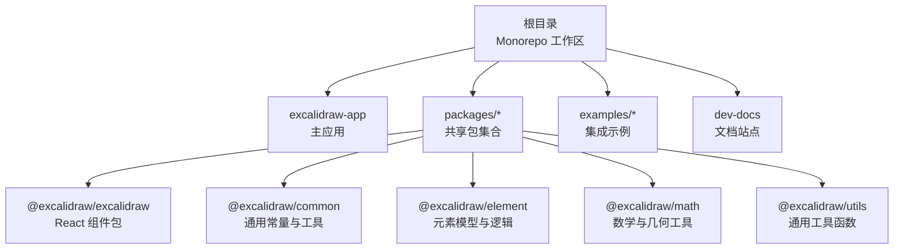
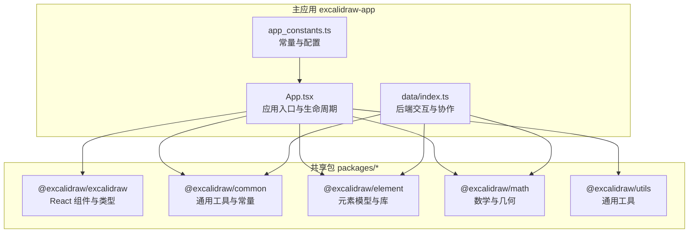
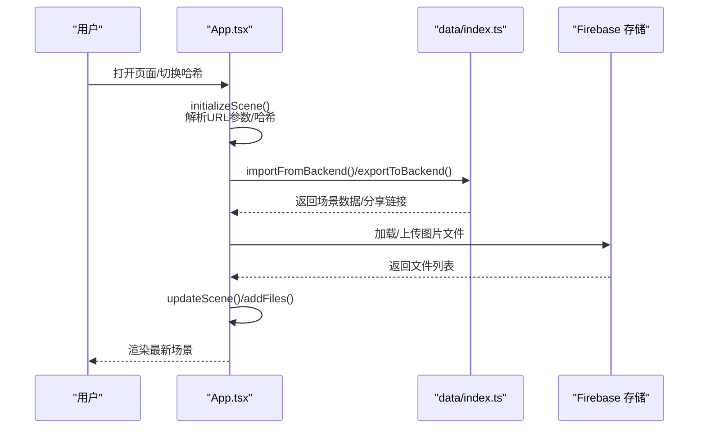
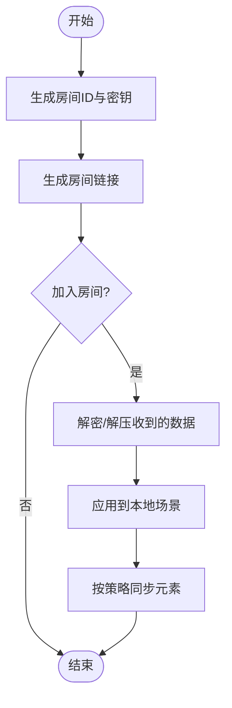
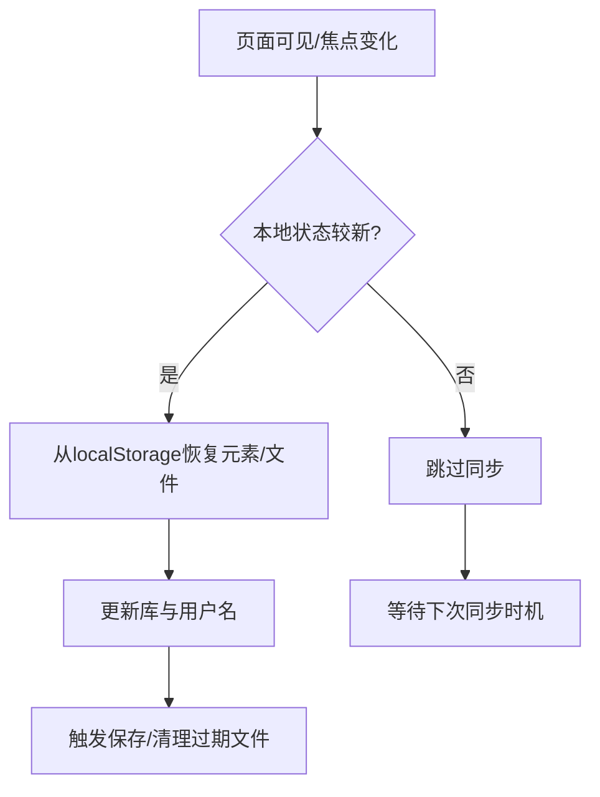
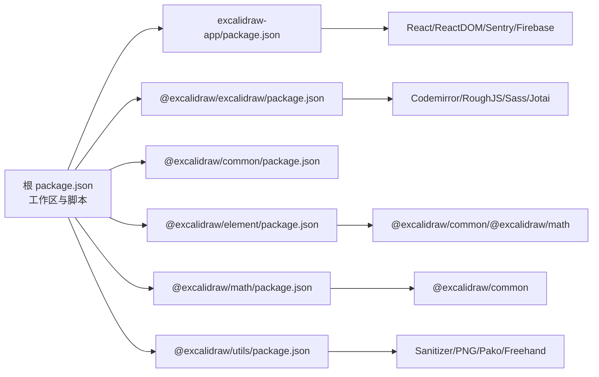

# 项目概述

<cite>
**本文引用的文件**
- [README.md](file://README.md)
- [package.json](file://package.json)
- [CONTRIBUTING.md](file://CONTRIBUTING.md)
- [dev-docs/README.md](file://dev-docs/README.md)
- [excalidraw-app/App.tsx](file://excalidraw-app/App.tsx)
- [excalidraw-app/data/index.ts](file://excalidraw-app/data/index.ts)
- [excalidraw-app/app_constants.ts](file://excalidraw-app/app_constants.ts)
- [excalidraw-app/package.json](file://excalidraw-app/package.json)
- [packages/excalidraw/package.json](file://packages/excalidraw/package.json)
- [packages/common/package.json](file://packages/common/package.json)
- [packages/element/package.json](file://packages/element/package.json)
- [packages/math/package.json](file://packages/math/package.json)
- [packages/utils/package.json](file://packages/utils/package.json)
</cite>

## 目录

1. [引言](#引言)
2. [项目结构](#项目结构)
3. [核心组件](#核心组件)
4. [架构总览](#架构总览)
5. [详细组件分析](#详细组件分析)
6. [依赖分析](#依赖分析)
7. [性能考虑](#性能考虑)
8. [故障排查指南](#故障排查指南)
9. [结论](#结论)
10. [附录](#附录)

## 引言

Excalidraw 是一款开源的虚拟手绘风格白板工具，强调“自由手绘感”的视觉风格与强大的协作能力。其核心价值主张包括：

- 开放与自由：完全免费且开源，遵循宽松许可协议，适合个人与企业广泛使用。
- 即时协作：支持端到端加密的实时协作，具备鼠标位置同步、可见场景边界广播等特性。
- 本地优先：采用浏览器存储（localStorage、IndexedDB）与多标签页同步机制，确保离线可用与数据安全。
- 可扩展生态：通过 npm 包形式提供可嵌入的 React 组件，便于在各类应用中集成。

目标用户与场景：

- 教育与培训：课堂演示、思维导图绘制、远程教学。
- 设计与研发：产品原型、流程图、系统设计、跨团队协作。
- 内容创作：手绘草稿、创意表达、知识可视化。
- 平台集成：作为嵌入式组件集成至笔记、IDE、在线教育平台等。

## 项目结构

本仓库采用 Monorepo 管理，根目录包含文档站点、示例工程、主应用与多个共享包。核心目录与职责如下：

- 根级配置与脚本：工作区定义、构建与测试脚本、版本发布脚本等。
- excalidraw-app：托管在官方站点的主应用，包含 UI、协作、数据持久化、国际化、主题与 PWA 支持等。
- packages/\*：核心共享包，按功能拆分，形成清晰的分层与复用。
- examples/\*：示例工程，展示如何在不同运行环境中集成 Excalidraw。
- dev-docs：基于 Docusaurus 的文档网站，用于维护开发指南与 API 文档。

图表来源

- [package.json:1-96](file://package.json#L1-L96)
- [excalidraw-app/package.json:1-58](file://excalidraw-app/package.json#L1-L58)
- [packages/excalidraw/package.json:1-141](file://packages/excalidraw/package.json#L1-L141)
- [packages/common/package.json:1-66](file://packages/common/package.json#L1-L66)
- [packages/element/package.json:1-71](file://packages/element/package.json#L1-L71)
- [packages/math/package.json:1-67](file://packages/math/package.json#L1-L67)
- [packages/utils/package.json:1-75](file://packages/utils/package.json#L1-L75)

章节来源

- [package.json:1-96](file://package.json#L1-L96)
- [dev-docs/README.md:1-42](file://dev-docs/README.md#L1-L42)

## 核心组件

- 主应用（excalidraw-app）
  - 负责应用初始化、主题与语言检测、PWA 安装事件处理、本地数据与协作状态管理、分享链接生成与导入、错误边界与调试画布等。
  - 关键职责：场景初始化、图片资源加载策略、跨标签页同步、协作房间建立与更新、导出到后端与分享链接生成。
- 共享包（packages/\*）
  - @excalidraw/excalidraw：对外暴露的 React 组件与类型，封装渲染、交互、导出、撤销重做等能力。
  - @excalidraw/common：通用常量、工具函数、环境检测、事件与节流防抖等。
  - @excalidraw/element：元素模型、绑定关系、几何判断、库迁移适配器等。
  - @excalidraw/math：向量、曲线、布局相关的数学工具。
  - @excalidraw/utils：压缩、编码、文件处理、文本处理等通用工具。
- 数据与协作（excalidraw-app/data）
  - 负责与后端的加压/解压、加密/解密、文件上传与下载、协作房间链接生成与解析、可见场景边界与鼠标位置广播等。
- 应用常量（excalidraw-app/app_constants）
  - 定义保存延迟、同步间隔、文件大小限制、存储键名、WebSocket 子类型与前缀等。

章节来源

- [excalidraw-app/App.tsx:1-1288](file://excalidraw-app/App.tsx#L1-L1288)
- [excalidraw-app/data/index.ts:1-308](file://excalidraw-app/data/index.ts#L1-L308)
- [excalidraw-app/app_constants.ts:1-62](file://excalidraw-app/app_constants.ts#L1-L62)
- [packages/excalidraw/package.json:1-141](file://packages/excalidraw/package.json#L1-L141)
- [packages/common/package.json:1-66](file://packages/common/package.json#L1-L66)
- [packages/element/package.json:1-71](file://packages/element/package.json#L1-L71)
- [packages/math/package.json:1-67](file://packages/math/package.json#L1-L67)
- [packages/utils/package.json:1-75](file://packages/utils/package.json#L1-L75)

## 架构总览

整体架构围绕“主应用 + 共享包 + 数据与协作模块”展开，采用 React + Vite 的现代前端技术栈，并通过 Monorepo 实现包内复用与统一构建。

图表来源

- [excalidraw-app/App.tsx:1-1288](file://excalidraw-app/App.tsx#L1-L1288)
- [excalidraw-app/data/index.ts:1-308](file://excalidraw-app/data/index.ts#L1-L308)
- [excalidraw-app/app_constants.ts:1-62](file://excalidraw-app/app_constants.ts#L1-L62)
- [packages/excalidraw/package.json:1-141](file://packages/excalidraw/package.json#L1-L141)
- [packages/common/package.json:1-66](file://packages/common/package.json#L1-L66)
- [packages/element/package.json:1-71](file://packages/element/package.json#L1-L71)
- [packages/math/package.json:1-67](file://packages/math/package.json#L1-L67)
- [packages/utils/package.json:1-75](file://packages/utils/package.json#L1-L75)

## 详细组件分析

### 主应用生命周期与场景初始化

主应用负责在启动阶段完成以下关键步骤：

- 初始化场景：根据 URL 参数或哈希决定是否从外部后端导入、是否为协作房间、是否从本地存储恢复。
- 图片资源加载：区分协作模式与本地模式，按需从 Firebase 或本地 IndexedDB 加载图片并更新元素状态。
- 同步与保存：监听窗口事件与可见性变化，按阈值进行本地保存与跨标签页同步。
- 导出与分享：将当前场景压缩、加密并上传至后端，生成带密钥的只读链接；同时支持导出到第三方服务。

图表来源

- [excalidraw-app/App.tsx:216-372](file://excalidraw-app/App.tsx#L216-L372)
- [excalidraw-app/data/index.ts:202-307](file://excalidraw-app/data/index.ts#L202-L307)

章节来源

- [excalidraw-app/App.tsx:216-372](file://excalidraw-app/App.tsx#L216-L372)
- [excalidraw-app/data/index.ts:202-307](file://excalidraw-app/data/index.ts#L202-L307)

### 协作与加密通信

- 房间链接生成与校验：随机生成房间 ID 与密钥，校验密钥长度并生成可分享链接。
- WebSocket 数据子类型：定义了初始化、更新、鼠标位置、空闲状态、可见场景边界等消息类型。
- 场景同步：过滤不可见或已删除元素，按阈值进行全量或增量同步，避免无效传输。

图表来源

- [excalidraw-app/data/index.ts:68-164](file://excalidraw-app/data/index.ts#L68-L164)
- [excalidraw-app/app_constants.ts:23-30](file://excalidraw-app/app_constants.ts#L23-L30)

章节来源

- [excalidraw-app/data/index.ts:68-164](file://excalidraw-app/data/index.ts#L68-L164)
- [excalidraw-app/app_constants.ts:23-30](file://excalidraw-app/app_constants.ts#L23-L30)

### 数据持久化与跨标签页同步

- 本地存储策略：对元素、应用状态、文件分别设置保存延迟与版本号，避免频繁写入。
- 跨标签页同步：基于 localStorage 版本号比较，仅在本地较新时进行同步，减少冲突。
- 文件清理：在首次加载时清理过期文件，降低存储压力。

图表来源

- [excalidraw-app/App.tsx:560-617](file://excalidraw-app/App.tsx#L560-L617)

章节来源

- [excalidraw-app/App.tsx:560-617](file://excalidraw-app/App.tsx#L560-L617)

### React 组件包与类型系统

- 对外暴露：React 组件、API 提供者、命令面板、错误对话框、分享对话框等。
- 类型与导出：通过 exports 字段为不同子路径提供开发/生产与类型映射，便于按需引入。
- 依赖生态：整合编辑器、数学、几何、UI、状态管理等依赖，保证渲染与交互性能。

章节来源

- [packages/excalidraw/package.json:1-141](file://packages/excalidraw/package.json#L1-L141)

## 依赖分析

- 工作区与脚本
  - 使用 Yarn Workspaces 管理工作区，集中定义构建、测试、覆盖率与发布脚本。
- 主应用依赖
  - 前端框架：React 与 ReactDOM。
  - 协作与存储：Socket.IO 客户端、Firebase SDK、IDB-keyval。
  - 状态与工具：Jotai、i18n 检测、Sentry 浏览器监控。
- 共享包依赖
  - @excalidraw/excalidraw：Codemirror、roughjs、Perfect-Freehand、Sass、Jotai 等。
  - @excalidraw/element：依赖 common 与 math，以及分数索引库。
  - @excalidraw/math：依赖 common。
  - @excalidraw/utils：依赖 Sanitizer、PNG 处理、压缩与绘图库。

图表来源

- [package.json:1-96](file://package.json#L1-L96)
- [excalidraw-app/package.json:28-40](file://excalidraw-app/package.json#L28-L40)
- [packages/excalidraw/package.json:80-117](file://packages/excalidraw/package.json#L80-L117)
- [packages/element/package.json:66-69](file://packages/element/package.json#L66-L69)
- [packages/math/package.json:64](file://packages/math/package.json#L64)
- [packages/utils/package.json:50-60](file://packages/utils/package.json#L50-L60)

章节来源

- [package.json:1-96](file://package.json#L1-L96)
- [excalidraw-app/package.json:28-40](file://excalidraw-app/package.json#L28-L40)
- [packages/excalidraw/package.json:80-117](file://packages/excalidraw/package.json#L80-L117)
- [packages/element/package.json:66-69](file://packages/element/package.json#L66-L69)
- [packages/math/package.json:64](file://packages/math/package.json#L64)
- [packages/utils/package.json:50-60](file://packages/utils/package.json#L50-L60)

## 性能考虑

- 渲染节流：启用渲染节流开关，降低高频绘制带来的性能消耗。
- 保存与同步延迟：通过时间阈值合并多次变更，减少写入与网络请求频率。
- 图片懒加载与状态更新：仅在需要时加载图片文件，并更新元素状态以避免重复处理。
- 压缩与加密：导出前进行压缩与加密，减小传输体积与提升安全性。
- 缓存与清理：定期清理过期文件，维持存储空间健康。

章节来源

- [excalidraw-app/App.tsx:155](file://excalidraw-app/App.tsx#L155)
- [excalidraw-app/App.tsx:690-717](file://excalidraw-app/App.tsx#L690-L717)
- [excalidraw-app/data/index.ts:255-260](file://excalidraw-app/data/index.ts#L255-L260)

## 故障排查指南

- 分享链接无法打开
  - 检查密钥长度与格式，确认链接是否包含正确的密钥片段。
  - 若后端返回过大错误，调整场景规模或分批导出。
- 图片加载失败
  - 确认 Firebase 前缀与权限，检查文件状态更新与错误集合。
  - 在协作模式下，优先从协作文件前缀拉取。
- 协作房间异常
  - 校验房间 ID 与密钥生成逻辑，确认 WebSocket 子类型与广播事件。
  - 检查本地状态版本号，避免覆盖较新的浏览器存储。
- 本地保存与卸载提示
  - 若存在未保存文件，浏览器可能阻止卸载；可通过禁用卸载阻止进行调试（不建议生产使用）。

章节来源

- [excalidraw-app/data/index.ts:138-146](file://excalidraw-app/data/index.ts#L138-L146)
- [excalidraw-app/data/index.ts:294-299](file://excalidraw-app/data/index.ts#L294-L299)
- [excalidraw-app/App.tsx:441-521](file://excalidraw-app/App.tsx#L441-L521)
- [excalidraw-app/App.tsx:799-807](file://excalidraw-app/App.tsx#L799-L807)

## 结论

Excalidraw 以“手绘风格 + 即时协作 + 本地优先”的理念，构建了从主应用到共享包的完整生态。其 Monorepo 架构实现了高内聚、低耦合与强复用，既满足初学者快速上手，也为资深开发者提供了清晰的扩展点与优化空间。通过完善的导出与分享机制、稳健的协作与加密通信、以及对性能与存储的细致考量，Excalidraw 成为跨领域协作与创意表达的理想工具。

## 附录

- 快速开始与开发指南
  - 集成 npm 包并在自有应用中嵌入 Excalidraw 组件。
  - 查看文档站点与开发指南，了解构建、测试与发布流程。
- 社区与赞助
  - 欢迎通过 Discord、GitHub Issues、Open Collective 等渠道参与贡献与支持。

章节来源

- [README.md:83-96](file://README.md#L83-L96)
- [dev-docs/README.md:1-42](file://dev-docs/README.md#L1-L42)
- [CONTRIBUTING.md:1-4](file://CONTRIBUTING.md#L1-L4)
